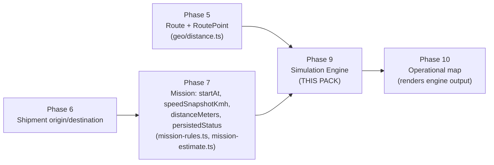

# Phase 09 — Simulation Engine — Development Pack

Status of this document: **Planning artifact.** This directory is a Development Pack produced before any Phase 9 code is written. It is binding for whoever implements Phase 9, in the same way `docs/IMPLEMENTATION_PLAN.md` is binding for every other phase. Nothing in this pack has been implemented yet.

## 1. Purpose

Phase 9 builds the **Simulation Engine**: the deterministic, pure calculation layer that turns a Mission's static data (start time, average speed, origin, destination, optional route) into an approximate vehicle position at any requested point in time — without GPS.

This pack exists so that the engineer (or Claude instance) who implements Phase 9 needs to make **zero architectural decisions**. Every interface, algorithm, edge case, test, and file path is fixed here. Implementation is transcription plus verification, not design.

## 2. Goals

| # | Goal |
|---|---|
| G1 | Produce a pure, deterministic function that computes a Mission's approximate position, progress, ETA, and bearing at an arbitrary view time. |
| G2 | Guarantee the same output for the same input, forever — no wall-clock reads inside the calculation core, no randomness, no I/O. |
| G3 | Make the engine trivially unit-testable in isolation, with zero database, zero network, zero rendering. |
| G4 | Make the engine consumable by Phase 10 (operational map) without Phase 10 needing to know how the math works. |
| G5 | Keep the engine framework-independent: no React, no Next.js UI components, no MapLibre or any map-rendering library, ever, inside the engine module itself. |
| G6 | Reuse existing Phase 5/6/7 primitives (`haversineDistanceMeters`, `computeRouteDistances`, `deriveMissionDisplayStatus`) instead of re-deriving them. |

## 3. Phase Overview

Phase 9 sits strictly between Phase 7 (which already snapshots everything the engine needs onto the `Mission` row at publish time) and Phase 10 (which will call the engine repeatedly to animate vehicles on the real map). Phase 9 adds **no new business data** — it only adds a calculation layer over data that already exists.

## 4. Dependencies

### 4.1 Must already exist (verified present in the repository as of this writing)

| Dependency | File | What Phase 9 reuses from it |
|---|---|---|
| `haversineDistanceMeters`, `computeRouteDistances`, `GeoPoint` | `src/lib/geo/distance.ts` | Great-circle distance math (Phase 5) |
| `deriveMissionDisplayStatus`, `isMissionOperationallyLocked` | `src/lib/domain/mission-rules.ts` | Status derivation (WAITING/IN_PROGRESS/ARRIVED/CANCELLED/ARCHIVED/DRAFT) (Phase 7) |
| `Mission` Prisma model (`startAt`, `speedSnapshotKmh`, `distanceMeters`, `estimatedArrivalAt`, `persistedStatus`, `cancelledAt`, origin/destination snapshot fields) | `prisma/schema.prisma` | The frozen, already-persisted inputs the engine reads (Phase 7) |
| `Route` / `RoutePoint` Prisma models (`points[].cumulativeDistanceMeters` precomputed at route-creation time) | `prisma/schema.prisma` | Route geometry (Phase 5) |
| ADR-011 (direct-line fallback when no route) | `docs/DECISIONS.md` | The fallback rule Phase 9 formalizes into code |

### 4.2 Must NOT be touched by Phase 9

- `prisma/schema.prisma` — **no migration in this phase.** See [07-DATABASE.md](./07-DATABASE.md).
- Any file under `src/app/**` that renders JSX.
- Any file that imports `maplibre-gl`, `react`, or `next/*` outside of an explicitly-allowed thin API route handler (see [06-API.md](./06-API.md) §3).

## 5. Deliverables

| Deliverable | Location | Type |
|---|---|---|
| Pure geometry function | `src/lib/domain/mission-simulation.ts` | New file, framework-independent |
| Status-aware orchestrator | same file | New file, framework-independent |
| DB-touching context loader | `src/server/services/simulation-service.ts` | New file, server-only |
| Optional read-only HTTP endpoint | `src/app/api/v1/missions/[id]/simulate/route.ts` | New file, thin route handler only |
| Unit tests | `tests/unit/mission-simulation.test.ts` | New file |
| Updated `docs/PHASE_STATUS.md` | Phase 9 completion record | Documentation |

No UI file, no page, no component is a deliverable of Phase 9. See [01-SCOPE.md](./01-SCOPE.md) for the full boundary and the explicit deviation from `IMPLEMENTATION_PLAN.md`'s original Phase 9 prose that this pack documents.

## 6. What Is Completed After This Phase

After Phase 9 ships:

- Given any Mission and any point in time, the system can answer: "where is this vehicle approximately, what fraction of the trip is done, when will it arrive, which direction is it facing" — as a pure function call, in-process, with no network round trip required.
- Phase 10 can start immediately: it consumes `simulateMissionPosition()` (or the HTTP endpoint) as a black box and focuses entirely on rendering.
- The core algorithm has boundary-tested, regression-proof unit coverage that will catch any future accidental behavior change (e.g., someone "helpfully" changing interpolation math while building Phase 10).

## 7. How to Read This Pack

Read in this order (also encoded in [13-PROMPT.md](./13-PROMPT.md)):

1. `00-README.md` (this file)
2. `01-SCOPE.md`
3. `02-REQUIREMENTS.md`
4. `03-DOMAIN.md`
5. `04-ARCHITECTURE.md`
6. `05-IMPLEMENTATION.md`
7. `06-API.md`
8. `07-DATABASE.md`
9. `08-TESTS.md`
10. `09-ACCEPTANCE.md`
11. `10-NON_FUNCTIONAL.md`
12. `11-OUT_OF_SCOPE.md`
13. `ADR.md` (can be read in parallel with 04/05 — it explains *why*, they explain *what*)
14. `FAQ.md` (reference, read on demand)
15. `12-CHECKLIST.md` (use while implementing)
16. `13-PROMPT.md` (the actual kickoff prompt for the implementation session)
