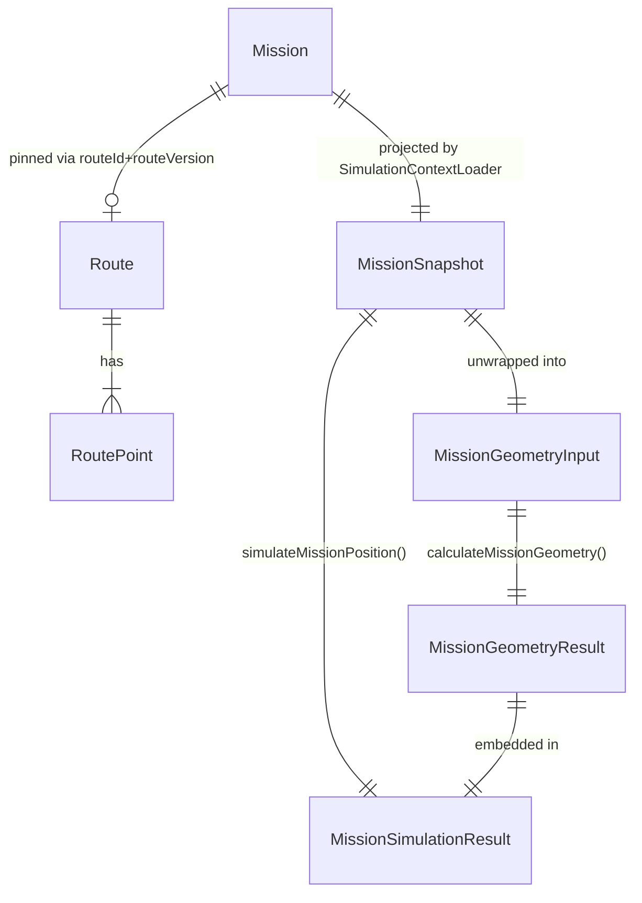

# 03 — Domain Model

This document describes every domain object Phase 9 reads, produces, or introduces. Objects marked **(existing)** already exist in the repository and are described here only to the extent Phase 9 depends on them — do not redefine or duplicate them. Objects marked **(new)** are introduced by Phase 9.

## 1. `Mission` (existing — `prisma/schema.prisma`, `Mission` model)

### Purpose
The authoritative, already-snapshotted record of a planned or in-progress trip. Phase 9 treats it as a **read-only input**.

### Properties Phase 9 reads

| Field | Type | Meaning for Phase 9 |
|---|---|---|
| `id` | `String` | Identifies the mission for the loader/API. |
| `startAt` | `DateTime` | Trip start instant (UTC). |
| `originLatitude` / `originLongitude` | `Decimal(9,6)` | Snapshotted origin coordinates. Cast to `number` before entering the pure engine. |
| `destinationLatitude` / `destinationLongitude` | `Decimal(9,6)` | Snapshotted destination coordinates. |
| `routeId` | `String?` | Nullable. If set, Phase 9 must load the matching `Route` row. |
| `routeVersion` | `Int?` | Pinned route version — see BR-3 in [02-REQUIREMENTS.md](./02-REQUIREMENTS.md). |
| `speedSnapshotKmh` | `Decimal(10,2)` | The average speed to simulate with. Never re-read from `Vehicle.avgSpeedKmh`. |
| `distanceMeters` | `BigInt` | The total distance computed at publish/re-commit time (Phase 7). Phase 9 **recomputes** this from geometry rather than trusting the stored value directly — see ADR-P9-04 for why. |
| `estimatedArrivalAt` | `DateTime` | Used both directly and as an input to `deriveMissionDisplayStatus()`. |
| `persistedStatus` | `MissionPersistedStatus` (`DRAFT \| SCHEDULED \| CANCELLED \| ARCHIVED`) | Drives status derivation (FR-9). |
| `cancelledAt` | `DateTime?` | Used to clamp geometry per FR-10. |

### Relationships
`Mission` → `Vehicle` (read for nothing in Phase 9 — speed is already snapshotted), `Mission` → `Route` (optional, via `routeId`+`routeVersion`), `Mission` → `OrganizationUnit` (origin/destination, already denormalized onto Mission itself so no join is strictly required for geometry).

### Lifecycle (unchanged by Phase 9)
`DRAFT → SCHEDULED → (CANCELLED | ARRIVED-implicit-via-time | ARCHIVED-future)`. Phase 9 does not participate in any transition — it only reads whatever state a Mission is currently in.

### Invariants Phase 9 relies on (guaranteed by Phase 7, not re-verified by Phase 9)
- If `persistedStatus === SCHEDULED`, then `speedSnapshotKmh > 0` and `estimatedArrivalAt > startAt` (or `estimatedArrivalAt === startAt` only in the zero-distance edge case).
- If `routeId` is set, a `Route` row with matching `id` and `version === routeVersion` exists (append-only versioning, ADR-020).

---

## 2. `Vehicle` (existing — not read by Phase 9 except transitively)

### Purpose
Phase 9 does **not** query `Vehicle` directly. `Mission.speedSnapshotKmh` already contains everything the engine needs (BR-2). `Vehicle` is documented here only to make explicit that this is a deliberate non-dependency, not an oversight.

---

## 3. `Route` / `RoutePoint` (existing — `prisma/schema.prisma`)

### Purpose
`Route` is a reusable, versioned polyline. `RoutePoint` rows carry `sequence`, `latitude`, `longitude`, and **already-precomputed** `cumulativeDistanceMeters` (`BigInt`, computed by `computeRouteDistances()` at route-creation time in Phase 5's `route-service.ts`).

### Properties Phase 9 reads

| Field | Type | Meaning for Phase 9 |
|---|---|---|
| `Route.id`, `Route.version` | `String`, `Int` | Composite key used to fetch the exact snapshot pinned on the Mission. |
| `RoutePoint.sequence` | `Int` | Ordering key — points must be read `ORDER BY sequence ASC`. |
| `RoutePoint.latitude` / `longitude` | `Decimal(9,6)` | Cast to `number`. |
| `RoutePoint.cumulativeDistanceMeters` | `BigInt` | Cast to `number`. Reused directly — Phase 9 does **not** recompute cumulative distances from scratch; it trusts the already-persisted, already-correct values (they were computed once, deterministically, by the same `computeRouteDistances()` function Phase 9 itself would otherwise call). |

### Relationships
`Route 1 — N RoutePoint`, cascade delete (existing, unrelated to Phase 9).

### Invariants Phase 9 relies on
- `RoutePoint.cumulativeDistanceMeters` is monotonically non-decreasing when ordered by `sequence` (guaranteed by construction in Phase 5 — never independently produced by hand).
- The first point's `cumulativeDistanceMeters` is always `0` (Phase 5 invariant, from `computeRouteDistances()`).

---

## 4. `SimulationRoutePoint` (new — pure DTO, `src/lib/domain/mission-simulation.ts`)

### Purpose
The pure engine's own minimal shape for a route point — decoupled from Prisma's `Decimal`/`BigInt` types so the engine never imports `@prisma/client`.

### Definition

```ts
export interface SimulationRoutePoint {
  sequence: number;
  latitude: number;
  longitude: number;
  cumulativeDistanceMeters: number;
}
```

### Invariants (caller-enforced, not runtime-checked — see [02-REQUIREMENTS.md](./02-REQUIREMENTS.md) EC-8)
- Array sorted ascending by `sequence`.
- `cumulativeDistanceMeters` monotonically non-decreasing along the array.
- `cumulativeDistanceMeters[0] === 0`.

---

## 5. `MissionGeometryInput` (new — pure DTO)

### Purpose
The complete, self-sufficient input to the geometry-only calculation core. Contains no status/persistence concept at all — purely time and space.

### Definition

```ts
export interface MissionGeometryInput {
  viewTime: Date;
  startAt: Date;
  speedKmh: number;
  origin: GeoPoint;          // from @/lib/geo/distance
  destination: GeoPoint;
  routePoints?: readonly SimulationRoutePoint[];
}
```

### Relationships
Constructed by `simulateMissionPosition()` (§7) from a `MissionSnapshot` (§6), or constructed directly by a test / future caller that does not need status awareness.

---

## 6. `MissionSnapshot` (new — pure DTO)

### Purpose
The complete, status-aware input to the orchestrator. This is the shape `SimulationContextLoader` (§9) produces from the database.

### Definition

```ts
export interface MissionSnapshot {
  startAt: Date;
  estimatedArrivalAt: Date;
  speedKmh: number;
  persistedStatus: "DRAFT" | "SCHEDULED" | "CANCELLED" | "ARCHIVED";
  cancelledAt: Date | null;
  origin: GeoPoint;
  destination: GeoPoint;
  routePoints?: readonly SimulationRoutePoint[];
}
```

### Relationships
1:1 read-projection of a `Mission` row (§1) plus its resolved `RoutePoint[]` (§3), reshaped into plain, Prisma-free types.

### Lifecycle
Constructed fresh on every call. Never cached across calls inside the pure layer (an optional, separate caching layer at the loader boundary is described in [04-ARCHITECTURE.md](./04-ARCHITECTURE.md) §7 as an extension point, not a Phase 9 deliverable).

---

## 7. `MissionGeometryResult` (new — pure DTO, output of `calculateMissionGeometry()`)

### Purpose
The geometry-only result: no status field, because the geometry core has no concept of Mission status.

### Definition

```ts
export interface MissionGeometryResult {
  position: GeoPoint;
  progressRatio: number;          // 0..1 inclusive
  traveledMeters: number;         // >= 0
  remainingMeters: number;        // >= 0
  totalDistanceMeters: number;    // >= 0
  estimatedArrivalAt: Date;
  remainingSeconds: number;       // >= 0
  bearingDegrees: number | null;  // [0, 360) or null
  isFallbackDirect: boolean;
}
```

### Invariants
- `traveledMeters + remainingMeters === totalDistanceMeters` (floating-point tolerance: see [08-TESTS.md](./08-TESTS.md) precision notes).
- `progressRatio === traveledMeters / totalDistanceMeters` except when `totalDistanceMeters === 0`, where `progressRatio === 1` (EC-5).
- `bearingDegrees === null` **iff** `totalDistanceMeters === 0` (EC-5) — every other case has a defined bearing.

---

## 8. `MissionSimulationResult` (new — pure DTO, output of `simulateMissionPosition()`)

### Purpose
`MissionGeometryResult` plus the status/estimation metadata a consumer actually needs to render something safely.

### Definition

```ts
export interface MissionSimulationResult extends MissionGeometryResult {
  status: MissionDisplayStatus; // reused type from mission-rules.ts: "DRAFT"|"WAITING"|"IN_PROGRESS"|"ARRIVED"|"CANCELLED"|"ARCHIVED"
  isEstimated: true;
}
```

### Relationships
This is the type returned by both `simulateMissionPosition()` (pure, in-process) and `getMissionSimulation()` (DB-touching service), and — JSON-serialized (`Date` → ISO string) — by the HTTP endpoint. See [06-API.md](./06-API.md) for the wire format.

### Lifecycle
A fresh, immutable value per call. Never mutated after construction.

### Invariants
- `isEstimated` is always the literal `true` — this is a type-level guarantee (TypeScript literal type `true`, not `boolean`) so no code path can accidentally construct a result claiming to be non-estimated.
- If `status === "CANCELLED"`, the embedded `MissionGeometryResult` was computed using the clamped `viewTime` per FR-10, not the raw requested `viewTime`.

---

## 9. `SimulationContextLoader` (new — DB-touching service, `src/server/services/simulation-service.ts`)

### Purpose
The **only** Phase 9 component allowed to touch Prisma. Converts `(missionId, viewTime)` into a call to `simulateMissionPosition()`.

### "Properties" (its public interface)

```ts
export async function getMissionSimulation(missionId: string, viewTime: Date): Promise<MissionSimulationResult>;
```

### Relationships
Depends on: Prisma client (`@/lib/db/prisma`), `simulateMissionPosition()`, `DomainError` (existing error type from `@/lib/errors/domain-error`).

### Lifecycle
Stateless function, called per-request. No instance, no class, no retained state — matches the functional style of every other `*-service.ts` file in this codebase (`mission-service.ts`, `route-service.ts`, etc., which export functions, not classes).

### Invariants
- Never returns a `Mission` that is soft-deleted (`deletedAt IS NOT NULL`) — throws `MISSION_NOT_FOUND` instead, matching the existing pattern in `mission-service.ts`'s `getMissionById()`.

---

## 10. `MissionDisplayStatus` (existing — reused, not redefined)

Defined in `src/lib/domain/mission-rules.ts`:

```ts
export type MissionDisplayStatus = "DRAFT" | "WAITING" | "IN_PROGRESS" | "ARRIVED" | "CANCELLED" | "ARCHIVED";
```

Phase 9 imports this type and the function that produces it (`deriveMissionDisplayStatus`) verbatim. **Do not create a second status enum for simulation purposes.**

---

## 11. Domain Object Relationship Diagram



## 12. Type Ownership Table (single source of truth per type)

| Type | Owning file | Phase 9 may... |
|---|---|---|
| `GeoPoint` | `src/lib/geo/distance.ts` | import, not redefine |
| `MissionDisplayStatus` | `src/lib/domain/mission-rules.ts` | import, not redefine |
| `SimulationRoutePoint`, `MissionGeometryInput`, `MissionGeometryResult`, `MissionSnapshot`, `MissionSimulationResult` | `src/lib/domain/mission-simulation.ts` (new) | define here, once |
| `MissionSimulationResultDTO` (wire format) | `src/app/api/v1/missions/[id]/simulate/route.ts` or a colocated types file — see [06-API.md](./06-API.md) | define here, once |
