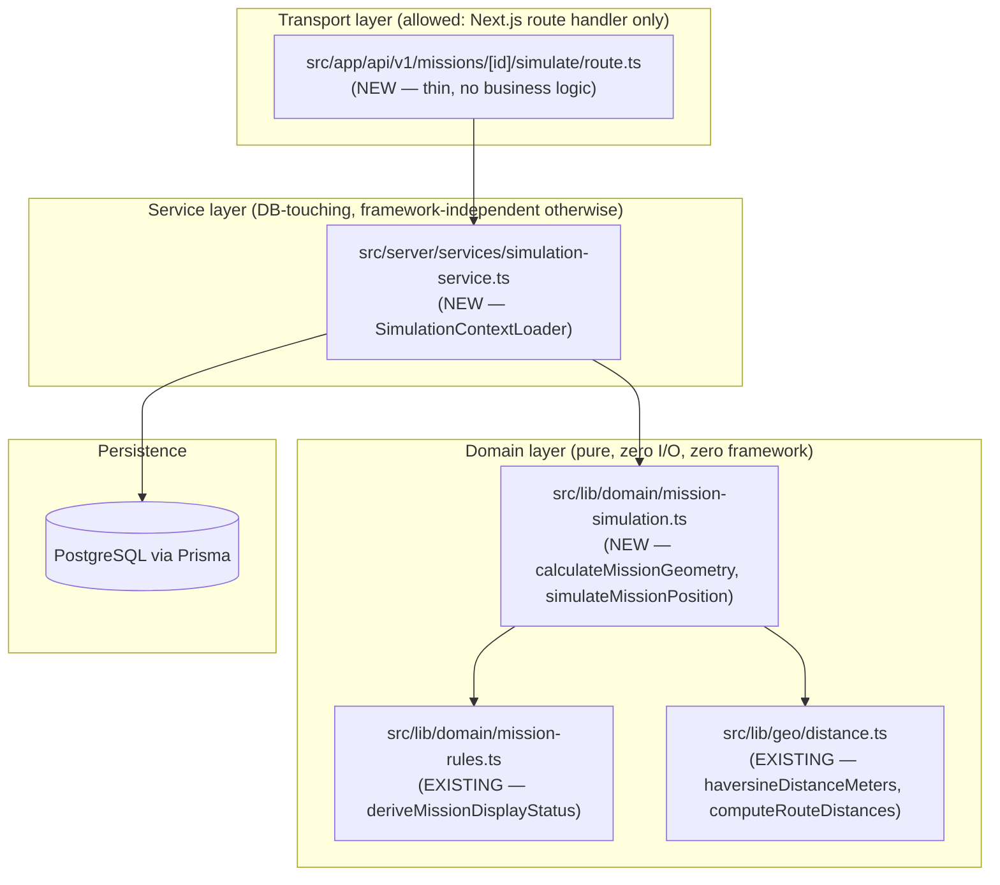
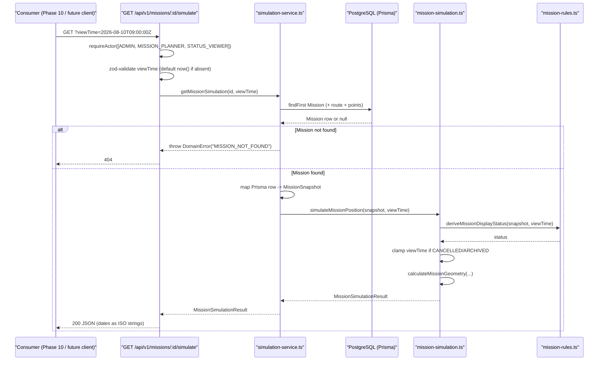
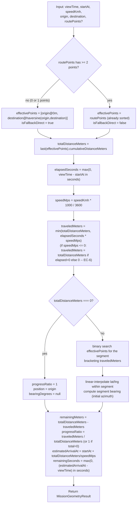
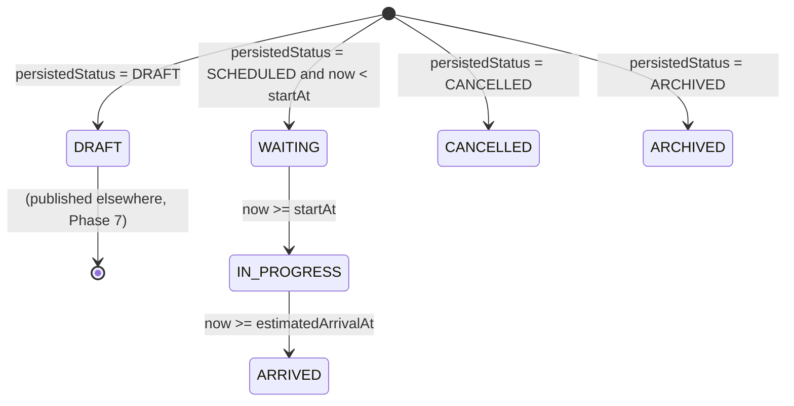

# 04 — Architecture

## 1. Layers

Phase 9 introduces exactly two new files in the existing three-layer structure this repository already uses (`lib/domain` = pure, `server/services` = orchestration/DB, `app/api` = HTTP transport):



**Rule:** arrows only point downward/rightward. `mission-simulation.ts` never imports `simulation-service.ts` or anything under `src/app/**`. This is the same dependency direction already enforced across this codebase (`CLAUDE.md` §2: "لایه‌های domain/service/repository/permission/audit از UI جدا باشند").

## 2. Modules

| Module | File | Exports | Imports allowed |
|---|---|---|---|
| Geometry core | `src/lib/domain/mission-simulation.ts` | `calculateMissionGeometry`, `simulateMissionPosition`, `SimulationRoutePoint`, `MissionGeometryInput`, `MissionGeometryResult`, `MissionSnapshot`, `MissionSimulationResult` | `@/lib/geo/distance`, `@/lib/domain/mission-rules` only |
| Context loader | `src/server/services/simulation-service.ts` | `getMissionSimulation` | `@/lib/db/prisma`, `@/lib/errors/domain-error`, `@/lib/domain/mission-simulation`, Prisma generated types |
| HTTP endpoint | `src/app/api/v1/missions/[id]/simulate/route.ts` | Next.js route handler (`GET`) | `@/lib/http/api-auth`, `@/lib/permissions/roles`, `@/server/services/simulation-service`, `zod` |

## 3. Services

Exactly one new service, `simulation-service.ts`, exporting exactly one function:

```ts
export async function getMissionSimulation(missionId: string, viewTime: Date): Promise<MissionSimulationResult>;
```

It does three things, in order, and nothing else:

1. Fetch the `Mission` row (`prisma.mission.findFirst({ where: { id: missionId, deletedAt: null }, include: { route: { include: { points: true } } } })`, filtered so `route` only resolves if `mission.routeId` matches — see [05-IMPLEMENTATION.md](./05-IMPLEMENTATION.md) §5 for the exact Prisma query, including the `routeVersion` matching subtlety).
2. Map the Prisma row (with `Decimal`/`BigInt` fields) into a `MissionSnapshot` (plain `number`/`Date` fields).
3. Call `simulateMissionPosition(snapshot, viewTime)` and return its result untouched.

## 4. Interfaces

All interfaces are TypeScript `interface`/`type` declarations, not runtime abstractions (no dependency-injection container, no class hierarchy — this matches the rest of the codebase, which uses plain exported functions everywhere, e.g. `mission-service.ts`, `route-service.ts`). See [03-DOMAIN.md](./03-DOMAIN.md) for every interface's full field list.

| Interface | Direction |
|---|---|
| `MissionGeometryInput` → `MissionGeometryResult` | `calculateMissionGeometry()` |
| `MissionSnapshot` → `MissionSimulationResult` | `simulateMissionPosition()` |
| `(missionId, viewTime)` → `Promise<MissionSimulationResult>` | `getMissionSimulation()` |

## 5. Dependency Rules (enforced by code review, not tooling, in this repo)

| Rule | Rationale |
|---|---|
| `mission-simulation.ts` imports nothing from `@prisma/client` or `@/lib/db/*`. | Keeps the engine testable without a database and reusable outside this Next.js app if ever needed. |
| `mission-simulation.ts` imports nothing from `react`, `next/*`, or `maplibre-gl`. | Explicit product-owner mandate — see [01-SCOPE.md](./01-SCOPE.md) §2. |
| `simulation-service.ts` imports nothing from `src/app/**` or any `.tsx` file. | Service layer must stay UI-agnostic — same rule every other `*-service.ts` file already follows. |
| The HTTP route handler contains no calculation logic — it only validates the request shape and calls the service. | Matches every existing route handler in `src/app/api/v1/**` (thin controller pattern already used for `missions`, `routes`, `shipments`). |
| `mission-simulation.ts` never mutates its inputs. | Purity requirement (FR/§8 in [02-REQUIREMENTS.md](./02-REQUIREMENTS.md)). |

## 6. SOLID Considerations

| Principle | How Phase 9 applies it |
|---|---|
| **Single Responsibility** | `calculateMissionGeometry()` knows only geometry/time math — zero knowledge of `MissionPersistedStatus`. `simulateMissionPosition()` knows only how to combine geometry with status — zero knowledge of Prisma. `getMissionSimulation()` knows only how to fetch and shape data — zero knowledge of the math. Three functions, three responsibilities, none overlapping. |
| **Open/Closed** | Adding a new status-driven clamping rule (e.g. a future `PAUSED` status) means editing `simulateMissionPosition()`'s clamp table only — `calculateMissionGeometry()` never changes for status-related reasons. Adding a new interpolation strategy (e.g. geodesic `along`) means swapping the internal segment-interpolation helper without touching the function's public signature — see §7 Extension Points. |
| **Liskov Substitution** | N/A — no inheritance hierarchy in this phase. |
| **Interface Segregation** | `MissionGeometryInput` contains only what geometry needs; `MissionSnapshot` is a strict superset. A caller that only wants pure geometry (e.g. a future "route preview" feature reusing this engine before a Mission even exists) can call `calculateMissionGeometry()` directly without ever constructing a `MissionSnapshot`. |
| **Dependency Inversion** | `simulateMissionPosition()` depends on the existing `deriveMissionDisplayStatus()` **abstraction** (a pure function with a stable signature), not on how Phase 7 internally computes it. If Phase 7's internals change but the signature/behavior of `deriveMissionDisplayStatus()` stays the same, Phase 9 is unaffected. |

## 7. Sequence Diagram — HTTP Request Path



## 8. Flow Diagram — Inside `calculateMissionGeometry()`



## 9. State Machine — Mission Display Status (existing, reused unmodified)

This state machine already exists in `mission-rules.ts` (`deriveMissionDisplayStatus`). Phase 9 does not add states or transitions; it only **consumes** this machine. Reproduced here for completeness:



**Phase 9's addition on top of this machine (new, this phase):** when the derived status is `CANCELLED` or `ARCHIVED`, `simulateMissionPosition()` clamps the `viewTime` fed into `calculateMissionGeometry()` — this is a *view-time transformation*, not a new state, and is fully specified in [02-REQUIREMENTS.md](./02-REQUIREMENTS.md) FR-10 and EC-11.

## 10. Caching Strategy

**Phase 9 ships with no caching.** This is a deliberate decision, not an omission:

| Layer | Caching in Phase 9 | Why |
|---|---|---|
| `calculateMissionGeometry()` | None | Already `O(log n)`, sub-millisecond — caching would add complexity for no measurable benefit at current scale (see [02-REQUIREMENTS.md](./02-REQUIREMENTS.md) §7 performance targets). |
| `getMissionSimulation()` (DB read) | None | A single indexed `findFirst` by primary key plus an already-indexed route-points read; not a bottleneck at the documented baseline scale (2,000 concurrent missions, per `docs/ARCHITECTURE_AND_DATA_MODEL.md` §7). |
| HTTP endpoint | None (no `Cache-Control`, no ETag) | The result changes every second by construction (`viewTime`-dependent); HTTP caching would either be wrong (stale) or useless (never a cache hit for a fresh `viewTime`). |

**Extension point (not built in Phase 9):** if Phase 10 or Phase 16 capacity testing shows the DB read is a bottleneck under sustained polling, a short-TTL (5–30s) in-memory cache keyed by `(missionId, routeVersion)` at the `SimulationContextLoader` boundary is the documented future option (this mirrors `docs/ARCHITECTURE_AND_DATA_MODEL.md` §6: "می‌توان snapshot cache کوتاه‌عمر ساخت، اما cache source of truth نیست"). This cache would store the **route points array** (which never changes for a fixed `routeVersion` — routes are append-only per ADR-020), not the computed position. Not implemented now; do not build it in Phase 9.

## 11. Extension Points (for Phase 10+, not built now)

| Extension point | How Phase 9's design accommodates it without modification |
|---|---|
| Batch simulation (many missions at once) | `getMissionSimulation()` can be called in a loop, or a future `getMissionSimulations(missionIds, viewTime)` can be added as a *new* exported function that internally does a single batched Prisma query and maps each row the same way — no change to `calculateMissionGeometry()` or `simulateMissionPosition()`. |
| Geodesic-exact interpolation | The internal segment-interpolation helper (private to `mission-simulation.ts`) is the only place linear lat/lng math happens; swapping it for a geodesic formula changes zero exported signatures. See ADR-P9-02. |
| Live polling / WebSocket push (Phase 10) | Phase 10 calls `getMissionSimulation()` on its own schedule (e.g. every 5 seconds per `docs/ARCHITECTURE_AND_DATA_MODEL.md` §6's suggested interval) — Phase 9 exposes a pull-based API by design; push is entirely a Phase 10 transport concern layered on top. |
| Caching (see §10) | Would wrap `getMissionSimulation()`'s DB read only; the pure core is untouched. |

## 12. Future-Proofing

- **`isFallbackDirect` is preserved end-to-end** (geometry result → simulation result → HTTP DTO) specifically so Phase 10's map renderer can style a fallback-direct trip differently (dashed line) from a real-route trip (solid line), per `docs/PROJECT_SPEC.md` §9's UI requirement — Phase 9 does not render this, but guarantees the signal exists for Phase 10 to use.
- **`bearingDegrees` is nullable, not `0`-defaulted**, specifically so Phase 10 can distinguish "no meaningful direction" (zero-length trip) from "heading due north" (`0°`) — a `0`-default would silently corrupt that distinction.
- **The pure/service split is strict** specifically so a future non-HTTP consumer (e.g. a batch export job, or a future mobile backend) can import `simulateMissionPosition()` directly without spinning up a Next.js request.
