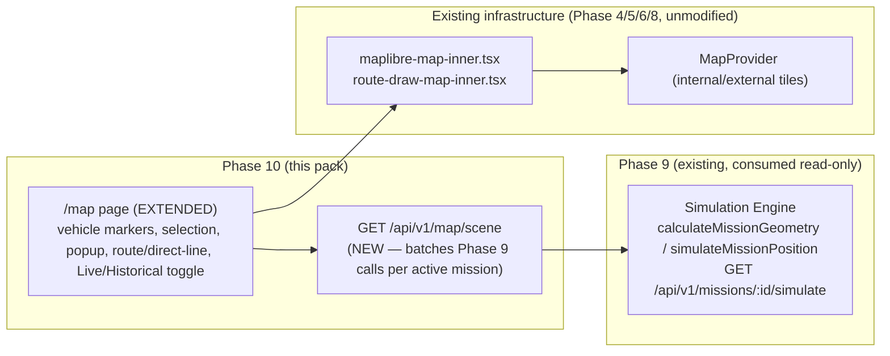
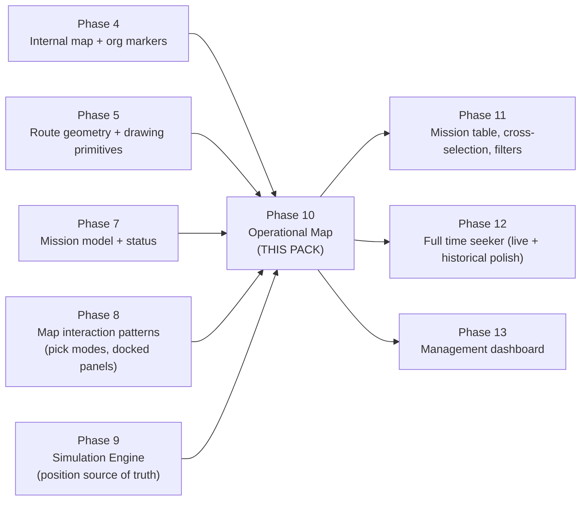

# Phase 10 — Operational Map — Development Pack

**Superseded notice (post-implementation):** the product owner requested direct implementation before this pack's one-document-at-a-time approval process reached `01-SCOPE.md`. Phase 10 shipped based on this file plus the existing binding docs (`docs/IMPLEMENTATION_PLAN.md`, `docs/PROJECT_SPEC.md`, `docs/UX_MAP_AND_DESIGN_SYSTEM.md`), not a completed 16-document pack. This directory is kept as a partial planning artifact and historical record, not a complete binding spec — see `docs/DECISIONS.md` ADR-025 and `docs/PHASE_STATUS.md` Phase 10 for what was actually built. The terminology and objectives below (O1–O7) were followed as written; nothing later in a hypothetical full pack was ever produced or is missing from the shipped implementation.

Status of this document: **Planning artifact.** This directory is a Development Pack produced before any Phase 10 code is written. It is binding for whoever implements Phase 10, the same way `docs/IMPLEMENTATION_PLAN.md` is binding for every other phase. Nothing in this pack has been implemented yet.

**Process note (historical):** this pack was being produced one document at a time, with explicit approval required between documents (per the request that opened this thread). This file (`00-README.md`) is the first and only document produced under that process — see the superseded notice above.

## 1. Purpose

Phase 10 builds the **Operational Map**: the real, production `/map` page extended to show where every active mission's vehicle approximately is, right now or at a chosen past moment — by calling Phase 9's Simulation Engine and rendering its output. Phase 10 owns *presentation only*. It computes nothing about position, distance, ETA, progress, or bearing — Phase 9 already computes all of that, and Phase 10's only job is to ask for it and draw it.

## 2. Objectives

| # | Objective |
|---|---|
| O1 | Extend the existing `/map` page (shipped in Phase 4, extended in Phase 8) to render vehicle markers for missions whose derived status is `WAITING`, `IN_PROGRESS`, or `ARRIVED`, using Phase 9's `MissionSimulationResult` as the only source of position data. |
| O2 | Let a user select a vehicle (from the map) or a mission (from a summary table) and see the other highlight in sync, with a detail popup/card showing mission facts. |
| O3 | Draw the selected mission's route — solid if a real route was used, dashed if Phase 9 reports `isFallbackDirect: true` — and highlight its origin/destination. |
| O4 | Support a Live mode (view time follows the clock) and a Historical mode (view time is pinned to a user-chosen instant), both driving the same Phase 9 calls with a different `viewTime`. |
| O5 | Keep the map usable and honest about approximation: every vehicle position is permanently labeled per `CLAUDE.md`'s vocabulary rules (`نمای زنده محاسباتی` / `موقعیت تقریبی`), never implying real GPS. |
| O6 | Work fully inside an offline LAN — no new external dependency, no CDN asset, using the same internal `MapProvider` mechanism already shipped in Phase 4. |
| O7 | Remain responsive and usable at 360/768/1024/1440px and on touch devices, per `docs/UX_MAP_AND_DESIGN_SYSTEM.md`. |

## 3. Deliverables (preview — finalized in `01-SCOPE.md`)

At a high level, Phase 10 is expected to deliver:

- A lightweight scene-query endpoint (`GET /api/v1/map/scene`, name fixed by `docs/IMPLEMENTATION_PLAN.md`'s own Phase 10 section) that returns, for a given `viewTime` and optional filters, the list of active missions with their Phase-9-computed position already attached — batching what Phase 9 deliberately left as a single-mission call (Phase 9's own `11-OUT_OF_SCOPE.md`, item O9, explicitly assigns this batch endpoint to Phase 10).
- Vehicle markers on the existing `/map` MapLibre instance, positioned from that endpoint's data, with a status ring/badge and a direction indicator.
- Selection state (`selectedMissionId`) shared between the map and a mission summary list, per `docs/UX_MAP_AND_DESIGN_SYSTEM.md` §6's synchronization rule.
- Route/direct-line rendering for the selected mission only (reusing Phase 5's route-drawing primitives read-only, the same pattern already used by Phase 6/8).
- A detail popup/card with mission facts (origin, destination, progress, ETA, vehicle, cargo) sourced entirely from the scene endpoint's payload.
- A minimal Live/Historical toggle sufficient for Phase 10's own acceptance scenario (full time-slider UX — step buttons, scrubbing, playback speed — is Phase 12's job; see `01-SCOPE.md` and `11-OUT_OF_SCOPE.md` for the exact line).

This list is illustrative, not authoritative — `01-SCOPE.md` is the binding IN/OUT boundary.

## 4. Dependencies

### 4.1 Must already exist (verified present in the repository as of this writing)

| Dependency | File(s) | What Phase 10 reuses from it |
|---|---|---|
| Simulation Engine | `src/lib/domain/mission-simulation.ts`, `src/server/services/simulation-service.ts`, `GET /api/v1/missions/:id/simulate` | The **only** source of vehicle position, progress, ETA, bearing, and `isFallbackDirect`. Phase 10 must not reimplement any of this math. |
| Mission display status | `src/lib/domain/mission-rules.ts` (`deriveMissionDisplayStatus`) | Already embedded in every `MissionSimulationResult.status` — Phase 10 reads it, never recomputes it. |
| Internal map rendering | `src/features/map/maplibre-map-inner.tsx`, `map-view.tsx`, `level-styles.ts`, `types.ts` | The existing MapLibre instance, org-unit (office/warehouse) marker rendering, clustering, and the `interactionMode`/`onMarkerSelect`/`onMapPick`/`pinPoint` extension points already added in Phase 8. |
| Route geometry rendering | `src/features/routes/route-draw-map-inner.tsx` | The existing read-only polyline+marker rendering already reused by Phase 6 (shipment preview) and Phase 8 (mission-from-map preview). |
| Map provider abstraction | `src/server/services/map-provider-service.ts`, `GET /api/v1/map-providers/active` | Internal/external tile provider selection — unchanged by Phase 10. |
| Mission data | `src/server/services/mission-service.ts`, `Mission`/`MissionShipment` Prisma models | Static mission facts (code, vehicle identifier, cargo, notes) the detail card needs alongside Phase 9's dynamic position data. |
| UX spec | `docs/UX_MAP_AND_DESIGN_SYSTEM.md` §3, §4, §6, §7, §10, §11 | Binding layout, touch, accessibility, marker, selection-sync, time-seeker, and vocabulary rules — quoted and expanded throughout this pack, not re-litigated. |

### 4.2 Must NOT be touched by Phase 10

- `src/lib/domain/mission-simulation.ts` and `src/server/services/simulation-service.ts` — consumed via their existing exports/endpoint only, never modified, never duplicated.
- `prisma/schema.prisma` — no schema change is expected; see `07-DATABASE.md` for the final word.
- Any dashboard/KPI code (`docs/IMPLEMENTATION_PLAN.md` Phase 13's territory).
- Any mission-table filtering UI beyond what Phase 10's own acceptance scenario needs (full filter panel is Phase 11's job).
- Any advanced time-slider control (playback speed, historical scrubbing polish) beyond a minimal Live/Historical toggle (Phase 12's job).

## 5. Architecture Overview (high level — full detail in `04-ARCHITECTURE.md`)

Phase 10 adds exactly one new server-side data-fetching path (the scene endpoint) and extends one existing client feature (`/map`). It does not introduce a new rendering engine, a new state-management library, or a new map instance — it builds on the MapLibre instance and component patterns already proven across four prior phases.

## 6. Phase Relationship

Phase 10 is the first phase where the product's two previously-separate halves — the *planning* side (Phases 1–8: create org/fleet/routes/shipments/missions) and the *computation* side (Phase 9: where is it now) — become visible together on one screen. Everything after Phase 10 (11, 12, 13) is refinement of this same screen, not a new one.

## 7. Terminology Locked For This Pack

Every subsequent document in this pack (`01-SCOPE.md` onward) must use these terms exactly, with no synonyms invented later. Resolutions of naming conflicts between existing docs are recorded here once, per `ADR.md`'s ADR-P10-01.

| Term used in this pack | Meaning | Source / resolution |
|---|---|---|
| **Operational Map** | The `/map` page, as extended by this phase | English working name for this pack; the shipped Persian UI label stays `نقشه عملیات` (see next row) |
| `نقشه عملیات` | The page's actual H1/nav label in the running app | Shipped since Phase 4, kept unchanged (`src/features/map/map-view.tsx`, `src/components/layout/nav-items.ts`). `docs/PROJECT_SPEC.md` line 256 and `docs/UX_MAP_AND_DESIGN_SYSTEM.md` §11 instead say `نمای پایش` for the same page — this pack treats `نمای پایش` as the *conceptual* name used in prose, and `نقشه عملیات` as the *binding UI string*, to avoid an unnecessary rename of an already-shipped, already-linked-to heading. See ADR-P10-01. |
| **Scene** | The full set of data needed to render the map at one `viewTime`: active missions + their Phase 9 simulation results + any UI-relevant static facts | New term, this pack; matches the endpoint name `GET /api/v1/map/scene` already fixed by `docs/IMPLEMENTATION_PLAN.md` |
| **Vehicle Marker** | The map marker representing one mission's simulated vehicle position | `docs/UX_MAP_AND_DESIGN_SYSTEM.md` §6 |
| **Selection** | The single shared `selectedMissionId` driving map highlight + table highlight + popup | `docs/UX_MAP_AND_DESIGN_SYSTEM.md` §6, "Selection synchronization" |
| **Live mode** | `نمای زنده محاسباتی` — view time tracks the clock | `CLAUDE.md` §5 (banned term list), `docs/UX_MAP_AND_DESIGN_SYSTEM.md` §11 |
| **Historical mode** | `بازسازی زمانی` — view time is pinned by the user | Same |
| **Estimated position** | `موقعیت تقریبی` — the permanent, mandatory qualifier on every rendered vehicle position | `CLAUDE.md` §5, `docs/UX_MAP_AND_DESIGN_SYSTEM.md` §11 |
| **Direct-line mission** | A mission whose `MissionSimulationResult.isFallbackDirect === true` | Phase 9 (`docs/phase-09-simulation-engine/03-DOMAIN.md`) |
| Mission display-status labels | `پیش‌نویس` / `در انتظار حرکت` / `در حال حرکت` / `رسیده` / `لغوشده` / `بایگانی‌شده` | `src/features/missions/status-labels.ts` (Phase 7), reused verbatim — Phase 10 must not invent new status labels |

## 8. What Is Completed After This Phase

After Phase 10 ships:

- Opening `/map` shows, alongside the office/warehouse markers already there since Phase 4, a marker for every vehicle whose mission is currently `WAITING`, `IN_PROGRESS`, or `ARRIVED` — positioned by Phase 9's engine, refreshed on a controlled interval, never persisted per-tick.
- Clicking a vehicle marker (or a row in a minimal mission list) selects that mission, highlights it on both sides, draws its route or direct line, and opens a detail card with the facts a dispatcher needs (origin, destination, progress, ETA, vehicle, cargo).
- A user can flip to Historical mode, pick a past instant, and see the whole scene redraw as it was at that moment — proving Phase 9's determinism guarantee is actually usable end to end, not just true in a unit test.
- Phase 11 (mission table, cross-selection polish, full filters) and Phase 12 (full time-seeker UX) both build directly on top of the `selectedMissionId` state and `/api/v1/map/scene` endpoint this phase establishes, without needing to redesign either.

## 9. Next Step

Awaiting product-owner approval of this document before `01-SCOPE.md` is written.
