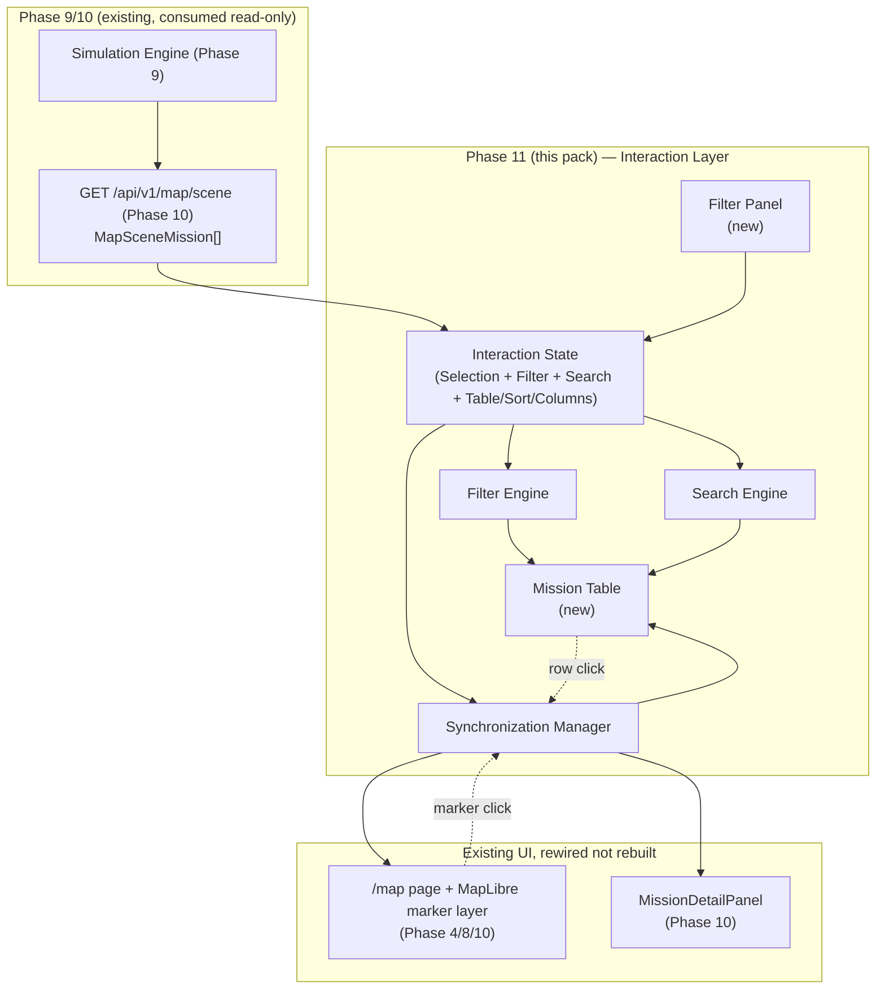
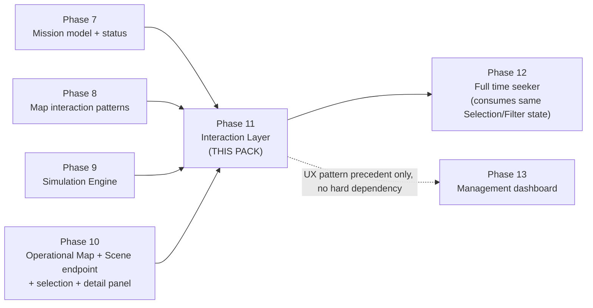

# Phase 11 — Interaction Layer (Mission Table, Selection, Filtering, Search) — Development Pack

**Superseded notice (post-implementation):** as with Phase 10, the product owner requested direct implementation before this pack's one-document-at-a-time process reached `01-SCOPE.md`. Phase 11 shipped based on this file plus the existing binding docs (`docs/IMPLEMENTATION_PLAN.md`, `docs/PROJECT_SPEC.md` §9, `docs/UX_MAP_AND_DESIGN_SYSTEM.md`) and the deferred decisions in §9 below, resolved by the implementer and recorded in `docs/DECISIONS.md` ADR-027. See `docs/PHASE_STATUS.md` Phase 11 for what was actually built. This directory is kept as a partial planning artifact and historical record, not a complete binding spec.

Status of this document: **Planning artifact.** This directory is a Development Pack produced before any Phase 11 code is written. It is binding for whoever implements Phase 11, the same way `docs/IMPLEMENTATION_PLAN.md` is binding for every other phase. Nothing in this pack has been implemented yet.

**Process note (historical):** this pack was being produced one document at a time, with explicit product-owner approval required between documents. This file (`00-README.md`) is the first and only document produced under that process — see the superseded notice above.

**Reading order for the implementation engineer:** this file first, then `01-SCOPE.md` … `13-PROMPT.md` in numeric order, then `ADR.md`, then `FAQ.md`. `13-PROMPT.md` restates this order as the binding implementation prompt — nothing here overrides it.

## 1. Purpose

Phase 10 (shipped) made mission vehicles *visible* on the map: a marker per active mission, positioned by Phase 9's Simulation Engine, with a click-to-select detail popup. It proved the map can show the truth. It did not make the map *usable as a daily workspace* — there is no way today to list every active mission next to the map, filter that list down to "everything headed to Tabriz," search for one mission by tracking code, or keep a table row and a map marker in sync as a single, well-defined "selection."

Phase 11 builds exactly that: the **Interaction Layer**. It is the layer between the human dispatcher and the data Phase 9/10 already compute and render. Phase 11 introduces no new fact about the world — no new position, no new geometry, no new mission field. It only lets the user find, select, filter, sort, and inspect the missions that Phase 10's `GET /api/v1/map/scene` already returns, and keeps every view of that data (map, table, detail panel, filter chips) showing one consistent, deterministic UI state.

Everything in this document and pack must be read against `docs/PROJECT_SPEC.md` §9 ("نمای نقشه"), which is the binding functional spec for the filter list, selection behavior, and map/table sync rules this phase implements, and `docs/UX_MAP_AND_DESIGN_SYSTEM.md` §3/§4/§6, which is the binding layout, touch, accessibility, and synchronization spec. This pack does not restate those documents' authority — it operationalizes them into an implementable design.

## 2. Objectives

| # | Objective |
|---|---|
| O1 | Render a **Mission Table** next to the map (desktop), in a drawer (tablet), or as a bottom sheet (mobile) — one row per mission currently present in Phase 10's Scene (`MapSceneMission[]`), never a separately-fetched dataset. |
| O2 | Replace Phase 10's page-local `selectedMissionId` (`src/features/map/map-view.tsx`) with a shared **Selection** concept that the map, the table, the detail panel, and filter chips all read from and write to — exactly one selection, never two independent ones (`docs/UX_MAP_AND_DESIGN_SYSTEM.md` §6, non-negotiable). |
| O3 | Rewire Phase 10's existing `MissionDetailPanel` to the new Selection state without changing its visual contract or props shape more than strictly necessary — it is reused, not rebuilt. |
| O4 | Implement the full filter set fixed by `docs/PROJECT_SPEC.md` §9: origin, destination, vehicle type, display status, start-time before/after, ETA before/after, free-text search (mission code / shipment / vehicle identifier), and "only missions active at the current view time." |
| O5 | Support setting an origin or destination filter directly from a map marker's context menu (`docs/PROJECT_SPEC.md` §9's "context menu مبدأ/مقصد" requirement), in addition to the filter panel form. |
| O6 | Provide **Quick Search** (single query box, same free-text fields as O4) and **Advanced Search** (structured multi-field form combining several filters at once) as two entry points to the same underlying filter/search engine — not two separate engines. |
| O7 | Provide deterministic, stable **sorting** on the table's columns (start time, ETA, progress, status, vehicle identifier), with a documented tie-break rule so re-sorting never silently reorders equal rows. |
| O8 | Keep the table usable and responsive as the active-mission count grows, via pagination and/or virtualization (`docs/IMPLEMENTATION_PLAN.md` Phase 11: "scroll/virtualization برای تعداد زیاد") — without ever hiding the currently-selected row from view when it is filtered out or paged away (exact rule defined in `02-REQUIREMENTS.md`). |
| O9 | Let the user configure which table columns are visible and save a named combination of filters + sort + visible columns as a **Saved View** for later reuse in the same session (cross-session persistence is a `07-DATABASE.md` decision, not assumed here). |
| O10 | Support full **keyboard navigation** (row-to-row, select, clear selection, close panel/sheet) and correct **focus management** across map, table, filter panel, and mobile sheets, per `docs/UX_MAP_AND_DESIGN_SYSTEM.md` §4. |
| O11 | Support **touch** interaction patterns distinct from desktop click/hover: tap-to-select, and an explicit rule for what (if anything) double-tap/double-click does, on top of the bottom-sheet/drawer patterns already fixed by `docs/UX_MAP_AND_DESIGN_SYSTEM.md` §3. |
| O12 | Keep map auto-focus and highlight behavior exactly as `docs/UX_MAP_AND_DESIGN_SYSTEM.md` §6 already specifies (row → marker highlight + short pan/zoom; marker → row highlight + scroll-into-view) — Phase 11 formalizes and implements this rule, it does not renegotiate it. |
| O13 | Meet `docs/UX_MAP_AND_DESIGN_SYSTEM.md` §4's accessibility bar: `aria-live` announcements on filter/selection change, full contrast/label compliance, and no information conveyed by color alone. |
| O14 | Keep everything in this phase **fully client-side against already-fetched Scene data** wherever functionally possible — filtering, search, and sort must not fire a new network request per keystroke — consistent with `CLAUDE.md` §2's no-operational-internet-dependency rule and Phase 10's existing 5-second polling model. |
| O15 | Preserve Phase 8's mission-creation-mode behavior untouched: while the map is in "ساخت مأموریت از نقشه" mode, vehicles (and therefore the table Phase 11 adds) must stay hidden/inert exactly as Phase 10 already implemented, to avoid click and layout conflicts. |

## 3. Deliverables (preview — finalized in `01-SCOPE.md`)

At a high level, Phase 11 is expected to deliver:

- A **Mission Table** component embedded in the `/map` page's layout (aside on desktop, drawer on tablet, bottom sheet on mobile), rendering `MapSceneMission` rows with sortable columns and a progress indicator per row.
- A shared **interaction state** (Selection + Filter + Search + Table/column/sort state) that both the existing map (`maplibre-map-inner.tsx`, `map-view.tsx`) and the new table read and write, replacing Phase 10's page-local `selectedMissionId` `useState`.
- A **Filter Panel** (collapsible on desktop, drawer on tablet, full-screen sheet on mobile, per `docs/UX_MAP_AND_DESIGN_SYSTEM.md` §3) implementing every filter in Objective O4, an active-filter chip row, and a one-action reset.
- A **context menu** on origin/destination markers that applies the corresponding filter.
- **Quick Search** and **Advanced Search** UI, both operating over the same in-memory Scene data.
- **Column configuration** and **Saved Views**, scoped for this session at minimum (persistence tier decided in `07-DATABASE.md`).
- Keyboard, focus, and touch handling for the table and filter panel, and the accessibility affordances Objective O13 requires.
- Updated automated tests (unit + e2e) covering selection sync, every filter and filter combination rule, search, sort, and the responsive/keyboard/touch behaviors above.

This list is illustrative, not authoritative — `01-SCOPE.md` is the binding IN/OUT boundary.

## 4. Dependencies

### 4.1 Must already exist (verified present in the repository as of this writing)

| Dependency | File(s) | What Phase 11 reuses from it |
|---|---|---|
| Scene data source | `src/server/services/map-scene-service.ts`, `GET /api/v1/map/scene`, `src/features/map/types.ts` (`MapSceneMission`, `MapScene`), `src/features/map/use-map-queries.ts` (`useMapScene`, 5s `refetchInterval`) | The **only** data source for the Mission Table and every filter/search/sort operation. Phase 11 must not add new position, distance, ETA, or bearing computation — it consumes fields already on `MapSceneMission` (`status`, `progressRatio`, `startAt`, `estimatedArrivalAt`, `remainingSeconds`, `originTitle`, `destinationTitle`, `vehicleTypeName`, `vehicleIdentifier`, `code`, `isFallbackDirect`, `cargoTypeNames`, `shipmentCount`). |
| Map workspace + existing selection | `src/features/map/map-view.tsx` (`selectedMissionId`, `selectedMission`, `selectedRoutePreview` `useMemo`s), `src/features/map/maplibre-map-inner.tsx` (`onVehicleSelect` prop, vehicle marker click handling) | The existing, working selection wiring built in Phase 10. Phase 11 generalizes *where this state lives* (see §9 below) but must preserve the exact external contract: a vehicle marker click still resolves to one `missionId`, still drives route/direct-line preview, still opens the detail panel. |
| Details Panel | `src/features/map/mission-detail-panel.tsx` (`MissionDetailPanel`) | Reused verbatim as the "Details Panel" required by this phase's objectives — its props (`mission`, `onClose`, `onViewFullDetails`) already match what a Selection-driven table needs; Phase 11 rewires its data source, not its markup. |
| Mission display-status vocabulary | `src/features/missions/status-labels.ts` (`missionDisplayStatusLabel`, `missionDisplayStatusTone`), `src/features/missions/types.ts` (`MissionDisplayStatusValue`) | Reused verbatim for table badges, the status filter's options, and the legend — Phase 11 must not invent new status labels or tones. |
| Reusable drawer/sheet primitive | `src/components/ui/sheet.tsx` (Phase 2) | The existing, already-shipped primitive for the tablet drawer / mobile full-screen sheet patterns `docs/UX_MAP_AND_DESIGN_SYSTEM.md` §3 requires for the table and filter panel — a new sheet/drawer component must not be built from scratch. |
| Filter/search UI precedent | `src/features/missions/missions-list-view.tsx` (query box + status `<select>`, `/missions` page), `src/features/organization/organization-tree-view.tsx` (client-side name/code search) | Existing, shipped UX conventions for search inputs and filter controls in this codebase. Phase 11 follows the same visual/interaction idiom for consistency, but operates on a different, smaller, already-in-memory dataset (Scene, refreshed every 5s) rather than `/missions`' paginated server-side list — the two tables are not the same component and must not be merged (see `01-SCOPE.md`). |
| Binding functional/UX specs | `docs/PROJECT_SPEC.md` §2 ("زمان مشاهده" / View Time is an official domain term), §9 ("نمای نقشه" — fixed components, behavior, filter list), `docs/UX_MAP_AND_DESIGN_SYSTEM.md` §3, §4, §6; `docs/IMPLEMENTATION_PLAN.md` Phase 11 section | Binding requirement sources, quoted and expanded throughout this pack, not re-litigated. |
| Reference mockups | `docs/mockups/06-operations-map-desktop.png`, `docs/mockups/02-map-mobile.png` (see `docs/mockups/README.md`) | Visual reference for the desktop side-table-with-map layout and the mobile bottom-sheet mission list; not pixel-binding, but directionally authoritative per `docs/UX_MAP_AND_DESIGN_SYSTEM.md`'s own precedence note. |

### 4.2 Must NOT be touched by Phase 11

- `src/lib/domain/mission-simulation.ts`, `src/server/services/simulation-service.ts`, and `src/server/services/map-scene-service.ts`'s position/geometry logic — Phase 11 consumes `GET /api/v1/map/scene`'s existing response shape; whether filtering happens client-side against that response or via new server-side query parameters is an open question resolved in `04-ARCHITECTURE.md` (§9 below), but no mission-position math is added either way.
- `src/features/map/maplibre-map-inner.tsx`'s marker-rendering internals (SVG construction, MapLibre `Marker` lifecycle, route-line layer) — Phase 11 may add or adjust props for highlight/pan triggers, it must not rewrite how markers are drawn.
- `src/features/missions/missions-list-view.tsx` and the standalone `/missions` page — a different page, a different dataset (all `MissionPersistedStatusValue` values via server pagination, not just `SCHEDULED`/Scene). Out of scope; see `01-SCOPE.md` and `11-OUT_OF_SCOPE.md`.
- Any full time-slider control (playback, scrubbing polish, Live/Historical toggle UI) — Phase 12's job. Phase 11's filters may reference the *current* `viewTime` the map is already using (via the existing `useMapScene(viewTime?)` hook signature), but does not build time controls.
- Any dashboard/KPI code — Phase 13's territory.
- Mission creation, editing, cancellation, or duplication flows (Phases 7/8) — Phase 11 is read/select/filter only; the table has no create/edit/delete affordance.

## 5. Architecture Overview (high level — full detail in `04-ARCHITECTURE.md`)

Phase 11 adds no new server-side computation path. It adds one client-side state layer (Interaction State, with its Filter/Search/Sync sub-parts) and one new UI surface (the Mission Table + Filter Panel), and rewires two existing UI surfaces (the map's selection trigger, the Details Panel) to read from that shared state instead of `map-view.tsx`'s local `useState`.

## 6. Phase Relationship

Phase 11 is the phase where the Operational Map stops being a single interactive screen and becomes a *filterable, searchable workspace* — the thing a dispatcher actually keeps open all day. Phase 12 (full time-seeker UX) and Phase 13 (dashboard) both build on top of this phase's Interaction State and Mission Table without needing to redesign either.

## 7. Terminology Locked For This Pack

Every subsequent document in this pack (`01-SCOPE.md` onward) must use these terms exactly, with no synonyms invented later.

### 7.1 Reused verbatim from prior phases — not redefined here

| Term | Meaning | Source |
|---|---|---|
| **Scene** | The full Phase 10 dataset for one `viewTime`: active missions + their Phase 9 simulation results | `docs/phase-10-operational-map/00-README.md` §7 |
| **View Time** (`زمان مشاهده`) | The instant the map/table reconstruct mission state for — now (Live) or a chosen past instant (Historical) | `docs/PROJECT_SPEC.md` §2 — an official domain term, not a Phase 10/11 invention |
| **Vehicle Marker** | The map marker representing one mission's simulated vehicle position | `docs/UX_MAP_AND_DESIGN_SYSTEM.md` §6 |
| **Estimated position** (`موقعیت تقریبی`) | The permanent, mandatory qualifier on every rendered vehicle position | `CLAUDE.md` §5 |
| **Live mode** / **Historical mode** | View time tracks the clock / view time is pinned by the user | `docs/phase-10-operational-map/00-README.md` §7 |
| **Direct-line mission** | A mission whose `MissionSimulationResult.isFallbackDirect === true` | `docs/phase-09-simulation-engine/03-DOMAIN.md` |
| Mission display-status labels | `پیش‌نویس` / `در انتظار حرکت` / `در حال حرکت` / `رسیده` / `لغوشده` / `بایگانی‌شده` | `src/features/missions/status-labels.ts` |

### 7.2 New terms this pack defines (full definitions in `03-DOMAIN.md`)

| Term | Meaning (one-line preview; binding definition in `03-DOMAIN.md`) |
|---|---|
| **Mission Row** | The Mission Table's per-mission unit — a `MapSceneMission` plus table-only derived fields (is it selected, is it filtered-out-but-selected, its sort key). |
| **Selection** | The single shared "which `missionId`, if any, is currently selected" fact, now owned by the Interaction State rather than `map-view.tsx` local state. |
| **Selection Context** | The piece of Interaction State (and its read/write API) holding Selection and the highlight flags derived from it. |
| **Filter Context** | The active set of filter predicates (origin, destination, vehicle type, status, time ranges, "active at view time") currently applied to the Scene. |
| **Filter Group** | A named cluster of related filter predicates (e.g., all time-range filters) used to define the AND/OR combination rule precisely in `02-REQUIREMENTS.md`. |
| **Search Context** | The active Quick Search query and/or Advanced Search field values, and which mode is active. |
| **Table State** | Sort column/direction, visible/hidden columns, and pagination/virtualization window — everything about *how the table is currently displayed*, independent of *which rows exist*. |
| **Interaction State** | The umbrella state object combining Selection Context + Filter Context + Search Context + Table State for the whole Operational Map screen. |
| **Highlight State** | Derived (never separately stored) flags — is this row/marker selected, hovered, or filtered-out — computed from Interaction State + Scene on every render. |
| **Saved View** | A named, reusable combination of Filter Context + Search Context + Table State. |
| **Active Filter Chip** | The dismissible UI token shown per active filter predicate, per `docs/PROJECT_SPEC.md` §9. |
| **Context Menu Filter** | A filter predicate applied by right-click/long-press on a map marker rather than through the Filter Panel form, per `docs/PROJECT_SPEC.md` §9. |

## 8. What Is Completed After This Phase

After Phase 11 ships:

- Opening `/map` shows the same vehicle markers Phase 10 already renders, now with a Mission Table beside/under the map listing every one of them, kept in exact sync with the map through one shared Selection.
- Clicking a table row or a map marker produces the same, deterministic result either way: that mission highlighted on both surfaces, the map panned/zoomed to it, its route or direct-line drawn, and its Details Panel open.
- A dispatcher can narrow the table (and, implicitly, which markers are emphasized) to "everything from this warehouse," "everything overdue," or "the truck with tracking code X," using either the filter panel, a map marker's context menu, or the search box — and see that filter as a removable chip.
- The table stays usable with a large active fleet through sorting, column configuration, and virtualization/pagination, without ever silently losing the current selection from view.
- Phase 12 (full time-seeker) and Phase 13 (dashboard) both build directly on the Interaction State and Mission Table this phase establishes, without needing to redesign either.

## 9. Open Architectural Questions For `04-ARCHITECTURE.md`

This `00-README.md` intentionally does not resolve these — they are real design decisions, not oversights, and each gets a full `ADR-P11-xx` entry in `ADR.md` once `04-ARCHITECTURE.md` has laid out the options:

1. **Where does Interaction State live?** Lifted out of `map-view.tsx` into a dedicated module (React Context, a custom hook, or a small client-state store) versus keeping it page-local but passed down further. `map-view.tsx` is already the single consumer of Phase 10's `selectedMissionId`; Phase 11 adds three more pieces of related state (filter, search, table) to the same screen, which is the point at which prop-drilling typically stops scaling.
2. **Client-side vs. server-side filtering.** The Scene is already fetched wholesale every 5 seconds (Phase 10). Default assumption for this pack is that filtering, search, and sort happen entirely client-side against the already-fetched `MapSceneMission[]`, per Objective O14 — but this needs a documented complexity/dataset-size argument, not just an assumption, especially for the "active at view time" and Historical-mode filter cases.
3. **Saved View persistence tier.** Session-only (in-memory/`sessionStorage`) versus `localStorage` versus a real DB-backed `UserPreference`-style table. `07-DATABASE.md` makes the final call; this pack's minimum bar (Objective O9) is session-only.
4. **Table implementation approach.** A plain semantic `<table>` with manual virtualization (consistent with `missions-list-view.tsx`'s existing no-heavy-dependency pattern) versus introducing a table/virtualization library as a new `package.json` dependency. Every prior phase has stayed dependency-light by deliberate precedent; adding a new library is a decision this pack must justify explicitly, not default into.

## 10. Next Step

Awaiting product-owner approval of this document before `01-SCOPE.md` is written.
