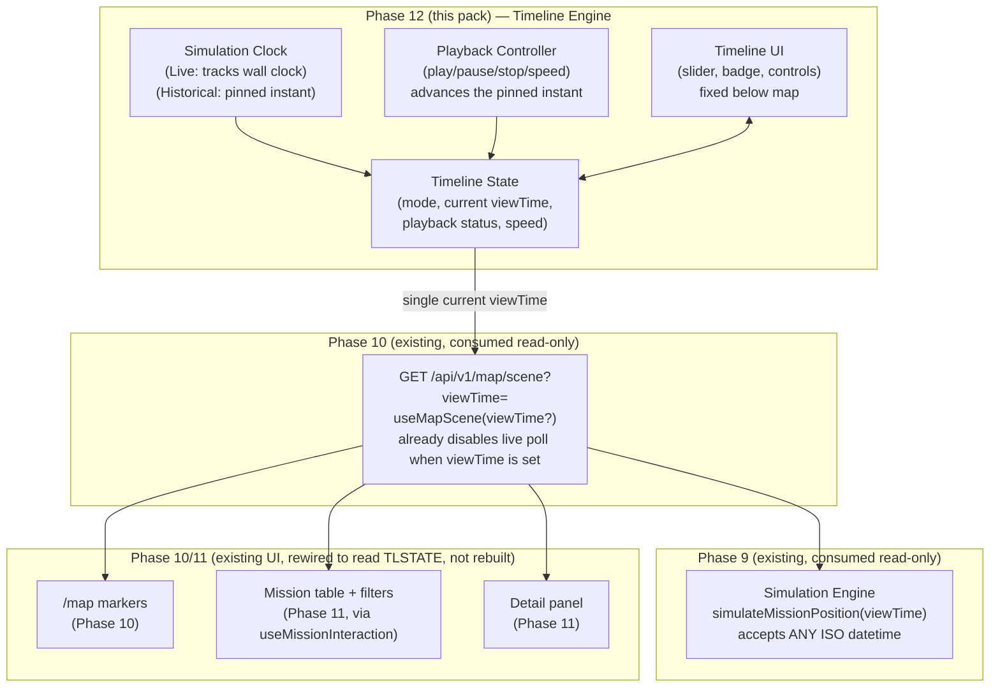
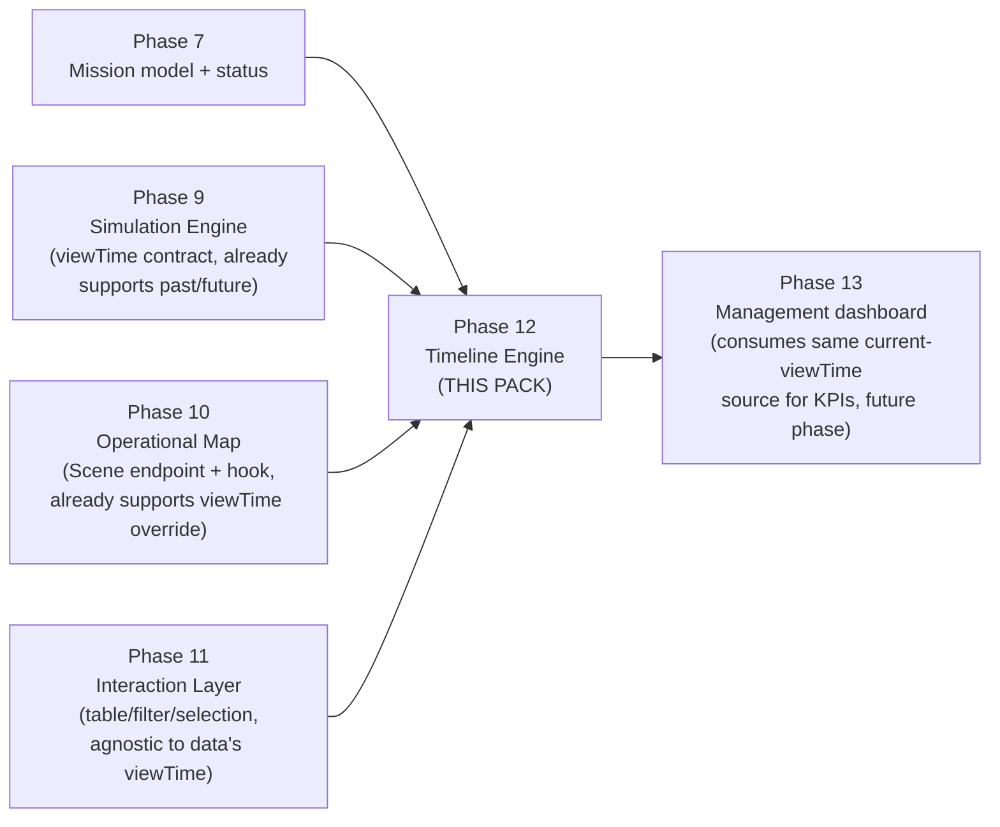

# Phase 12 — Timeline Engine (Live/Historical Playback & Time Synchronization) — Development Pack

**Superseded notice (post-implementation):** the product owner requested direct implementation before this pack's one-document-at-a-time approval process reached `01-SCOPE.md`. Phase 12 shipped based on this file plus the existing binding docs (`docs/IMPLEMENTATION_PLAN.md`, `docs/PROJECT_SPEC.md`, `docs/UX_MAP_AND_DESIGN_SYSTEM.md`), not a completed 16-document pack. This directory is kept as a partial planning artifact and historical record, not a complete binding spec — see `docs/DECISIONS.md` ADR-028 (which resolves the five Open Architectural Questions in §9 below, plus one additional correctness fix found during regression testing) and `docs/PHASE_STATUS.md` Phase 12 for what was actually built. The terminology and objectives below were followed as written; nothing later in a hypothetical full pack was ever produced or is missing from the shipped implementation.

Status of this document: **Planning artifact.** This directory is a Development Pack produced before any Phase 12 code is written. It is binding for whoever implements Phase 12, the same way `docs/IMPLEMENTATION_PLAN.md` is binding for every other phase. Nothing in this pack has been implemented yet.

**Process note (historical):** this pack was being produced one document at a time, with explicit product-owner approval required between documents. This file (`00-README.md`) is the first and only document produced under that process — see the superseded notice above.

**Reading order for the implementation engineer:** this file first, then `01-SCOPE.md` … `13-PROMPT.md` in numeric order, then `ADR.md`, then `FAQ.md`. `13-PROMPT.md` restates this order as the binding implementation prompt — nothing here overrides it.

## 1. Purpose

Phase 10 gave the Operational Map a window into *now*: every vehicle marker is positioned by calling Phase 9's Simulation Engine with `viewTime = the current instant`, refreshed every 5 seconds. Phase 11 turned that single screen into a daily workspace — a mission table, filters, search — but every one of those features still only ever looks at *now*. In the shipped code today, `map-view.tsx` calls `useMapScene()` with **no argument**, which silently means "Live, forever." There is no way, right now, for a dispatcher to ask "where was this vehicle 20 minutes ago?" or "what will the fleet look like at 18:00 if nothing changes?" — even though the answer is one function call away.

That function call already exists. Phase 9's `simulateMissionPosition()` has accepted an arbitrary `viewTime` — past, present, or future — since the day it shipped, with a validation schema (`src/lib/validation/simulation.ts`) that places **no range restriction** on it at all. Phase 9's own `11-OUT_OF_SCOPE.md` (§8, "Historical Position Seeker / Timeline Scrubber") explicitly named this exact gap and explicitly assigned it here: *"each scrub position is just another `viewTime` passed to `simulateMissionPosition()`; it has zero engine-level implications and is explicitly a later phase's UI work."* Phase 10's own batch endpoint, `GET /api/v1/map/scene`, and its client hook, `useMapScene(viewTime?: string)`, were built the same way — the optional parameter and the logic to disable live polling when it is set (`refetchInterval: viewTime ? false : 5000`) are already sitting in `src/features/map/use-map-queries.ts`, unused by any caller.

Phase 12 is the phase that finally drives that parameter. It builds the **Timeline Engine**: a self-contained clock-and-playback subsystem whose entire output is a single value — *what instant is the application currently looking at* — plus enough state (mode, playback status, speed) to render the control that lets a human pick that instant. It computes no position, draws no marker, and owns no simulation math. It is a **time decision and distribution layer**, sitting between the user and the read-only interfaces Phases 9, 10, and 11 already expose.

This document and the rest of this pack must be read against `docs/PROJECT_SPEC.md` §2 (`زمان مشاهده` / **View Time** is an official, pre-existing domain term — not a Phase 12 invention) and §10 ("سیکر زمان" — the binding functional spec for Live/Historical behavior, controls, and acceptance criteria), and `docs/UX_MAP_AND_DESIGN_SYSTEM.md` §7 (binding layout/interaction spec for the seeker control) and §11 (locked vocabulary: `نمای زنده محاسباتی` for Live, `بازسازی زمانی` for Historical — already shipped verbatim in Phase 10's map badge). This pack operationalizes those documents; it does not re-litigate them.

## 2. Goals

| # | Goal |
|---|---|
| G1 | **Live Mode**: `viewTime` tracks the real clock automatically with drift control (`PROJECT_SPEC.md` §10, "کنترل drift"). This is not a new behavior to build from nothing — it is the *existing*, shipped, default behavior of Phase 10/11 (`useMapScene()` with no argument), which this phase formalizes as one named mode of a larger state machine rather than "the only thing the app can do." |
| G2 | **Historical Mode**: the user can pin `viewTime` to any Jalali date/time — past **or** future (Phase 9's engine already status-clamps correctly in both directions: pre-departure `WAITING`, in-flight `IN_PROGRESS`, arrived `ARRIVED`, and frozen `CANCELLED`/`ARCHIVED` snapshots, per `mission-simulation.ts`) — via slider drag, ±5/±15-minute step buttons, or direct time entry, and see the *entire* scene (map markers **and** Phase 11's mission table, together, from the same value) redraw for that instant. |
| G3 | **Playback**: Play / Pause / Resume / Stop / Replay, at a selectable speed (0.25×, 0.5×, 1×, 2×, 4×, 8×), that auto-advances `viewTime` along a client-side interval. This is still, structurally, nothing more than "call `useMapScene(viewTime)` with a rapidly-changing `viewTime` string" — no new poll target, no new backend behavior. |
| G4 | **One-step return to Live**: a single, always-reachable, always-visible action that exits Historical/Playback and resumes clock-tracking — per `PROJECT_SPEC.md` §10 ("بازگشت به Live یک action یک‌مرحله‌ای باشد") and the Phase 0 prototype's own `بازگشت به اکنون` button precedent (`src/components/map/time-seeker.tsx` — visual precedent only, see §4.1). |
| G5 | **Universal synchronization**: every current consumer of Scene data — Phase 10's map markers, Phase 11's mission table and detail panel, and (in a later phase) Phase 13's dashboard KPIs — reads the *same* current `viewTime` from *one* source. This generalizes Phase 11's own non-negotiable rule ("one shared `selectedMissionId`," `docs/UX_MAP_AND_DESIGN_SYSTEM.md` §6) to "one shared current `viewTime`." Two independent time states are as forbidden here as two independent selections were in Phase 11. |
| G6 | **Unambiguous mode indication**: a permanent, impossible-to-miss badge distinguishing Live from Historical, using the exact locked terms (`نمای زنده محاسباتی` / `بازسازی زمانی`), extending — not replacing — the badge Phase 10 already renders over the map. |
| G7 | **Zero new network dependency**: per `CLAUDE.md` §2, Phase 12 must not introduce any new outbound call. It only changes *which* `viewTime` value is sent to the *already-existing* internal endpoint (`GET /api/v1/map/scene`). No new endpoint, no new provider, no new poll target. |
| G8 | **Accessibility & responsiveness**: the slider must be fully keyboard-operable (arrow keys, Home/End at minimum) and fully touch-operable (drag, tap step buttons), and the control's layout must satisfy `UX_MAP_AND_DESIGN_SYSTEM.md` §7 (fixed below the map; no overlap with the attribution control or the mobile safe area) across 360–1440px. |
| G9 | **`prefers-reduced-motion` compliance**: any smooth interpolation of vehicle position between playback ticks must be disabled or shortened when the user has this OS-level preference set — an explicit requirement of `UX_MAP_AND_DESIGN_SYSTEM.md` §7. |
| G10 | **Clean extension points**: the Timeline Engine's public interface must not need a shape change to eventually support multi-day playback, mission-history recording, time bookmarks, playback recording, collaborative playback, or event-timeline overlays. All six are explicitly *out of this phase* (per the instructions that opened this thread) — but the boundary must not accidentally block them. See §9 and `11-OUT_OF_SCOPE.md` (once written) for the specific interface implications. |

## 3. Deliverables (preview — finalized in `01-SCOPE.md`)

At a high level, Phase 12 is expected to deliver:

- A Timeline Engine client module (exact shape decided in `03-DOMAIN.md`/`04-ARCHITECTURE.md`; expected to follow the same pattern Phase 11 already established with `useMissionInteraction` — a single hook/controller owning Live/Historical mode, playback state, speed, and the current `viewTime`) that is the *one* source every Scene consumer reads from.
- A Timeline control UI, fixed below the map per `UX_MAP_AND_DESIGN_SYSTEM.md` §7: mode badge, play/pause, step back/forward, Jalali date+time display/entry, a draggable slider, a speed selector, and a "بازگشت به اکنون" action.
- The one-line wiring change this whole phase exists to make possible: `map-view.tsx`'s `useMapScene()` becomes `useMapScene(timelineEngine.viewTimeParam)` — and nothing downstream of that (Phase 10's marker rendering, Phase 11's table/filter/selection hook) needs to change shape, because both already just consume whatever `MapSceneMission[]` they're handed.
- An additive Historical-mode indicator alongside Phase 10's existing `نمای زنده محاسباتی` map badge.
- Unit tests for the pure clock/playback-tick arithmetic and e2e tests for mode switching, slider drag, play/pause/speed changes, and return-to-Live — see `08-TESTS.md`.

This list is illustrative, not authoritative — `01-SCOPE.md` is the binding IN/OUT boundary.

## 4. Dependencies

### 4.1 Must already exist (verified present in the repository as of this writing)

| Dependency | File(s) | What Phase 12 reuses from it |
|---|---|---|
| Simulation Engine `viewTime` contract | `src/lib/domain/mission-simulation.ts`, `src/server/services/simulation-service.ts`, `GET /api/v1/missions/:id/simulate?viewTime=`, `src/lib/validation/simulation.ts` | Accepts **any** ISO-8601 datetime already — verified: `simulateQuerySchema` places no min/max/range constraint on `viewTime` at all. Status-aware clamping (pre-departure `WAITING`, in-flight `IN_PROGRESS`, arrived `ARRIVED`, frozen `CANCELLED`/`ARCHIVED`) already works correctly for both past and future `viewTime`. Phase 12 must not modify this file — it is consumed exclusively through the already-shipped interfaces below. |
| Scene batch endpoint + hook | `src/server/services/map-scene-service.ts`, `GET /api/v1/map/scene?viewTime=`, `src/features/map/use-map-queries.ts`'s `useMapScene(viewTime?: string)` | Already supports an optional `viewTime` override that **disables** the 5-second live poll the instant it is set (`refetchInterval: viewTime ? false : 5000`). This is the exact mechanism Historical Mode and Playback both drive. Phase 12 adds the state and UI that *decides what string to pass*, not the plumbing itself — no change to this hook's signature is expected. |
| Mission table, detail panel, selection | `src/features/map/operational-mission-table.tsx`, `src/features/map/mission-detail-panel.tsx`, `src/features/map/use-mission-interaction.ts` (Phase 11) | All three consume whatever `MapSceneMission[]` (and the derived `selectedMissionId`) they are handed, with zero awareness of whether that data came from a Live poll or a pinned Historical `viewTime`. No interface change is expected in any of these files. |
| Map marker rendering | `src/features/map/maplibre-map-inner.tsx` (Phase 10) | Renders whatever `vehicles` prop it receives — same agnosticism as the table. No interface change expected. |
| Jalali date utilities | `src/lib/dates/jalali.ts` (`jalaliToUtcIso`, `utcIsoToJalali`, `jalaliMonthNames`), `src/components/ui/jalali-datetime-input.tsx` (Phase 7) | Reused for the Historical Mode date/time display and direct-entry control. Phase 12 must not reimplement Jalali↔Gregorian conversion; per `CLAUDE.md` §2, all Jalali conversion happens only at this existing boundary. |
| Locked terminology | `docs/UX_MAP_AND_DESIGN_SYSTEM.md` §11 | `نمای زنده محاسباتی` (Live), `بازسازی زمانی` (Historical) — already rendered verbatim in Phase 10's shipped map badge (`src/features/map/map-view.tsx`). Phase 12 extends this badge; it does not rename or duplicate the terms. |
| Binding functional/UX specs | `docs/PROJECT_SPEC.md` §2 (View Time definition), §10 ("سیکر زمان" — Live/Historical controls, 24h initial range, badge, one-step return); `docs/UX_MAP_AND_DESIGN_SYSTEM.md` §7 (seeker layout/interaction), §11 (vocabulary); `docs/IMPLEMENTATION_PLAN.md` Phase 12 section | Binding requirement sources, quoted and expanded throughout this pack, not re-litigated. |
| Visual precedent — **not code reuse** | `src/components/map/time-seeker.tsx`, `src/demo/fixtures.ts` (`timeSeekerHours`, `timeSeekerCurrentPercent`) — Phase 0 prototype | A fully decorative, fixture-driven demo component: play/pause icon toggle, Live/Historical badge, a fake 0–100% progress bar animated by a bare `setInterval`, static hour-label ticks, and a "بازگشت به اکنون" reset button. It establishes the intended **visual language only** — it contains zero real time logic (its "playback" loops a percentage, not a `Date`) and must not be imported, wrapped, or extended. Phase 12 builds a real component from scratch against real `viewTime` values, following this component's layout/interaction *shape*, not its code. |
| Reference mockups | `docs/mockups/06-operations-map-desktop.png`, `docs/mockups/02-map-mobile.png` (see `docs/mockups/README.md`, both explicitly tagged "Phase 12") | Visual reference for the desktop time-seeker bar below the map and the mobile two-row touch-friendly seeker; directionally authoritative per `UX_MAP_AND_DESIGN_SYSTEM.md`'s own precedence note, not pixel-binding. |

### 4.2 Must NOT be touched by Phase 12

- `src/lib/domain/mission-simulation.ts`, `src/server/services/simulation-service.ts`, `src/server/services/map-scene-service.ts` — Phase 12 supplies a different `viewTime` *input* to these existing call paths; it adds no new computation and changes no existing computation.
- `src/features/map/maplibre-map-inner.tsx`'s marker-rendering internals, `src/features/map/operational-mission-table.tsx` / `mission-filter-panel.tsx`'s filter/sort/search logic (Phase 11) — Phase 12 changes *when* the data being rendered/filtered was computed for, never *what* is rendered or how it is filtered.
- Any dashboard/KPI code — Phase 13's territory, though Phase 13 is expected to later consume the same current-`viewTime` source this phase establishes (see §6).
- Mission creation, editing, or the mission-creation-mode map interaction (Phases 7/8) — while mission-creation mode is active, the map already hides vehicle markers entirely (Phase 10/11); Phase 12 must preserve that and additionally ensure Playback cannot run concurrently with mission-creation mode (see `02-REQUIREMENTS.md`).
- Any filtering/search/sort logic (Phase 11) — explicitly out of scope per this phase's brief; the Timeline Engine and the Interaction Layer are peers that both feed `map-view.tsx`, not layers one inside the other.

## 5. Architecture Overview (high level — full detail in `04-ARCHITECTURE.md`)

Phase 12 adds **no new server-side computation path and no new endpoint**. It adds one client-side state/UI layer (the Timeline Engine) that decides the single input value (`viewTime`) already accepted by Phase 10's existing data-fetching hook. Everything visually downstream of that hook — markers, table, detail panel — is unchanged code that simply starts receiving data computed for a different instant than "always now."

## 6. Phase Relationship

Phase 12 is the phase where the Operational Map stops being a window onto only "right now" and becomes a window onto *any* moment the underlying data supports — a capability Phase 9 built in from day one and Phase 10 wired a hook for, but which no UI has driven until this phase. Phase 13 (dashboard) is expected to be a second, independent consumer of the same current-`viewTime` source this phase establishes, without needing the Timeline Engine's internals to change.

## 7. Terminology Locked For This Pack

Every subsequent document in this pack (`01-SCOPE.md` onward) must use these terms exactly, with no synonyms invented later.

### 7.1 Reused verbatim from prior phases — not redefined here

| Term | Meaning | Source |
|---|---|---|
| **View Time** (`زمان مشاهده`) | The instant the map/table reconstruct mission state for | `docs/PROJECT_SPEC.md` §2 — an official domain term, predates this phase |
| **Scene** | The full Phase 10 dataset for one `viewTime`: active missions + their Phase 9 simulation results | `docs/phase-10-operational-map/00-README.md` §7 |
| **Estimated position** (`موقعیت تقریبی`) | The permanent, mandatory qualifier on every rendered vehicle position | `CLAUDE.md` §5 |
| **Live mode** (`نمای زنده محاسباتی`) | View Time tracks the clock | `docs/UX_MAP_AND_DESIGN_SYSTEM.md` §11, already shipped in Phase 10 |
| **Historical mode** (`بازسازی زمانی`) | View Time is pinned by the user | `docs/UX_MAP_AND_DESIGN_SYSTEM.md` §11, already shipped as a term (not yet as a reachable UI state) in Phase 10 |
| **Selection** | The single shared `selectedMissionId` driving map/table/panel highlight | `docs/phase-11-interaction-layer/00-README.md` §7.2 |
| Mission display-status labels | `پیش‌نویس` / `در انتظار حرکت` / `در حال حرکت` / `رسیده` / `لغوشده` / `بایگانی‌شده` | `src/features/missions/status-labels.ts` (Phase 7) |

### 7.2 New terms this pack defines (full definitions in `03-DOMAIN.md`)

| Term | Meaning (one-line preview; binding definition in `03-DOMAIN.md`) |
|---|---|
| **Timeline Engine** | The umbrella subsystem (clock + playback controller + state + UI) this phase builds; the single authority for "what View Time is the app currently showing." |
| **Simulation Clock** | The component deciding the current View Time in Live mode (tracks wall clock, with drift correction) versus Historical mode (holds a pinned value until moved). |
| **Playback Controller** | The component that, when Playing, advances the pinned View Time along a wall-clock interval scaled by Playback Speed. |
| **Playback State** | One of: `stopped`, `playing`, `paused` — the Playback Controller's own state machine, independent of but interacting with Live/Historical mode (see `02-REQUIREMENTS.md` for the exact interaction rules). |
| **Playback Speed** | A multiplier (0.25×, 0.5×, 1×, 2×, 4×, 8×) applied to how fast Playback advances View Time relative to wall-clock time. |
| **Timeline Cursor** | The UI representation (the slider thumb) of the current View Time's position within the current Time Range. |
| **Time Range** | The bounded span of instants the Timeline UI currently displays (initially one Jalali calendar day per `PROJECT_SPEC.md` §10; multi-day range is an out-of-scope extension point, §9). |
| **Current Time Indicator** | The always-visible readout (Jalali date + time, optionally with seconds) of the exact current View Time value. |
| **Time Marker** | A single labeled tick on the Timeline UI (e.g., an hour label, or in a future extension a bookmark) — distinct from the Timeline Cursor, which marks the *current* instant specifically. |
| **Synchronization Context** | The mechanism by which the single current View Time value reaches every consumer (map, table, detail panel) without duplicate state — the Phase-12 analogue of Phase 11's shared Selection. |
| **Timeline Event** | An internal notification the Timeline Engine emits on any View Time or mode change, which `map-view.tsx` (or, later, Phase 13's dashboard) subscribes to — the extension point future features (bookmarks, recording) attach to without changing the Engine's core shape. |

## 8. What Is Completed After This Phase

After Phase 12 ships:

- Opening `/map` behaves exactly as it does today — Live mode, tracking the clock, is still the default and requires no user action, satisfying the acceptance bar that shipping this phase must not regress the current experience.
- A dispatcher can drag the timeline slider, use step buttons, or type an exact time to see the whole scene — every marker on the map and every row in Phase 11's mission table — redraw consistently for that instant, with an unmistakable "بازسازی زمانی" indicator so it can never be mistaken for live data.
- The same dispatcher can press Play and watch the fleet move through a past (or future) window at a chosen speed, pause at any interesting moment, and return to Live with one action.
- Phase 13's dashboard, when it is built, inherits a working, tested "what instant are we currently showing" primitive it can subscribe to, without needing to design its own.

## 9. Open Architectural Questions For `04-ARCHITECTURE.md`

This `00-README.md` intentionally does not resolve these — they are real design decisions, not oversights, and each gets a full `ADR-P12-xx` entry in `ADR.md` once `04-ARCHITECTURE.md` has laid out the options:

1. **Where does Timeline state live, and in what order relative to Phase 11's state?** `useMissionInteraction` (Phase 11) currently takes an already-fetched `missions` array as input. The Timeline Engine's output (`viewTime`) must exist *before* `useMapScene(viewTime)` is called, which is itself *before* `useMissionInteraction` runs — meaning the Timeline Engine sits one level higher in `map-view.tsx`'s data flow than Phase 11's hook. Whether it is a sibling hook, a small context, or a state machine library is undecided.
2. **Playback tick mechanism.** A `setInterval` recomputing an elapsed-time-scaled `viewTime` on a fixed cadence (e.g., every 250ms–1000ms) versus a `requestAnimationFrame`-driven approach. The former is simpler and matches this codebase's existing `setInterval`-based patterns (Phase 10's 5-second poll, the Phase 0 prototype's own playback loop); the latter is smoother but couples to paint timing and burns battery on a background/inactive tab. Given Phase 9's engine is deterministic and cheap to re-evaluate, a moderate fixed-interval tick is the likely default — final call and exact interval value belongs in `04-ARCHITECTURE.md`/`05-IMPLEMENTATION.md`.
3. **Multi-day Time Range expansion.** `PROJECT_SPEC.md` §10 fixes the *initial* range at one Jalali day and explicitly allows future expansion "با pagination داده." Whether Phase 12 builds any part of that pagination now or leaves the Timeline UI hard-bound to a single day (with multi-day as a pure future extension point, per the Special Requirements this pack was commissioned under) is an open call for `01-SCOPE.md`.
4. **Session persistence of Playback/Timeline preferences.** Phase 11's ADR-027 chose session-only (in-memory, not `localStorage`) persistence for Saved Views. Whether Timeline mode/speed/last-viewed-position should follow the same precedent, or reset to Live on every page load (arguably safer — a dispatcher should never silently land on stale Historical data), is a real product decision, not just a technical one — see `07-DATABASE.md`.
5. **Interaction between Playback and Phase 8's mission-creation mode.** Phase 10/11 already hide vehicle markers and the mission table while mission-creation mode is active. Whether entering mission-creation mode while Playback is running should pause it automatically, block entry until paused, or simply continue running underneath (harmlessly, since markers are hidden anyway) needs one explicit rule, not an implicit one — candidate for `02-REQUIREMENTS.md`.

## 10. Next Step

Awaiting product-owner approval of this document before `01-SCOPE.md` is written.
