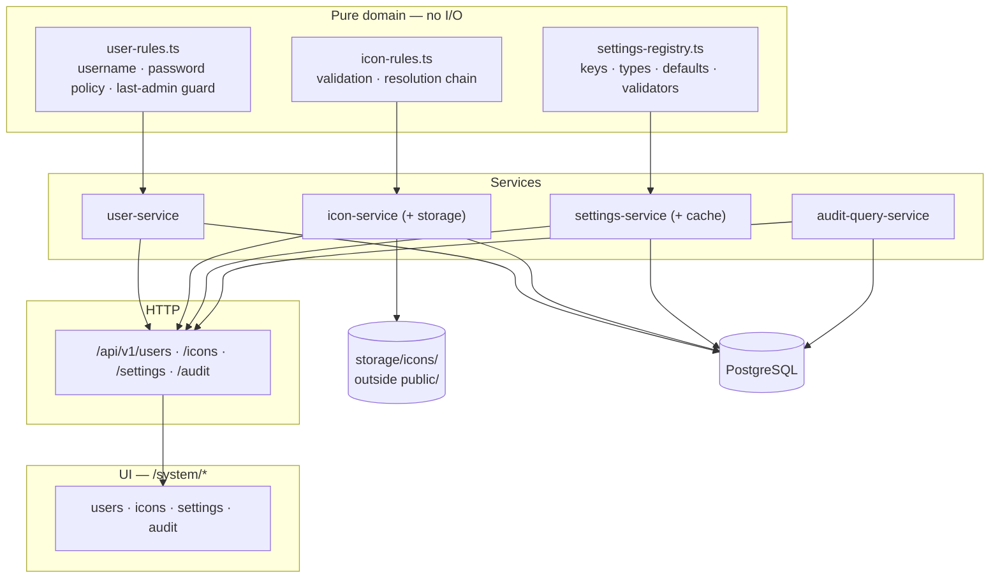
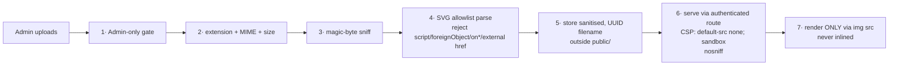

# Phase 14 — Users, Map Icons & System Settings — Development Pack

Status: **Planning artifact.** Binding for whoever implements Phase 14, exactly as `docs/IMPLEMENTATION_PLAN.md` is binding for every other phase. Nothing here is implemented yet.

**Reading order:** `PRE_IMPLEMENTATION_REVIEW.md` → this file → `01-SCOPE.md` … `13-PROMPT.md` → `ADR.md` → `FAQ.md`.

Every architectural decision is already made and recorded in `ADR.md`. The implementation engineer builds; it does not design.

---

## 1. Purpose

Phase 14 delivers the administration surface the product has been deferring since Phase 1. Three capabilities, one phase, because they share one audience (the Admin), one page group (`/system/*`), and one security posture:

1. **User management** — create, edit, activate, suspend, soft-delete, restore users and assign roles, with the last active Admin protected.
2. **Map icon management** — an `IconAsset` library of admin-uploaded PNG/SVG icons, safely validated, assigned to organisation units and vehicle types, resolved with a deterministic fallback chain.
3. **System settings** — a typed, audited, database-backed registry that finally makes the system timezone configurable as `CLAUDE.md` §2 has required since day one.

Plus a read-only **audit viewer**, because every prior phase has been writing to `AuditLog` with no way to read across entities.

### 1.1 What this phase is not

It is **not** a new authorization architecture. The repository has no permission model — authorization is `assertRole(actor, allowedRoles)` over a three-value enum, used by all 40 API routes. Phase 14 keeps it and does not introduce permissions (ADR-P14-01).

It is **not** map provider management. Phase 4 shipped that in full. Phase 14 adds only the *global map defaults* Phase 4 never owned (ADR-P14-10).

## 2. Goals

| # | Goal | Why it is not met today |
|---|---|---|
| **G1** | An Admin can create a user, assign roles, and hand over a first-login password. | No user-management API or UI exists — only login, logout, change-password. |
| **G2** | An Admin can deactivate, suspend and soft-delete users without destroying history. | `User` has no `deletedAt` and ten back-relations to historical records; deletion is currently impossible without orphaning data. |
| **G3** | The system can never be left with zero active Admins. | No such guard exists. |
| **G4** | An Admin can upload PNG/SVG icons that cannot become an XSS vector. | No `IconAsset` model, no storage, no sanitisation, no upload route. |
| **G5** | Icons resolve deterministically: specific entity → entity type → built-in default. | No `iconAssetId` anywhere; the map draws coloured circles. |
| **G6** | The system timezone is configurable, per `CLAUDE.md` §2. | It is `const TEHRAN_OFFSET_MINUTES = 3*60+30` in `jalali.ts`. |
| **G7** | Admin-editable settings are typed, validated, defaulted, audited and cached. | No settings mechanism exists in any form. |
| **G8** | Secrets never enter the settings store. | Must be established now, before the first setting exists. |
| **G9** | Every administrative change is audited with actor, before and after. | `AuditLog` supports it; nothing writes admin events yet. |
| **G10** | An Admin can read the audit trail across entities with filters. | `AuditLog` is only readable per-entity via mission history. |
| **G11** | Two admins editing the same user or setting cannot silently overwrite each other. | No concurrency control on any entity. |
| **G12** | Everything works on a LAN with no Internet. | Must be preserved, not achieved — no new external dependency is permitted. |

## 3. Dependencies

### 3.1 Consumed unchanged

| Dependency | From | Contract relied on |
|---|---|---|
| `User`, `Role`, `UserRole`, `Session` | Phase 1 | Identity. Extended additively, never restructured. |
| argon2 password hashing | Phase 1 | Reused verbatim. **Never** re-implemented or altered. |
| `assertRole` / `requireActor` / `ActorContext` | Phase 1 | The sole authorization mechanism. |
| `AuditLog` | Phase 1 | Already has actor, action, entity, before, after, metadata, IP, user-agent. **No schema change needed.** |
| `rate-limit.ts` | Phase 1 | In-memory, per-process. Reused; its limitation is inherited, not fixed. |
| `OrganizationUnit` | Phase 2 | Receives `iconAssetId`. |
| `VehicleType`, `Vehicle` | Phase 3 | Receive `iconAssetId`. |
| `MapProvider` + `/system/map-providers` | Phase 4 | **Not touched.** |
| CSV upload pattern | Phase 5 | The exact template for icon upload. |
| Design tokens, `Panel`, `Sheet`, `ConfirmDialog`, `StatCard`, `Icon`, theme system | Phase 0 | Reused; no new visual language. |
| `/system` tab shell | Phase 3 | New admin pages mount here. |

### 3.2 Must not be touched

Simulation engine (Phase 9), map rendering (Phases 10–12), dashboard (Phase 13), mission/shipment/route business logic (Phases 5–8), and the mission lifecycle work specified for Phase 15.

## 4. Architecture overview

### 4.1 The three boundaries this phase must hold

**Authorization.** Every administrative route calls `requireActor([RoleCode.ADMIN])` server-side. Hiding a button is never authorization. Verified by tests that call each endpoint directly as a non-Admin.

**Secrets vs settings.** Connection strings, password hashes and API keys never enter `SystemSetting`. The established precedent is `MapProvider.secretReference` — a *reference*, not a secret. Settings hold operator-tunable, non-sensitive values only.

**System configuration vs user preference.** A system setting supplies a *default* for users who have not chosen. It never overwrites an existing per-user choice (ADR-P14-08). Theme is the live example: `localStorage` already wins.

### 4.2 Icon safety — layered, not sanitiser-dependent

Steps 6–7 are the **primary** control; step 4 is defence in depth. Hand-written SVG sanitisers are a known source of bypasses, so the design does not depend on the parser being perfect. An SVG loaded through `` cannot execute script in any current browser.

## 5. Relationship with previous phases

| Phase | Relationship |
|---|---|
| **1 — auth** | Extends `User` additively. Reuses hashing, sessions, `assertRole`, `AuditLog`, rate limiting. |
| **2 — organisation** | Adds `iconAssetId` to `OrganizationUnit`. Its own CRUD is untouched. |
| **3 — fleet** | Adds `iconAssetId` to `VehicleType` and `Vehicle`. Mounts new pages in the `/system` shell. |
| **4 — map providers** | Untouched. Phase 14 adds only global map defaults as settings. |
| **5 — routes** | Reuses the CSV upload pattern as the icon-upload template. |
| **9–13** | Not consumed. The operational map gains icons where it drew coloured circles; no map code is restructured. |
| **15 — mission lifecycle** | Independent. Phase 15's pack defers mission *attachments* to reuse this phase's upload pipeline — Phase 14 must therefore leave that pipeline reusable. |

## 6. Terminology

### 6.1 Frozen — reused verbatim

| Term | Meaning |
|---|---|
| «مدیر سامانه» / «برنامه‌ریز مأموریت» / «بیننده وضعیت» | `ADMIN` / `MISSION_PLANNER` / `STATUS_VIEWER` (`roleLabel`) |
| «نقشه عملیات» | The map page (ADR-025 — never «نمای پایش») |
| «دفتر» / «انبار» | `OrganizationLevel` values |
| Soft delete, audit | Per ADR-015 |

### 6.2 New

| Term | Definition |
|---|---|
| **IconAsset** | An uploaded image with metadata, a content hash and a category. |
| **Icon category** | `VEHICLE` \| `OFFICE` \| `WAREHOUSE` \| `DESTINATION` \| `OTHER` — per `ARCHITECTURE_AND_DATA_MODEL.md`. `OFFICE`/`WAREHOUSE` map onto `OrganizationLevel`, not separate entities. |
| **Icon resolution** | Specific entity → entity type → built-in default. |
| **Setting key** | A stable string identifier; part of the persisted contract. |
| **Settings registry** | The code-side table of key → type, default, validator, audit sensitivity. |
| **User status** | Derived from `isActive`, `suspendedAt`, `deletedAt` — see `03-DOMAIN.md`. |

⚠️ **Naming hazard.** «تعلیق» (suspend) and «غیرفعال» (deactivate) are different states with different semantics (`03-DOMAIN.md` §2.2). Never use them interchangeably.

## 7. Deliverables

| # | Deliverable |
|---|---|
| D1 | Migration: `User` additive columns; `IconAsset`; `SystemSetting`; `iconAssetId` FKs + indexes |
| D2 | Pure `user-rules.ts` — username/password policy, status derivation, last-admin guard |
| D3 | Pure `icon-rules.ts` — file validation, SVG allowlist, resolution chain |
| D4 | Pure `settings-registry.ts` — keys, types, defaults, validators |
| D5 | `user-service` — full lifecycle, role assignment, optimistic concurrency, audit |
| D6 | `icon-service` + filesystem storage outside `public/` |
| D7 | `settings-service` + per-process cache with write invalidation |
| D8 | `audit-query-service` — cross-entity, filtered, paginated |
| D9 | API routes, all Admin-gated, all Zod-validated |
| D10 | UI: `/system/users`, `/system/icons`, `/system/settings`, `/system/audit` |
| D11 | Icon rendering wired into the map's existing marker layer |
| D12 | Tests per `08-TESTS.md`, including the full security suite |
| D13 | Docs: `PHASE_STATUS.md`, `README.md`, ADR-030…039, and the four documentation defects in `PRE_IMPLEMENTATION_REVIEW.md` §6 corrected |

## 8. Definition of success

- An Admin creates a Planner, who logs in, is forced to change password, and can plan a mission — with every step audited.
- An Admin uploads a hostile SVG containing `<script>` and an external reference; it is rejected with a precise Persian message, and no file is written.
- An Admin uploads a valid icon, assigns it to a vehicle type, and it appears on the operational map — replacing the coloured circle, with the circle still used wherever no icon is assigned.
- An Admin changes the timezone; Jalali display shifts, stored UTC data does not.
- An Admin attempts to deactivate the last active Admin and is refused — including when two admins try simultaneously.
- Every one of the above works with the Internet physically disconnected.

## 9. Open questions

**None.** All ten architectural decisions are resolved in `ADR.md` (ADR-P14-01 … ADR-P14-10). The implementation engineer makes no architectural choices.
