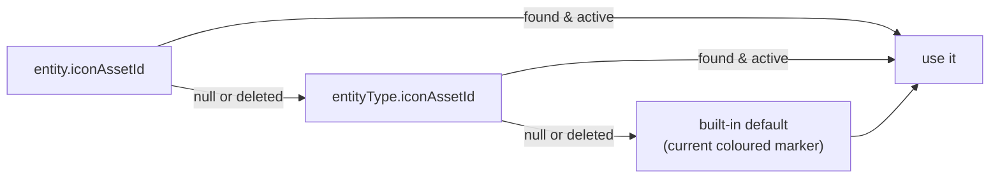

# Phase 14 — 02 — Requirements

Numbered and testable. `08-TESTS.md` references these IDs.

---

## 1. Functional requirements

### 1.1 Users

| ID | Requirement |
|---|---|
| **FR-U01** | An `ADMIN` creates a user with username, display name, initial password and ≥ 1 role. |
| **FR-U02** | A created user has `mustChangePassword = true` and must change it at first login (existing Phase 1 flow). |
| **FR-U03** | An `ADMIN` edits display name and role assignment. |
| **FR-U04** | An `ADMIN` deactivates a user; the user cannot log in and existing sessions are revoked. |
| **FR-U05** | An `ADMIN` suspends a user with a mandatory reason; distinct from deactivation (§3.2). |
| **FR-U06** | An `ADMIN` reactivates or unsuspends a user. |
| **FR-U07** | An `ADMIN` soft-deletes a user; the record and all history are retained. |
| **FR-U08** | An `ADMIN` restores a soft-deleted user. |
| **FR-U09** | An `ADMIN` resets a user's password; the new password is shown once and `mustChangePassword` is set. |
| **FR-U10** | Any authenticated user changes their own password (existing flow, unchanged). |
| **FR-U11** | The user list supports search by username/display name, filter by role and status, and sorting. |
| **FR-U12** | User detail shows creation, last modification, last login, current roles and recent audit entries. |
| **FR-U13** | **The system can never reach zero active, non-suspended, non-deleted Admins.** |
| **FR-U14** | A read-only role→capability matrix is displayed, derived from code. |

### 1.2 Icons

| ID | Requirement |
|---|---|
| **FR-I01** | An `ADMIN` uploads a PNG or SVG icon with a name and category. |
| **FR-I02** | Upload is rejected unless every validation in §4.2 passes. |
| **FR-I03** | The icon is previewed before and after upload, on light and dark backgrounds. |
| **FR-I04** | An `ADMIN` replaces an icon's file, keeping its identity and assignments. |
| **FR-I05** | An `ADMIN` soft-deletes and restores an icon. |
| **FR-I06** | An `ADMIN` assigns an icon to an organisation unit, a vehicle type, or an individual vehicle. |
| **FR-I07** | An `ADMIN` clears an assignment, returning the entity to the fallback chain. |
| **FR-I08** | Icons resolve per §3.4; a missing or deleted icon falls back silently and never breaks the map. |
| **FR-I09** | Icon bytes are served only to authenticated users, with `Content-Type`, CSP and `nosniff`. |
| **FR-I10** | Icons are cached by content hash; replacing an icon changes the hash and invalidates the cache. |

### 1.3 Settings

| ID | Requirement |
|---|---|
| **FR-S01** | An `ADMIN` views all settings grouped by category with current value, default and description. |
| **FR-S02** | An `ADMIN` changes a setting; the value is validated against the registry before persisting. |
| **FR-S03** | An `ADMIN` resets a setting to its default. |
| **FR-S04** | The effective value follows the precedence in §3.5. |
| **FR-S05** | Every change is audited with before and after values. |
| **FR-S06** | Changed settings take effect per their declared runtime-effect (§6, `06-API.md`). |
| **FR-S07** | The system timezone is a setting; changing it alters Jalali presentation only, never stored UTC data. |
| **FR-S08** | Secrets are never storable as settings — the registry contains no secret key and the API rejects unknown keys. |

### 1.4 Audit viewer

| ID | Requirement |
|---|---|
| **FR-A01** | An `ADMIN` lists audit entries filtered by actor, entity type, entity id, action and date range. |
| **FR-A02** | Results are paginated and sorted newest-first. |
| **FR-A03** | Each entry shows actor, Jalali timestamp, action, entity, and before/after where present. |
| **FR-A04** | The viewer is read-only; no API can modify or delete an audit entry. |

## 2. Authorization matrix

**Every row is enforced server-side.** UI visibility mirrors it but is never the control.

| Operation | ADMIN | MISSION_PLANNER | STATUS_VIEWER | Unauthenticated |
|---|:---:|:---:|:---:|:---:|
| List/view users | ✅ | ❌ 403 | ❌ 403 | ❌ 401 |
| Create/edit user | ✅ | ❌ | ❌ | ❌ |
| Activate/deactivate/suspend | ✅ | ❌ | ❌ | ❌ |
| Soft-delete/restore user | ✅ | ❌ | ❌ | ❌ |
| Reset another user's password | ✅ | ❌ | ❌ | ❌ |
| Assign roles | ✅ | ❌ | ❌ | ❌ |
| Change **own** password | ✅ | ✅ | ✅ | ❌ |
| List/upload/replace/delete icons | ✅ | ❌ | ❌ | ❌ |
| Assign icon to entity | ✅ | ❌ | ❌ | ❌ |
| **Read icon bytes** | ✅ | ✅ | ✅ | ❌ 401 |
| View/change settings | ✅ | ❌ | ❌ | ❌ |
| Read audit log | ✅ | ❌ | ❌ | ❌ |

Icon bytes are the sole exception: the operational map renders icons for all three roles, so `GET /icons/[id]/content` is open to any authenticated user. It exposes an image an Admin deliberately published — no privilege leak.

### 2.1 Authentication vs authorization

- **Authentication** — is there a valid session? Handled by `getCurrentUser()`; failure ⇒ **401 `UNAUTHENTICATED`**.
- **Authorization** — does this actor hold a permitted role? Handled by `assertRole`; failure ⇒ **403 `FORBIDDEN`**.
- `proxy.ts` redirects session-less browsers to `/login`. It is a UX convenience only and **is not** an authorization control — it matches `/dashboard/:path*` and does not protect `/api/*`.

## 3. Business rules

### 3.1 User identity

| ID | Rule |
|---|---|
| **BR-U01** | `username` is globally unique, case-insensitively. Stored as entered; compared lowercased. |
| **BR-U02** | `username`: 3–32 chars, `[a-zA-Z0-9._-]` only, must start with a letter. Rationale: usernames appear in URLs, logs and LTR-embedded UI. |
| **BR-U03** | `username` is **immutable** after creation — it is the audit correlation key across ten back-relations. |
| **BR-U04** | `displayName`: 1–64 chars, any script including Persian, trimmed. |
| **BR-U05** | A user holds ≥ 1 role at all times. Removing the last role is rejected. |
| **BR-U06** | A soft-deleted username stays reserved; reusing it requires restoring the user. Rationale: reissuing a username would silently reattribute historical audit entries. |

### 3.2 User status — derived, not stored

Three independent flags produce one displayed status. The **first match wins**:

| Order | Condition | Status | Persian | Can log in? |
|---|---|---|---|:---:|
| 1 | `deletedAt != null` | `DELETED` | حذف‌شده | ❌ |
| 2 | `suspendedAt != null` | `SUSPENDED` | تعلیق‌شده | ❌ |
| 3 | `isActive == false` | `INACTIVE` | غیرفعال | ❌ |
| 4 | otherwise | `ACTIVE` | فعال | ✅ |

**Deactivate vs suspend** — deliberately distinct:

| | Deactivate | Suspend |
|---|---|---|
| Meaning | Administrative off-boarding — left the organisation | Temporary security/disciplinary hold |
| Reason | optional | **mandatory** |
| Expected duration | indefinite | temporary |
| Reversal | activate | unsuspend |
| Field | `isActive = false` | `suspendedAt`, `suspensionReason` |

Both revoke sessions and block login. They are separate so the audit trail records *why*, which a single boolean cannot.

### 3.3 Last-admin protection (FR-U13)

An operation is rejected if it would leave zero users satisfying **all** of: holds `ADMIN`, `isActive`, `suspendedAt IS NULL`, `deletedAt IS NULL`.

| ID | Rule |
|---|---|
| **BR-U07** | Blocked operations: deactivate, suspend, soft-delete, and removing the `ADMIN` role. |
| **BR-U08** | The check runs **inside the transaction**, after the mutation is staged, on freshly-read state. A pre-transaction check is racy (R3). |
| **BR-U09** | The rule applies equally when an Admin targets themselves. |
| **BR-U10** | Error code `LAST_ADMIN_PROTECTED` (409), with a Persian message naming the constraint. |

### 3.4 Icon resolution



| ID | Rule |
|---|---|
| **BR-I01** | Order: specific entity → entity type → built-in default. |
| **BR-I02** | A soft-deleted or missing icon is treated as absent and falls through — **never** an error, never a broken image. |
| **BR-I03** | The built-in default always exists and requires no database row, so the map can never lose its markers. |
| **BR-I04** | `OrganizationUnit` resolves at entity level only (there is no "org unit type"); its category is `OFFICE` for the three office levels and `WAREHOUSE` for `WAREHOUSE`. |
| **BR-I05** | `Vehicle` resolves entity → `VehicleType` → default. |
| **BR-I06** | Resolution is a pure function of the ids and the icon set — no I/O, unit-testable. |

### 3.5 Settings precedence

```
environment variable  (infrastructure & secrets — highest)
        ↓
database SystemSetting (admin-editable)
        ↓
registry default       (code — always present)
```

| ID | Rule |
|---|---|
| **BR-S01** | An env var, where the registry declares one, always wins and the UI shows the setting as locked with the reason. Rationale: infrastructure must not be overridable from a web form. |
| **BR-S02** | A key absent from the database uses the registry default. |
| **BR-S03** | A key absent from the **registry** is rejected on write (422) and ignored on read. Unknown keys never reach storage. |
| **BR-S04** | A stored value failing its validator is ignored, the default is used, and the discrepancy is logged as an operational error. Rationale: a bad row must not break the application. |
| **BR-S05** | Secrets are never registry keys. Credentials use the `MapProvider.secretReference` pattern. |
| **BR-S06** | A system setting that has a user-level counterpart supplies a **default only** and never overwrites an existing user choice (theme is the live case). |

### 3.6 Password policy

| ID | Rule |
|---|---|
| **BR-P01** | Minimum 8 characters — matches the shipped `changePasswordSchema`; **do not** silently raise it and invalidate existing passwords. |
| **BR-P02** | Maximum 128 characters (DoS ceiling on hashing cost). |
| **BR-P03** | Must contain at least one letter and one digit. |
| **BR-P04** | Must not equal the username, case-insensitively. |
| **BR-P05** | Hashed with the existing argon2 helper. **Never** re-implemented, never stored or logged in plain text. |
| **BR-P06** | An admin-issued password is displayed exactly once, on the response to the issuing request, and never retrievable again. |
| **BR-P07** | Password fields never appear in `beforeJson`/`afterJson` or any log. |

## 4. Validation rules

### 4.1 Users

| ID | Field | Rule | Error |
|---|---|---|---|
| V-U01 | `username` | BR-U02 pattern | `USER_USERNAME_INVALID` 422 |
| V-U02 | `username` | unique (case-insensitive, including soft-deleted) | `USER_USERNAME_TAKEN` 409 |
| V-U03 | `displayName` | 1–64 trimmed | `USER_DISPLAY_NAME_INVALID` 422 |
| V-U04 | `password` | BR-P01…P04 | `USER_PASSWORD_WEAK` 422 |
| V-U05 | `roles` | non-empty, all valid `RoleCode` | `USER_ROLES_REQUIRED` 422 |
| V-U06 | `suspensionReason` | 3–500 when suspending | `USER_SUSPENSION_REASON_REQUIRED` 422 |
| V-U07 | `version` | required integer on mutations | `USER_VERSION_REQUIRED` 422 |
| V-U08 | target | exists and not soft-deleted (unless restoring) | `USER_NOT_FOUND` 404 |

### 4.2 Icon upload — every check, in order

| # | ID | Check | Reject with |
|---|---|---|---|
| 1 | V-I01 | Caller is `ADMIN` | 403 |
| 2 | V-I02 | Multipart parses; `file` is a `File` | `ICON_FILE_REQUIRED` 422 |
| 3 | V-I03 | Extension ∈ {`.png`, `.svg`} | `ICON_INVALID_EXTENSION` 422 |
| 4 | V-I04 | MIME ∈ {`image/png`, `image/svg+xml`} | `ICON_INVALID_MIME` 422 |
| 5 | V-I05 | Extension and MIME agree | `ICON_TYPE_MISMATCH` 422 |
| 6 | V-I06 | Size ≤ 2 MB (`API_SECURITY_OFFLINE_OPERATIONS.md` §6) | `ICON_TOO_LARGE` 422 |
| 7 | V-I07 | Size > 0 | `ICON_EMPTY` 422 |
| 8 | V-I08 | **Magic bytes** match the claimed type — PNG `89 50 4E 47 0D 0A 1A 0A`; SVG parses as XML with a root `<svg>` | `ICON_CONTENT_MISMATCH` 422 |
| 9 | V-I09 | PNG: dimensions 16–512 px per side, read from the IHDR chunk | `ICON_DIMENSIONS_INVALID` 422 |
| 10 | V-I10 | SVG: passes the allowlist analysis in §4.3 | `ICON_SVG_UNSAFE` 422 |
| 11 | V-I11 | `name` 1–64 trimmed, unique among non-deleted icons | `ICON_NAME_TAKEN` 409 |
| 12 | V-I12 | `category` ∈ `IconCategory` | `ICON_CATEGORY_INVALID` 422 |

MIME is validated **and** never trusted alone — step 8 is what actually establishes the content type, exactly as the CSV importer treats MIME as advisory.

### 4.3 SVG allowlist — reject, do not silently strip

Rejected outright if any is present:

| Construct | Why |
|---|---|
| `<script>` | script execution |
| `<foreignObject>` | embeds arbitrary HTML |
| `<iframe>`, `<embed>`, `<object>` | external content |
| `<use>`/`<image>` with `href`/`xlink:href` to `http:`, `https:`, `//`, or any non-`#` target | external fetch / SSRF |
| Any `on*` attribute (`onload`, `onclick`, …) | event handlers |
| `javascript:` anywhere | script URL |
| `data:` URI other than `data:image/png;base64,` | smuggled payload |
| `<!ENTITY` / any DOCTYPE with an internal subset | XXE / billion laughs |
| `<style>` or `style="…"` containing `@import`, `url(` with a non-`#` target, or `expression(` | external fetch / legacy script |

**Rejection, not stripping**, because silently altering an admin's file produces a different image than intended without telling them — a correctness problem on top of a security one. The response names the offending construct so the admin can fix the source.

The response of a successful upload stores the file **as received** after this analysis; comments and processing instructions are stripped as a normalisation step (they cannot execute but carry no value).

> **This parser is the second line of defence, not the first.** See §7.3.

### 4.4 Settings

| ID | Rule | Error |
|---|---|---|
| V-S01 | Key exists in the registry | `SETTING_UNKNOWN_KEY` 422 |
| V-S02 | Value matches the registry type | `SETTING_TYPE_MISMATCH` 422 |
| V-S03 | Value passes the registry validator (range/enum/pattern) | `SETTING_VALUE_INVALID` 422 |
| V-S04 | Key is not env-locked | `SETTING_ENV_LOCKED` 409 |
| V-S05 | `version` present | `SETTING_VERSION_REQUIRED` 422 |

## 5. Concurrency rules

| ID | Rule |
|---|---|
| **CC-01** | `User.version` and `SystemSetting.version` start at 0 and increment by 1 per successful mutation. |
| **CC-02** | Mutations use a conditional update — `WHERE id = ? AND version = ?`. Zero rows ⇒ `*_VERSION_CONFLICT` 409. |
| **CC-03** | The last-admin guard re-runs inside the transaction on freshly-read state (BR-U08). |
| **CC-04** | Replacing an icon writes a **new** content hash; in-flight readers of the old hash keep serving the old bytes until their cache expires — acceptable and documented (§7.4). |
| **CC-05** | Role assignment replaces the whole set atomically (`PUT`, not incremental add/remove) so two concurrent edits cannot interleave into an unintended set. |
| **CC-06** | Settings writes invalidate the cache after commit; a concurrent read may briefly return the previous value — bounded by the write, never indefinite. |

## 6. Failure handling

| Scenario | Behaviour |
|---|---|
| DB unavailable mid-mutation | Transaction rolls back; 500 with Persian message; retry offered. |
| Audit write fails after commit | Business fact stands; logged as operational error; **never** surfaced as a failed operation. |
| Filesystem write fails during upload | Transaction rolls back; **no `IconAsset` row is created**; no orphan row. |
| DB write fails after the file is written | Orphan file is deleted in the same request; if that also fails, it is logged for the Phase 17 sweeper. Orphan bytes are inert — no row references them. |
| Two admins deactivate the last two admins simultaneously | Exactly one succeeds; the other gets `LAST_ADMIN_PROTECTED`. |
| Stale `version` | 409; nothing written; UI offers reload. |
| Setting row corrupt/unparseable | Default used; discrepancy logged (BR-S04). |
| Icon file missing on disk but row exists | Resolution treats it as absent and falls back (BR-I02); logged. |
| Upload of a file that is valid PNG but named `.svg` | Rejected at V-I05/V-I08. |

## 7. Security requirements

### 7.1 Authorization
| ID | Requirement |
|---|---|
| SEC-01 | Every admin endpoint calls `requireActor([ADMIN])` before reading the body. |
| SEC-02 | UI hiding is never the control; tests call every endpoint directly as Planner and Viewer and expect 403. |
| SEC-03 | Privilege escalation is impossible: a non-Admin cannot grant themselves `ADMIN`, because role assignment is Admin-gated. |
| SEC-04 | IDOR: every `[id]` operation re-authorizes; user ids are UUIDs, never sequential. |

### 7.2 Input
| ID | Requirement |
|---|---|
| SEC-05 | Every body/query is Zod-validated at the route boundary. |
| SEC-06 | Free text (display name, suspension reason, icon name) is rendered as text, never `dangerouslySetInnerHTML`. |
| SEC-07 | No user input reaches a filesystem path — filenames are server-generated UUIDs (SEC-11). |

### 7.3 Files
| ID | Requirement |
|---|---|
| SEC-08 | The full check chain in §4.2 runs before any byte is written. |
| SEC-09 | SVG is analysed per §4.3. |
| SEC-10 | **Uploaded SVG is rendered only via ``, never inlined into the DOM.** This is the primary XSS control; the parser is secondary. |
| SEC-11 | Stored filename = `{uuid}.{ext}`. The client-supplied name is metadata only and never concatenated into a path. |
| SEC-12 | Storage lives outside `public/` — anything in `public/` is served statically before middleware and would be unauthenticated and un-auditable. |
| SEC-13 | Serving response headers: correct `Content-Type`, `X-Content-Type-Options: nosniff`, `Content-Security-Policy: default-src 'none'; style-src 'unsafe-inline'; sandbox`, `Content-Disposition: inline`. |
| SEC-14 | Path traversal is structurally impossible: the path is `join(ICON_ROOT, uuid + ext)` with a validated UUID; a `realpath` containment assertion backs it. |

### 7.4 Secrets & audit
| ID | Requirement |
|---|---|
| SEC-15 | Passwords, hashes and secrets never appear in `beforeJson`/`afterJson`, metadata, or any log. |
| SEC-16 | Audit payloads for user mutations are field-allowlisted, not whole-entity dumps. |
| SEC-17 | `SystemSetting` cannot hold a secret — the registry defines every legal key and contains none. |
| SEC-18 | Admin mutations are rate-limited with the existing limiter. |
| SEC-19 | Deactivation, suspension and deletion revoke all of the target's sessions in the same transaction. |

## 8. Performance

| ID | Requirement |
|---|---|
| P-01 | User list: paginated server-side, default 25/page. **This phase does not repeat the unpaginated-list defect** of the org tree and fleet pages. |
| P-02 | Audit list: paginated, default 50/page, ordered by the existing indexes. |
| P-03 | Settings read: served from the per-process cache; a cache hit performs no query. |
| P-04 | Icon bytes: `Cache-Control: private, max-age=31536000, immutable`, keyed by content hash. |
| P-05 | Icon resolution adds no query to map scene building — icon ids travel with the entities already fetched. |
| P-06 | Every new FK is indexed. |
| P-07 | Admin operations complete < 300 ms server-side, excluding argon2 hashing (inherently ~0.5–1 s and deliberately so). |

## 9. Offline / LAN

| ID | Requirement |
|---|---|
| OF-01 | No screen, service or asset in this phase contacts the Internet. |
| OF-02 | No new npm dependency with a runtime network call; no CDN; no external font or icon. |
| OF-03 | Icons are stored and served locally. |
| OF-04 | User, icon, settings and audit management all work fully with the Internet disconnected. |
| OF-05 | Settings referencing an external map provider store configuration only; provider unreachability degrades the map (existing Phase 4 behaviour) and never blocks administration. |
| OF-06 | No external authentication dependency is introduced. |

## 10. Accessibility, RTL & touch

| ID | Requirement |
|---|---|
| AX-01 | All new UI is RTL with logical CSS properties; no hardcoded `left`/`right`. |
| AX-02 | Persian labels, validation and errors throughout. |
| AX-03 | LTR technical values — username, URL, IP, filename, hash, UUID — render with `dir="ltr"` inside RTL text. |
| AX-04 | Timestamps display in Jalali; the underlying value stays UTC. |
| AX-05 | Persian digits for counts; `tabular-nums` for aligned numerals. |
| AX-06 | Touch targets ≥ 44×44 CSS px. |
| AX-07 | No hover-only affordance; every action is reachable by tap and by keyboard. |
| AX-08 | Focus visible; `Escape` closes dialogs; focus returns to the trigger. |
| AX-09 | Status conveyed by icon + label, never colour alone. |
| AX-10 | WCAG AA contrast in both themes. |
| AX-11 | Errors linked to fields via `aria-describedby`. |
| AX-12 | Tables become cards below `md`; the permission matrix scrolls horizontally in its own container without the page scrolling sideways. |
| AX-13 | File upload is reachable by keyboard, not drag-and-drop only. |
| AX-14 | Destructive actions require confirmation naming the target. |

## 11. Edge cases

| # | Case | Behaviour |
|---|---|---|
| E1 | Admin deactivates themselves while another active Admin exists | Allowed; sessions revoked; immediately logged out. |
| E2 | Admin deactivates themselves as the **only** Admin | Rejected, `LAST_ADMIN_PROTECTED`. |
| E3 | Two admins simultaneously deactivate each other, leaving zero | Exactly one succeeds. |
| E4 | Restoring a user whose username was never released | Succeeds — BR-U06 reserves it. |
| E5 | Creating a user with a soft-deleted user's username | Rejected, `USER_USERNAME_TAKEN`; the admin restores instead. |
| E6 | Removing a user's last role | Rejected, BR-U05. |
| E7 | Icon assigned to a type, then soft-deleted | Entities fall back to default; assignments retained so restore reinstates them. |
| E8 | Icon replaced while a user views the map | Old bytes served until cache expiry; new hash on next load. |
| E9 | SVG with `<script>` inside `<defs>` | Rejected — the analysis is tree-wide, not root-only. |
| E10 | PNG renamed to `.svg` | Rejected at V-I08 magic bytes. |
| E11 | 2 MB + 1 byte upload | Rejected at V-I06 before any parse. |
| E12 | Zero-byte file | Rejected at V-I07. |
| E13 | Timezone changed while a user views a Jalali date | Next render uses the new offset; stored UTC unchanged. |
| E14 | Setting reset while another admin edits it | Second write hits `SETTING_VERSION_CONFLICT`. |
| E15 | Env-locked setting edited in the UI | Field is read-only with the reason shown; a direct API call returns `SETTING_ENV_LOCKED`. |
| E16 | Audit filter matching nothing | Empty state with guidance, not an error. |
| E17 | Icon row exists, file missing on disk | Falls back to default; logged; the gallery marks it as damaged. |
| E18 | Admin resets their own password | Allowed; sessions revoked; must re-login. |
| E19 | Suspended user with a live session | Sessions revoked at suspension; the next request is unauthenticated. |
| E20 | Icon uploaded with a name differing only by case | Uniqueness is case-insensitive; rejected. |
