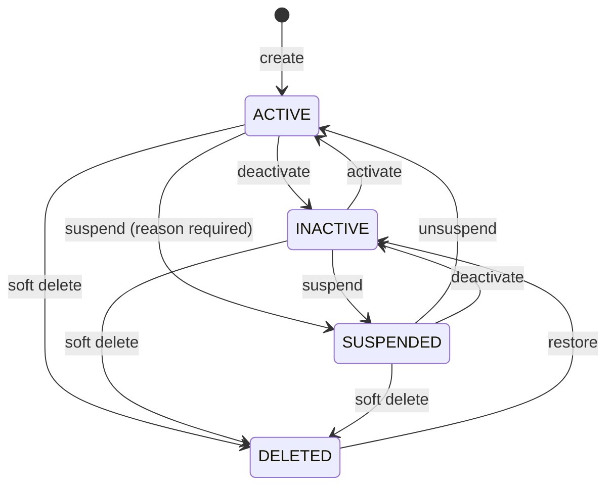
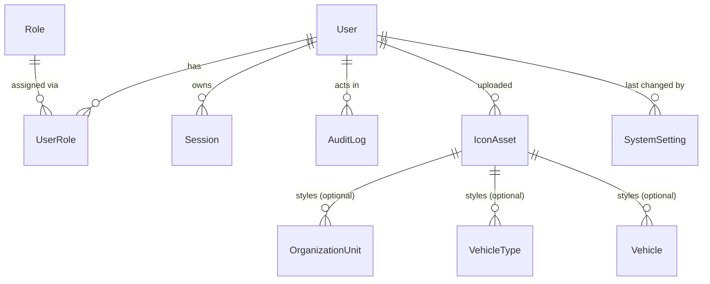

# Phase 14 — 03 — Domain Model

Ubiquitous language, entities, relationships, invariants. Terms here are used verbatim in code identifiers and every later document.

---

## 1. Naming hazards — read first

| Hazard | Distinction |
|---|---|
| **Deactivate vs Suspend** | Two different states, two different fields, two different meanings (§2.2). Never interchangeable in code, copy or tests. |
| **Role vs Permission** | This system has **roles only**. There is no permission entity. Never write `hasPermission`, `checkPermission`, or a `permissions` array — it would imply an architecture that does not exist. |
| **`IconAsset` vs icon name in `Icon` component** | `IconAsset` is an admin-uploaded database record. `IconName` in `src/components/ui/icons.tsx` is a built-in inline-SVG identifier. Unrelated; never conflate. |
| **Setting vs preference** | A *setting* is system-wide and Admin-owned. A *preference* is per-user and user-owned. A setting may supply a preference's default; it never overrides a user's choice. |
| **`SystemSetting.value` vs env var** | Both feed the same effective value; the env var wins and locks the setting. |
| **Icon category vs organisation level** | `IconCategory.OFFICE` covers three `OrganizationLevel` values; `WAREHOUSE` covers one. Not a 1:1 mapping. |

## 2. Entities

### 2.1 `User` (existing — extended)

| Field | Status | Meaning |
|---|---|---|
| `id` | existing | UUID. Never sequential — IDOR resistance. |
| `username` | existing, `@unique` | Login identity. Immutable (BR-U03). |
| `passwordHash` | existing | argon2. Never exposed by any API. |
| `mustChangePassword` | existing, default `true` | Forces the Phase 1 first-login flow. |
| `isActive` | existing, default `true` | Administrative on/off. |
| `createdAt` / `updatedAt` | existing | Timestamps. |
| `roles` | existing | `UserRole[]` — at least one at all times. |
| `sessions` | existing | Revoked on deactivate/suspend/delete. |
| *10 back-relations* | existing | `createdMissions`, `updatedRoutes`, … — **the reason hard delete is impossible.** |
| **`displayName`** | **new**, nullable | Human name; Persian expected. Falls back to `username` when absent. |
| **`deletedAt`** | **new**, nullable | Soft delete (ADR-015). |
| **`lastLoginAt`** | **new**, nullable | Set by the existing login flow. |
| **`suspendedAt`** | **new**, nullable | Suspension marker. |
| **`suspensionReason`** | **new**, nullable | Mandatory when suspending. |
| **`version`** | **new**, default 0 | Optimistic concurrency token. |

> `version` here means the same thing as in the Phase 15 pack — an opaque concurrency token with no business meaning. It is unrelated to `Route.version` or `Mission.routeVersion`, which are business version numbers.

### 2.2 `UserStatus` — derived value object

Not stored. Computed by a pure function; first match wins.



**Restore returns to `INACTIVE`, never straight to `ACTIVE`.** Reinstating a deleted account should be a deliberate two-step act, so the Admin consciously re-enables login rather than a single click silently granting access.

### 2.3 `Role` / `UserRole` (existing — unchanged)

`Role` is seeded reference data keyed by the `RoleCode` enum. Phase 14 **assigns** roles; it never creates, renames or deletes them, because `RoleCode` is a PostgreSQL enum and a new value needs a migration (ADR-P14-02).

| Role | Persian | Capabilities (derived from the 40 route gates) |
|---|---|---|
| `ADMIN` | مدیر سامانه | Everything, including all administration |
| `MISSION_PLANNER` | برنامه‌ریز مأموریت | Missions, shipments, routes, map; no administration |
| `STATUS_VIEWER` | بیننده وضعیت | Read-only: dashboard, map, routes |

The role→capability matrix shown in the UI is **derived from this table in code**, not stored, so it can never drift from the real gates.

### 2.4 `IconAsset` (new)

Shape follows `ARCHITECTURE_AND_DATA_MODEL.md` §IconAsset exactly.

| Field | Meaning |
|---|---|
| `id` | UUID; also the stored filename stem. |
| `name` | Admin-facing label, unique among non-deleted. |
| `category` | `IconCategory`. |
| `mimeType` | `image/png` \| `image/svg+xml`. |
| `storagePath` | Path **relative** to the icon root — never absolute, so the root can move without a data migration. |
| `sha256` | Content hash. Cache key and duplicate detector. |
| `width` / `height` | Pixels; nullable for SVG without intrinsic size. |
| `fileSize` | Bytes. |
| `originalFilename` | Display metadata only. **Never** used to build a path. |
| `isActive` | Admin-facing enable/disable without deleting. |
| `deletedAt` | Soft delete. |
| `uploadedById`, `createdAt`, `updatedAt`, `version` | Provenance + concurrency. |

### 2.5 `IconCategory` (new enum)

`VEHICLE` · `OFFICE` · `WAREHOUSE` · `DESTINATION` · `OTHER`

Mapping to real entities — deliberately not 1:1:

| Category | Applies to |
|---|---|
| `VEHICLE` | `VehicleType`, `Vehicle` |
| `OFFICE` | `OrganizationUnit` where level ∈ {`COUNTRY_OFFICE`, `GROUP_OFFICE`, `DISTRIBUTOR_OFFICE`} |
| `WAREHOUSE` | `OrganizationUnit` where level = `WAREHOUSE` |
| `DESTINATION` | Free-coordinate mission/shipment destinations (no owning row) |
| `OTHER` | Reserved; assignable to nothing in this phase |

Category is an **organisational filter for the admin gallery**, not an authorization or correctness boundary: assigning a `VEHICLE`-category icon to a warehouse is discouraged in the UI (the picker filters by category) but not a data-integrity violation.

### 2.6 `SystemSetting` (new)

| Field | Meaning |
|---|---|
| `key` | Primary key. A stable string; part of the persisted contract, never renamed. |
| `value` | `Json`. Type is enforced by the registry, not the column. |
| `updatedById`, `updatedAt`, `version` | Provenance + concurrency. |

**Rows are created lazily.** A key absent from the table uses its registry default; only an explicit change writes a row. So the table holds *deviations from default*, which makes "what has this operator changed?" answerable by selecting everything.

### 2.7 Settings registry (code, not a table)

```ts
export interface SettingDefinition<T> {
  key: string;
  group: "GENERAL" | "LOCALE" | "MAP" | "VISUALIZATION" | "TIMELINE" | "OPERATIONAL";
  type: "string" | "number" | "boolean" | "enum" | "json";
  default: T;
  /** null ⇒ not env-overridable. */
  envVar: string | null;
  validate: (raw: unknown) => T;          // throws DomainError on failure
  /** How a change reaches running clients. */
  runtimeEffect: "IMMEDIATE" | "NEXT_REQUEST" | "NEXT_PAGE_LOAD";
  labelFa: string;
  descriptionFa: string;
  /** true ⇒ value is redacted in audit payloads. No key sets this today. */
  sensitive: boolean;
}
```

The registry is the **single source of truth** for what a setting is. `07-DATABASE.md` §5 lists every key.

### 2.8 `AuditLog` (existing — unchanged)

No schema change. Phase 14 adds `action` values only:

`user.created` · `user.updated` · `user.activated` · `user.deactivated` · `user.suspended` · `user.unsuspended` · `user.deleted` · `user.restored` · `user.password_reset` · `user.roles_changed` · `icon.uploaded` · `icon.replaced` · `icon.deleted` · `icon.restored` · `icon.assigned` · `icon.unassigned` · `setting.changed` · `setting.reset`

matching the shipped `mission.cancelled` convention.

## 3. Relationships



**Aggregate roots:** `User`, `IconAsset`, `SystemSetting`. `UserRole` has no independent lifecycle. `AuditLog` is an append-only log, not an aggregate.

**Referential rule:** `iconAssetId` FKs are `ON DELETE SET NULL` at the database level *and* icons are soft-deleted in practice — belt and braces, so a deleted icon can never leave a dangling reference that breaks map rendering.

## 4. Invariants

| ID | Invariant |
|---|---|
| **I-01** | `username` is unique case-insensitively across **all** users, including soft-deleted. |
| **I-02** | Every non-deleted user holds ≥ 1 role. |
| **I-03** | ≥ 1 user satisfies `ADMIN ∧ isActive ∧ suspendedAt IS NULL ∧ deletedAt IS NULL` at all times. |
| **I-04** | `suspendedAt != null` ⟹ `suspensionReason != null`. |
| **I-05** | `deletedAt != null` ⟹ the user has no live session. |
| **I-06** | `passwordHash` is never null, never plain text, never returned by any API. |
| **I-07** | `User.version` is monotonically non-decreasing, forever. |
| **I-08** | Every `IconAsset` row has a file at `ICON_ROOT/storagePath`, **or** resolution treats it as absent (BR-I02) — the invariant is that a missing file never produces an error. |
| **I-09** | `IconAsset.sha256` matches the stored bytes. |
| **I-10** | `IconAsset.storagePath` is relative and contains no `..`, no absolute prefix, no separator other than the platform join produced server-side. |
| **I-11** | Every `SystemSetting.key` exists in the registry; unknown keys are never written. |
| **I-12** | Every stored setting value passes its validator, **or** the default is used and the discrepancy logged (BR-S04). |
| **I-13** | No `SystemSetting` holds a secret. |
| **I-14** | Audit entries are append-only; no code path updates or deletes one. |
| **I-15** | No audit payload contains a password, hash or secret. |

## 5. Pure domain functions

All in `src/lib/domain/` or `src/lib/settings/` — no DB, no React, fully unit-testable.

| Function | Responsibility |
|---|---|
| `deriveUserStatus(user)` | §2.2 precedence. Total; never throws. |
| `validateUsername(raw)` | BR-U02. |
| `validatePassword(raw, username)` | BR-P01…P04. |
| `wouldLeaveNoAdmin(admins, targetId, operation)` | BR-U07 predicate over an already-fetched admin set — pure, so the race-sensitive part is testable without a database. |
| `canRemoveRole(user, role, admins)` | BR-U05 + BR-U07. |
| `analyzeSvg(source)` | §4.3 of `02-REQUIREMENTS.md`. Returns findings; never mutates. |
| `validateIconFile(meta, bytes)` | V-I03…V-I10. |
| `readPngDimensions(bytes)` | IHDR chunk parse; dependency-free. |
| `resolveIcon(entityIconId, typeIconId, availableIcons)` | BR-I01…BR-I06. |
| `getSettingDefinition(key)` / `parseSettingValue(key, raw)` | Registry lookup + validation. |
| `resolveEffectiveSetting(key, dbValue, env)` | BR-S01…BR-S04 precedence. |

## 6. Domain events

No event bus exists (ADR-017). "Events" are `AuditLog` rows — the integration seam for any future outbox. Phase 14 introduces no new mechanism.

## 7. Glossary

| Term | Persian | Definition |
|---|---|---|
| User | کاربر | An authenticable account. |
| Role | نقش | One of three fixed `RoleCode` values. |
| Active | فعال | Can log in. |
| Inactive | غیرفعال | Administratively disabled. |
| Suspended | تعلیق‌شده | Temporarily held with a recorded reason. |
| Deleted | حذف‌شده | Soft-deleted; history retained. |
| Icon asset | آیکن | An admin-uploaded image. |
| Icon category | دسته آیکن | Grouping for the gallery. |
| Icon resolution | تعیین آیکن | The entity → type → default chain. |
| Setting | تنظیم | A system-wide, Admin-editable value. |
| Setting key | کلید تنظیم | Stable identifier; part of the contract. |
| Registry | فهرست تنظیمات | The code-side definition table. |
| Env-locked | قفل‌شده با متغیر محیطی | Overridden by an environment variable. |
| Audit entry | رکورد ممیزی | An append-only record of an administrative change. |
