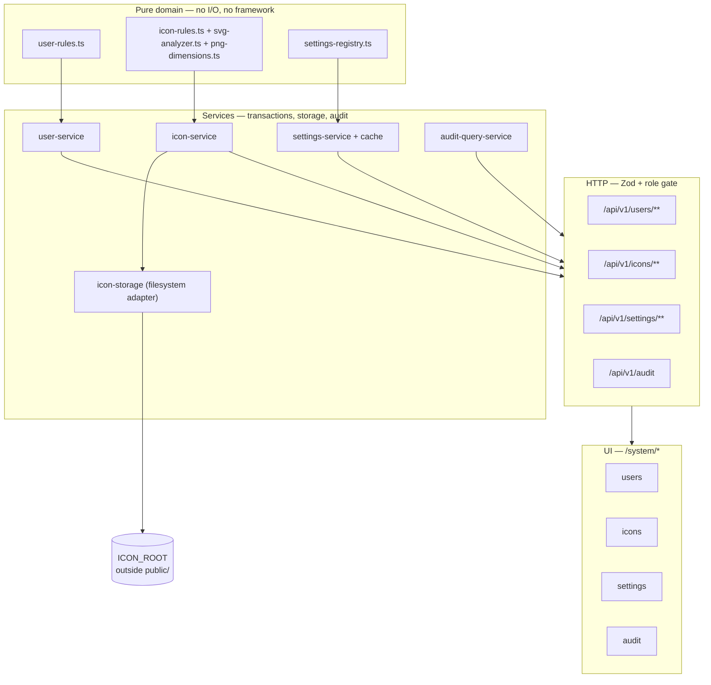
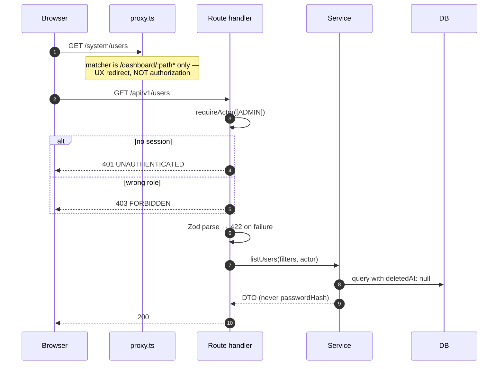
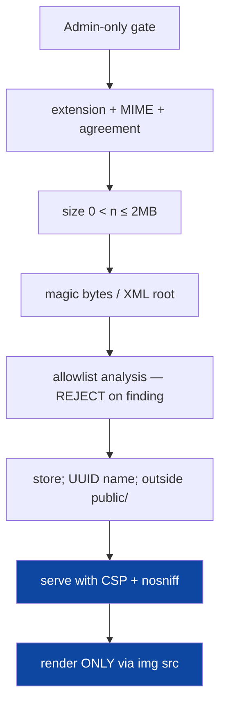
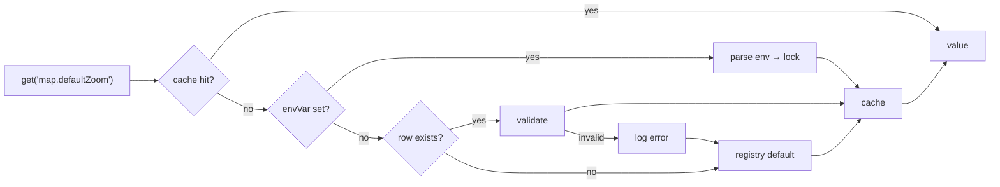
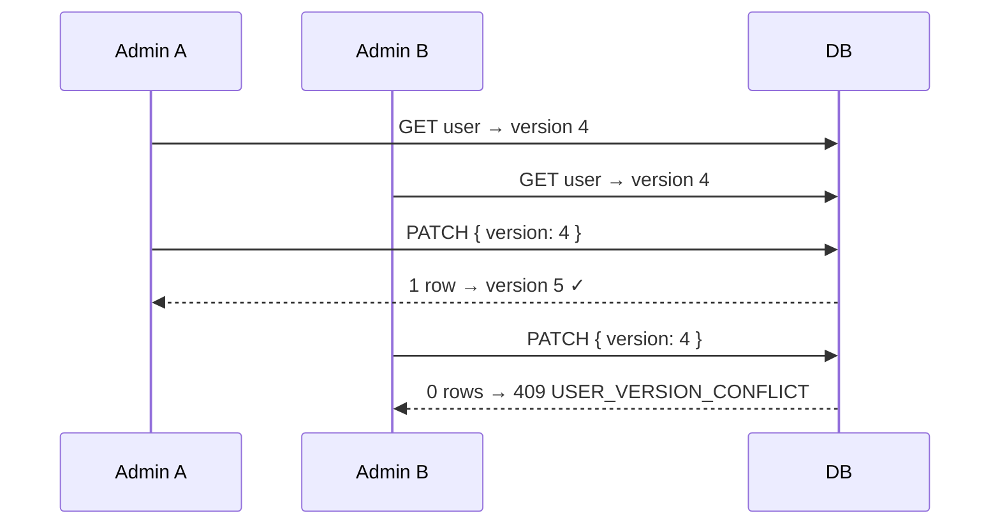

# Phase 14 — 04 — Architecture

Structure, rationale, extension points. Every decision here is final and recorded in `ADR.md`.

---

## 1. Layering



**Dependency rule.** Arrows point one way. L1 imports nothing below it. L2 imports L1 + Prisma + node:fs. L3 imports L2. L4 imports L3's DTO types and L1's *pure* helpers only.

> **Bundle hazard, learned the hard way in Phase 13.** A `"use client"` component that imports `@/lib/permissions/roles` pulls the Prisma client — and transitively `node:module` — into the browser bundle. `tsc` accepts it; the Turbopack build fails. Client components receive **pre-resolved plain data** (role labels as strings, capability rows as arrays), never server modules. `npm run build` is the only check that catches this.

## 2. Authorization architecture

### 2.1 What exists, restated

```ts
assertRole(actor: ActorContext, allowed: readonly RoleCode[]): void
```

One function. Three roles. Forty route gates. No permissions, no claims, no policies.

### 2.2 Why Phase 14 does not add permissions

| Option | Assessment |
|---|---|
| **Keep role-based** ✅ | Zero migration risk; all 40 gates keep working; matches every requirement in `PROJECT_SPEC.md`. |
| Add `Permission` + `RolePermission` | Two tables, a join on every request or a security-sensitive cache, and a mechanical rewrite of 40 gates — to express exactly the three role groupings that already exist. Negative value today. |
| Hybrid (roles that expand to permissions) | All the cost of the above plus two concepts to keep in sync. |

Decision: **role-based** (ADR-P14-01). The extension point is documented in §6 and costs one function signature when a real need appears.

### 2.3 Enforcement chain



Three independent gates — session, role, schema — in that order. The role gate runs **before** the body is read, so an unauthorized caller never reaches parsing.

## 3. Icon subsystem

### 3.1 Storage

```
<repo>/storage/icons/{uuid}.{png|svg}     ← ICON_ROOT, gitignored, outside public/
```

| Decision | Rationale |
|---|---|
| Filesystem, not database bytes | Matches `ARCHITECTURE_AND_DATA_MODEL.md` (`storagePath`, `sha256`); keeps binary out of every row read; lets the HTTP layer stream. |
| **Outside `public/`** | Next.js serves `public/` statically **before** middleware — a file there is world-readable, unauthenticated and un-auditable. That is disqualifying for admin-managed content. |
| Server-generated UUID filename | Path traversal and malicious-filename handling become structurally impossible rather than filtered. |
| `storagePath` stored **relative** | The root can move (container volume, ops change) with no data migration. |
| Content hash in the row | Cache key, duplicate detection, and integrity check in one field. |

### 3.2 Serving

```mermaid
sequenceDiagram
  participant B as Browser (img src)
  participant R as GET /icons/[id]/content
  participant S as icon-service
  participant FS

  B->>R: request
  R->>R: requireActor([ADMIN, PLANNER, VIEWER])
  R->>S: getIconBytes(id)
  S->>S: validate id is a UUID
  S->>FS: read join(ICON_ROOT, storagePath)
  S->>S: assert realpath is inside ICON_ROOT
  alt missing
    S-->>R: null
    R-->>B: 404
  end
  R-->>B: 200 + Content-Type<br/>+ nosniff<br/>+ CSP default-src 'none'; sandbox<br/>+ Cache-Control immutable
```

Serving through a route rather than statically is what makes the authentication, the CSP and the audit surface possible at all.

### 3.3 SVG defence in depth



The two highlighted steps are the **primary control**. An SVG loaded through `` cannot execute script in any current browser, regardless of its content. The allowlist parser (E) reduces residual risk; the design does not depend on it being flawless, because hand-written SVG sanitisers have a long history of bypasses.

**Rule for the implementation engineer: there is no code path anywhere that inlines uploaded SVG into the DOM.** No `dangerouslySetInnerHTML`, no `<svg>{content}</svg>`, no inlining "just for the preview". The preview uses `` like everything else.

## 4. Settings subsystem

### 4.1 Resolution



### 4.2 Cache

| Property | Decision |
|---|---|
| Scope | Per-process, in-memory `Map` |
| Population | Lazy on first read |
| Invalidation | Explicit, after a successful write commits |
| TTL | None — invalidation is exact, so a timer would only add staleness |
| Multi-instance | **Not handled.** Same limitation as the shipped `rate-limit.ts`; deferred to Phase 17 with the rest of the multi-instance work. |

**No caching of roles or permissions.** Authorization data is read from the session's user on every request, exactly as today. A cache there would let a revoked role keep working — the classic stale-security-config failure (risk R4). This is a deliberate non-optimisation.

### 4.3 Registry over table columns

A wide `Settings` table needs a migration per new setting. The registry defines type, default, validator, env binding, runtime effect and Persian labels in code, with values as JSON. Type safety comes from the registry's `validate`, which is also the only thing that may write to the column.

## 5. Concurrency

Same mechanism as the Phase 15 pack, for consistency across the codebase.



Optimistic, not pessimistic: admin edits are user-paced and may sit open in a form; a row lock held across that would block the record on an abandoned tab.

### 5.1 The last-admin race

The dangerous case is two admins deactivating each other simultaneously, leaving zero.

```
BEGIN
  UPDATE "User" SET isActive=false, version=version+1
    WHERE id=? AND version=?              -- 0 rows ⇒ 409
  SELECT count(*) FROM "User" u
    JOIN "UserRole" ur ON ...
    WHERE ur.roleId = ADMIN
      AND u."isActive" AND u."suspendedAt" IS NULL AND u."deletedAt" IS NULL
    FOR UPDATE                             -- serialises concurrent guards
  IF count = 0 THEN ROLLBACK, throw LAST_ADMIN_PROTECTED
COMMIT
```

The count runs **after** the mutation is staged and **inside** the transaction, with `FOR UPDATE` on the admin rows so two transactions cannot both observe a safe count. Checking before the transaction is racy and would allow the exact failure the rule exists to prevent.

## 6. Extension points

| Extension | Seam | Cost |
|---|---|---|
| Permission-based authorization | `assertRole` is one function with one call shape; replace with `assertCapability` and map roles → capabilities | one file + mechanical gate edits |
| Per-vehicle icons | `Vehicle.iconAssetId` is created now and consulted first by `resolveIcon`, even though the UI assigns at type level initially | UI only |
| Organisation-scoped settings | `SystemSetting` gains nullable `organizationUnitId` + compound unique; the precedence chain already has a scope slot | migration + one resolver branch |
| User preferences | The registry marks which keys have a user counterpart; a `UserPreference` table slots beneath system defaults | new table, no registry change |
| Mission attachments (Phase 15) | The upload → validate → hash → store → serve pipeline is written over a *category*, not hardcoded to icons | reuse |
| Shared settings cache | Cache access is behind one module | one file |
| Audit retention/archival | The viewer is read-only over an indexed table | Phase 17 ops |

## 7. Error taxonomy

| Code | HTTP | Meaning |
|---|---|---|
| `UNAUTHENTICATED` | 401 | No valid session |
| `FORBIDDEN` | 403 | Role gate |
| `USER_NOT_FOUND` / `ICON_NOT_FOUND` | 404 | Absent or soft-deleted |
| `USER_USERNAME_TAKEN` / `ICON_NAME_TAKEN` | 409 | Uniqueness |
| `LAST_ADMIN_PROTECTED` | 409 | BR-U07 |
| `USER_VERSION_CONFLICT` / `SETTING_VERSION_CONFLICT` / `ICON_VERSION_CONFLICT` | 409 | Concurrency |
| `SETTING_ENV_LOCKED` | 409 | Env override |
| `USER_USERNAME_INVALID` / `USER_PASSWORD_WEAK` / `USER_ROLES_REQUIRED` / `USER_SUSPENSION_REASON_REQUIRED` | 422 | Validation |
| `ICON_INVALID_EXTENSION` / `ICON_INVALID_MIME` / `ICON_TYPE_MISMATCH` / `ICON_TOO_LARGE` / `ICON_EMPTY` / `ICON_CONTENT_MISMATCH` / `ICON_DIMENSIONS_INVALID` / `ICON_SVG_UNSAFE` | 422 | Upload validation |
| `SETTING_UNKNOWN_KEY` / `SETTING_TYPE_MISMATCH` / `SETTING_VALUE_INVALID` | 422 | Settings validation |
| `*_VERSION_REQUIRED` | 422 | Missing concurrency token |

All carry a Persian `message`; field-level problems populate `fieldErrors`, matching the shipped `DomainError` envelope.

## 8. Deliberately not built

| Rejected | Why |
|---|---|
| `Permission` / `RolePermission` | §2.2 |
| Role CRUD | `RoleCode` is a PG enum; a fake "create role" button would be a lie |
| Storing icons in `public/` | Bypasses authentication and audit entirely |
| Inlining uploaded SVG for a "crisper" preview | Reintroduces the exact XSS vector the design eliminates |
| Trusting the sanitiser alone | Hand-written SVG sanitisers get bypassed; `` + CSP is the durable control |
| An image-processing dependency (sharp/jimp) | Dimensions come from a 24-byte PNG header parse; a native dependency for that is disproportionate and complicates offline deployment |
| Caching roles/permissions | Stale security configuration (R4) |
| Pessimistic locks on user edits | Human-paced forms |
| Email-based password reset | No mail infrastructure; LAN-only (ADR-004) |
| A second upload pipeline for attachments | Phase 15 reuses this one |
