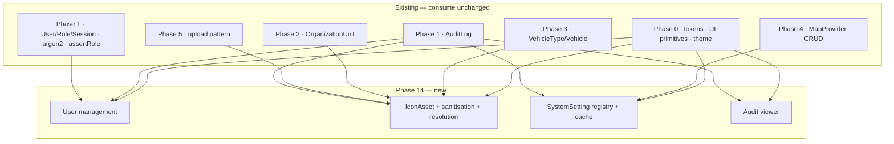

# Phase 14 — Pre-Implementation Dependency & Gap Review

**Repository-first audit, performed before any pack document was written.** Every claim below was verified against the working tree, not inferred from documentation. Where documentation and code disagree, the code is reported as truth and the documentation defect is flagged.

**Sources inspected:** `prisma/schema.prisma` (all 23 models/enums), `src/server/services/permission-service.ts`, `src/lib/permissions/roles.ts`, `src/lib/http/api-auth.ts`, `src/lib/security/rate-limit.ts`, `src/lib/validation/*`, `src/lib/dates/jalali.ts`, `src/app/api/v1/**` (all 40 route files), `src/app/api/v1/routes/import-csv/route.ts`, `src/components/theme/*`, `docs/IMPLEMENTATION_PLAN.md`, `docs/ARCHITECTURE_AND_DATA_MODEL.md`, `docs/API_SECURITY_OFFLINE_OPERATIONS.md`, `docs/PROJECT_SPEC.md`, `docs/UX_MAP_AND_DESIGN_SYSTEM.md`, `docs/DECISIONS.md` (ADR-001…029), `docs/PHASE_STATUS.md`, and the Phase 9/10/11/12/13/15 packs.

---

## 1. Executive summary

Phase 14 is buildable with **no architectural conflicts that block it**, but the commissioning brief makes four assumptions the repository contradicts. All four are resolved in §7 and become ADRs.

| # | Brief assumption | Repository reality |
|---|---|---|
| A | The system may use RBAC with a `Permission` entity | **There is no `Permission` model and no permission concept.** Authorization is a single function, `assertRole(actor, allowedRoles)`, over a fixed 3-value `RoleCode` enum. |
| B | `iconAssetId` already exists in the schema | **It does not.** `ARCHITECTURE_AND_DATA_MODEL.md` §IconAsset specifies the entity and `PHASE_STATUS.md` claims `iconAssetId` is "در schema پیش‌بینی شده" — but `grep -i icon prisma/schema.prisma` returns nothing. Both the entity and every FK are new work. **This is a documentation defect**, corrected in §6. |
| C | Map provider settings need building | **Already shipped in Phase 4** — full CRUD, `isDefault`, `isEnabled`, `healthStatus`, connection test, `secretReference`. Phase 14 must not rebuild it. |
| D | System settings exist somewhere to extend | **No settings mechanism exists at all.** The system timezone is a hardcoded `const TEHRAN_OFFSET_MINUTES` in `src/lib/dates/jalali.ts`, which directly contradicts `CLAUDE.md` §2 ("منطقه زمانی پیش‌فرض سامانه configurable"). |

---

## 2. What exists and must be reused (never rebuilt)

### 2.1 Identity — `User`, `Role`, `UserRole`, `Session`

```prisma
model User {
  id, username @unique, passwordHash, mustChangePassword @default(true),
  isActive @default(true), createdAt, updatedAt
  roles UserRole[]   sessions Session[]
  // + 10 back-relations for createdBy/updatedBy across business entities
}
model Role     { id, code RoleCode @unique, name, users UserRole[] }
model UserRole { userId, roleId, assignedAt, @@id([userId, roleId]) }
model Session  { id, userId, secretHash, createdAt, expiresAt, revokedAt, userAgent, ipAddress }
enum RoleCode  { MISSION_PLANNER  STATUS_VIEWER  ADMIN }
```

**Missing fields Phase 14 needs** (all additive, all nullable/defaulted): `displayName`, `deletedAt`, `lastLoginAt`, `version`, `suspendedAt`/`suspensionReason`.

**Critical:** `User` has **ten** back-relations (`createdMissions`, `updatedRoutes`, …). A user is referenced by historical business records across six entities. **Hard-deleting a user is therefore impossible without orphaning audit history** — soft delete is mandatory, not a preference (see §7.5).

### 2.2 Authorization — role-based only

`src/server/services/permission-service.ts` in its entirety:

```ts
export interface ActorContext { userId: string; username: string; roles: RoleCode[]; }

export function assertRole(actor: ActorContext, allowed: readonly RoleCode[]): void {
  if (!hasAnyRole(actor.roles, allowed)) {
    throw new DomainError("FORBIDDEN", "دسترسی به این عملیات مجاز نیست.");
  }
}
```

Every one of the **40 API route files** gates via `requireActor([...roles])`. Verified: only `auth/me` (performs its own 401) and `health` (no data) lack the gate, both correctly.

There is **no** permission table, no claims, no policies, no scopes. This is the single most important architectural fact for Phase 14.

### 2.3 Audit — `AuditLog` is complete and sufficient

```prisma
model AuditLog {
  id, actorUserId?, action, entityType, entityId?,
  beforeJson? Json, afterJson? Json, metadataJson? Json,
  ipAddress?, userAgent?, occurredAt
  @@index([entityType, entityId])  @@index([actorUserId])
}
```

Every field the brief's §10 asks for already exists: actor, timestamp, action, entity, entity id, before value, after value, IP, and a `metadataJson` slot for a correlation id. **No audit schema change is required.** Phase 14 adds new `action` values and a read-only viewer.

### 2.4 Map providers — shipped, do not rebuild

`MapProvider` has `name`, `kind`, `urlTemplate`, `attribution`, `minZoom`/`maxZoom`, `tileSize`, `subdomains`, `requiresApiKey`, `secretReference`, `isDefault`, `isEnabled`, `healthStatus`, `lastCheckedAt`, soft delete, audit FKs. Admin CRUD + connection test + public active-provider read are all live at `/system/map-providers`.

`secretReference` is a **reference**, not a secret — the established pattern for keeping credentials out of the database. Phase 14 must preserve it.

### 2.5 The one existing file-upload pattern — the template to copy

`src/app/api/v1/routes/import-csv/route.ts` establishes the exact shape Phase 14's icon upload must follow:

```ts
const result = await requireActor([...]);        // 1. authorize first
const formData = await request.formData().catch(() => null);
const file = formData?.get("file");
if (!file || !(file instanceof File)) → 422      // 2. presence + type guard
if (!nameLower.endsWith(".csv")) → 422           // 3. extension allowlist
if (!ALLOWED_MIME_TYPES.has(file.type)) → 422    // 4. MIME allowlist (never trusted alone)
if (file.size > MAX) → 422                       // 5. size ceiling
```

Note the ordering: authorize → parse → validate → act. Reuse it verbatim.

### 2.6 Other reusable assets

| Asset | Location | Phase 14 use |
|---|---|---|
| `rate-limit.ts` | `src/lib/security/` | Reuse for admin mutations. **In-memory and per-process** — a documented limitation deferred to Phase 17. |
| Theme system | `src/components/theme/` | `localStorage` key `armanhaml-theme`, blocking init script, `data-theme` attribute. Phase 14's "default theme" setting must not fight it (§7.8). |
| Design tokens | `src/app/globals.css` | Complete light/dark token set. Reuse; add nothing. |
| UI primitives | `src/components/ui/` | `Panel`, `Sheet`, `ConfirmDialog`, `StatCard`, `StatusBadge`, `Icon`, `Field`. |
| `system` tab shell | `src/app/(dashboard)/system/layout.tsx` | New admin pages mount here. |
| Jalali utilities | `src/lib/dates/jalali.ts` | Pure. Timezone is hardcoded — §7.7. |
| Password hashing | argon2 via `src/lib/auth/` | Reuse. **Never** re-implement or alter. |
| `DomainError` + `errorResponse` | `src/lib/errors/`, `src/lib/http/` | The error envelope contract. |

---

## 3. What does not exist (genuinely new work)

| Missing | Evidence | Consequence for Phase 14 |
|---|---|---|
| `Permission`, `RolePermission` | not in schema | Do **not** create — see ADR-P14-01. |
| `IconAsset` model | `grep -i icon prisma/schema.prisma` → empty | New model + migration. |
| `iconAssetId` on `OrganizationUnit`, `VehicleType`, `Vehicle` | not in schema | New nullable FKs. |
| Any icon storage directory | `public/` contains only `samples/` | New storage strategy needed (§7.3). |
| `SystemSetting` model | not in schema | New model + registry. |
| Any settings service/API/UI | no matches anywhere in `src/` | Entirely new. |
| User management API/UI | only `login`, `logout`, `change-password` exist | Entirely new. |
| Audit viewer UI | `getMissionHistory` reads `AuditLog` per-entity only | New cross-entity read API + page. |
| `User.displayName`, `deletedAt`, `lastLoginAt`, `version` | not in schema | Additive columns. |
| SVG sanitisation utility | no matches | New — and the highest-risk item in the phase (§7.4). |
| Image dimension probing | no image library installed | New; must be dependency-free (§7.4). |

---

## 4. Dependency map



**Phase 14 has no dependency on Phases 9–13 or 15.** It touches the operational map only by supplying icons the map already renders as coloured circles.

---

## 5. Breaking-change analysis

| Change | Breaking? | Mitigation |
|---|---|---|
| `iconAssetId` added to `OrganizationUnit`/`VehicleType`/`Vehicle` | No | Nullable; icon resolution falls back to the built-in default. |
| `User` gains `displayName`, `deletedAt`, `lastLoginAt`, `version` | No | All nullable or defaulted; no backfill. |
| Timezone becomes a setting | **Potentially yes** | `jalali.ts` is pure and used by pure domain code. Changing its signature would ripple everywhere. Contained by ADR-P14-07. |
| Existing list queries must exclude soft-deleted users | Yes, if missed | Every user query must add `deletedAt: null`. This is the classic soft-delete trap. |
| `version` required on user/setting mutations | Yes, for clients | Only Phase 14's own UI consumes these; ships together. |
| Map icons replace coloured circles on the map | No | Purely additive; the circle remains the fallback. |

---

## 6. Documentation defects found (must be corrected)

| # | Defect | Correction |
|---|---|---|
| D1 | `PHASE_STATUS.md` Phase 2 and Phase 3 entries state «کتابخانه آیکن (`iconAssetId`) در schema پیش‌بینی شده» — implying the column exists. It does not. | Correct both entries to say the column is *specified in `ARCHITECTURE_AND_DATA_MODEL.md`* but not yet in the schema; Phase 14 introduces it. |
| D2 | `ARCHITECTURE_AND_DATA_MODEL.md` §IconAsset lists `category = VEHICLE \| OFFICE \| WAREHOUSE \| DESTINATION \| OTHER` but the schema has no such enum, and `OFFICE`/`WAREHOUSE` are levels of one entity (`OrganizationUnit`), not separate entities. | Phase 14 implements the enum as specified and documents the mapping to `OrganizationLevel`. |
| D3 | `ARCHITECTURE_AND_DATA_MODEL.md` has **no** `SystemSetting` entity, yet `CLAUDE.md` §2 requires a configurable timezone. | Phase 14 adds the entity and the doc section. |
| D4 | `CLAUDE.md` §2 states the default timezone must be configurable; it is a hardcoded constant. | Resolved by ADR-P14-07. |

---

## 7. Architectural rulings (each becomes an ADR)

### 7.1 No `Permission` entity — authorization stays role-based

The brief invites an RBAC permission model. **Rejected.** Three fixed roles, 40 route gates all calling `assertRole`, and no requirement anywhere in `PROJECT_SPEC.md` for user-defined permissions. Introducing permissions means rewriting every gate, adding two tables and a cache-invalidation problem for security data — for zero present benefit. The role→capability matrix is derived from code and shown read-only. Extension point documented.

### 7.2 Role assignment is editable; the role *set* is not

`RoleCode` is a PostgreSQL enum. Adding a role requires a migration, so Phase 14 provides **role assignment**, not role creation. This is honest to the architecture rather than a fake "create role" button.

### 7.3 Icons on the filesystem, metadata in the database, served through an authenticated route

Matches `ARCHITECTURE_AND_DATA_MODEL.md` (`storagePath`, `sha256`). Storage lives **outside `public/`** — anything in `public/` is served statically by Next.js *before* middleware, so it would be world-readable and un-auditable. Serving through an API route is what makes it possible to enforce authentication, set `Content-Type`, and attach the CSP the security doc requires.

### 7.4 SVG safety is layered; the sanitiser is the *second* line of defence

`API_SECURITY_OFFLINE_OPERATIONS.md` §6 requires rejecting `<script>`, `<foreignObject>`, event handlers and external references. Phase 14 implements that allowlist parser — **and does not rely on it alone.** Hand-written SVG sanitisers are a well-known source of bypasses.

Primary control: uploaded SVG is **only ever rendered via ``**, never inlined into the DOM, and is served with `Content-Security-Policy: default-src 'none'; sandbox` plus `X-Content-Type-Options: nosniff`. Scripts inside an SVG loaded through `` do not execute in any current browser. Sanitisation then reduces the residual risk rather than being the only thing between an admin upload and stored XSS.

### 7.5 Users are soft-deleted, never hard-deleted; the last active Admin is protected

`User` has ten back-relations to historical business records. Hard deletion would orphan audit and provenance data, violating ADR-015. `IMPLEMENTATION_PLAN.md` Phase 14 explicitly requires blocking removal or deactivation of the last active Admin — enforced in the service, inside the transaction, not in the UI.

### 7.6 Settings are a typed key–value registry, not a wide table

A one-row-many-columns table needs a migration per setting. A registry defines each key's type, default, validation and audit sensitivity in code, with values stored as JSON. Type safety comes from the registry, not the column.

### 7.7 Timezone becomes a setting **without** breaking the pure domain layer

`jalali.ts` is pure and consumed by pure domain modules (`mission-rules`, `dashboard-rules`, `timeline-rules`). Making it read settings asynchronously would destroy that purity and violate `CLAUDE.md` §2.

Resolution: the pure functions gain an **optional offset parameter defaulting to the current Tehran constant**, so every existing caller is unchanged and every existing test still passes. The configured value is applied at the UI/service formatting boundary — exactly where `CLAUDE.md` says conversion belongs. Full propagation to every call site is explicitly *not* attempted in this phase.

### 7.8 Settings define *defaults*, never overrides of a user's own choice

Theme already persists per-browser in `localStorage`. A "default theme" system setting seeds users who have never chosen; it must never overwrite an existing choice. The same rule governs every setting that has a user-level counterpart. This keeps the "system configuration vs user preference" boundary the brief demands.

### 7.9 Optimistic concurrency on `User` and `SystemSetting`

Consistent with the decision already recorded for Phase 15 (ADR-P15-05): a `version` integer, checked in the `UPDATE … WHERE` predicate. Security configuration must never be silently overwritten by a stale editor.

### 7.10 Map provider CRUD is out of scope; only global map *defaults* are in scope

Phase 4 shipped provider management. Phase 14 adds default centre, default zoom and refresh interval as settings — data Phase 4 never owned.

---

## 8. Risks

| # | Risk | Severity | Mitigation |
|---|---|---|---|
| R1 | SVG sanitiser bypass → stored XSS | **High** | Layered defence (§7.4); ``-only rendering is the primary control. |
| R2 | Soft-delete filter forgotten in a user query → deleted users reappear | High | Every query adds `deletedAt: null`; explicit test. |
| R3 | Last-admin guard raced by two concurrent deactivations → zero admins, system unadministrable | **High** | Guard re-checked *inside* the transaction with a locking read, plus a concurrency test. |
| R4 | Stale permission/role cache lets a revoked role keep working | High | Roles are read from the session's user on every request; **no role caching is introduced.** |
| R5 | Timezone change silently shifts historical Jalali display | Medium | Stored data is UTC (ADR-008); only presentation changes. Documented. |
| R6 | Icon FK added without index → slow joins on large org trees | Medium | Index every new FK. |
| R7 | Settings cache stale across processes | Medium | Per-process cache with write invalidation; multi-instance deferred to Phase 17, consistent with the existing rate-limit limitation. |
| R8 | Path traversal via uploaded filename | High | Filenames are server-generated from a UUID; the client name is stored as display metadata only and never touches the filesystem path. |
| R9 | Admin locks themselves out by removing their own last role | Medium | Same guard as R3, plus a self-modification confirmation. |
| R10 | Large icon set slows the map | Low | Icons cached by content hash with far-future headers; hash changes on replace. |

---

## 9. Conclusion

No blocker. The four brief-vs-repository conflicts (§1) and ten architectural rulings (§7) are resolved and carried into the pack as ADR-P14-01 … ADR-P14-10. Four documentation defects (§6) are corrected as part of the phase.

Proceeding to `00-README.md`.
