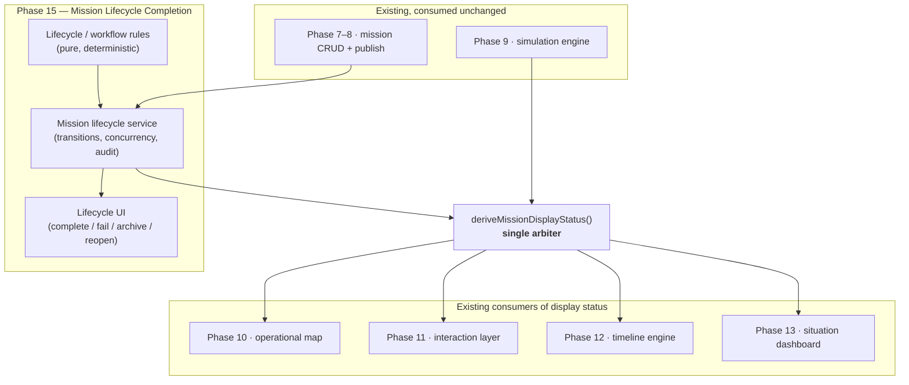
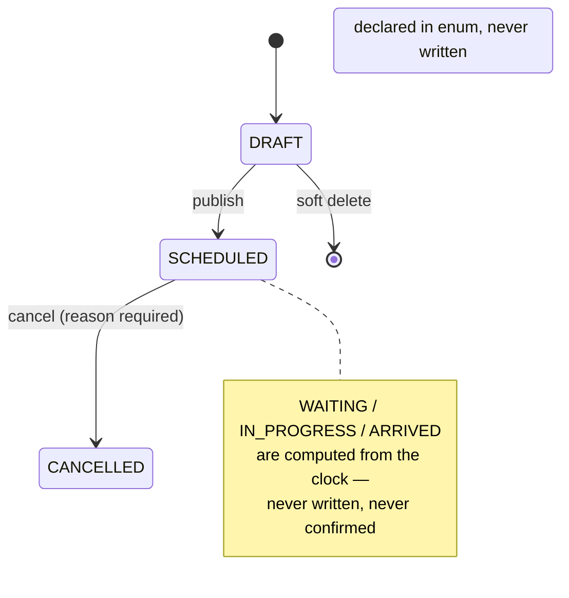
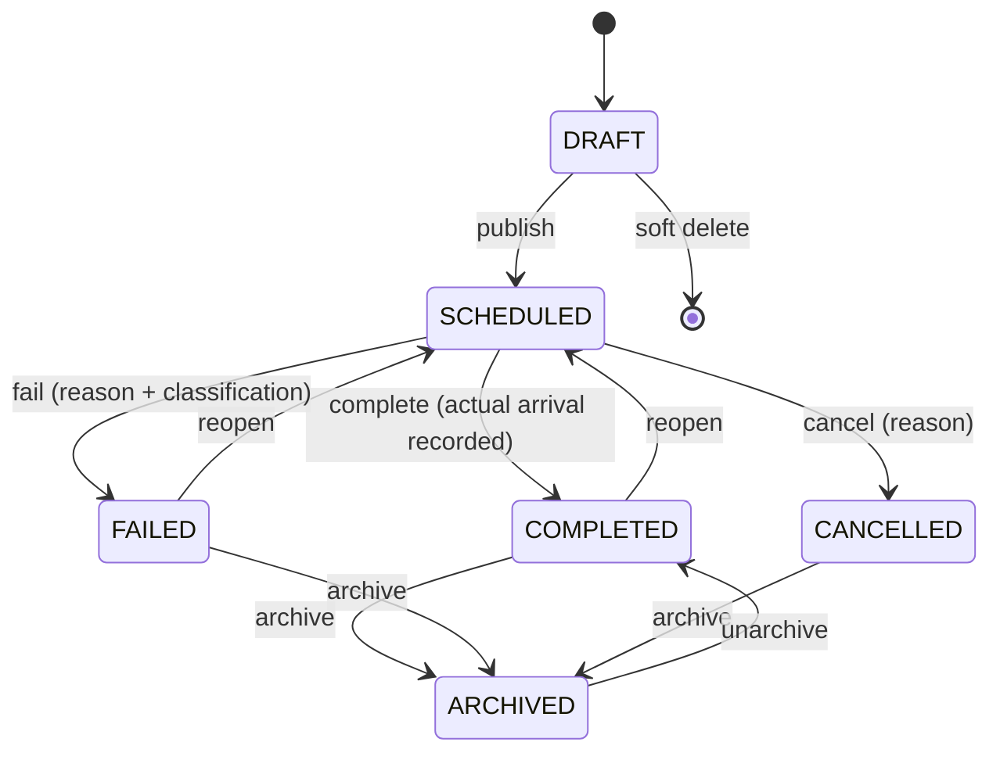

# Phase 15 — Mission Lifecycle Completion — Development Pack

Status of this document: **Planning artifact.** This directory is a Development Pack produced before any Phase 15 code is written. It is binding for whoever implements Phase 15, the same way `docs/IMPLEMENTATION_PLAN.md` is binding for every other phase. Nothing in this pack has been implemented yet.

**Process note:** this pack was opened one document at a time; on the product owner's instruction the remaining documents were then produced in a single pass. **The pack is complete** — `00-README.md` … `13-PROMPT.md`, `ADR.md`, `FAQ.md`, preceded by `PRE_IMPLEMENTATION_DEPENDENCY_REVIEW.md`, which is the audit this document's decisions rest on.

All six open architectural questions listed in §7 below have since been **resolved** and are recorded as ADR-P15-01 … ADR-P15-10 in `ADR.md`. §7 is retained as the record of what was open at this stage; `ADR.md` is authoritative for the answers.

**Reading order for the implementation engineer:** `PRE_IMPLEMENTATION_DEPENDENCY_REVIEW.md` first (it explains why this phase exists and what already ships), then this file, then `01-SCOPE.md` … `13-PROMPT.md` in numeric order, then `ADR.md`, then `FAQ.md`.

---

## 1. Purpose

Phase 15 closes a single, precisely-stated gap:

> **The system currently knows what was *planned*, and what the *clock* implies. It has no way to record what actually *happened*.**

Every mission today is a plan (`startAt`, `estimatedArrivalAt`, a speed snapshot, a route version) plus a status derived from comparing that plan to the current instant. A mission whose `estimatedArrivalAt` has passed displays as «رسیده» forever — whether it arrived early, arrived four hours late, broke down halfway, or never departed. No operator ever confirms anything, and nothing distinguishes "we believe this arrived" from "we know this arrived."

Phase 15 introduces **persisted terminal states and actual timestamps**, so an operator can assert outcomes, and the system can tell the difference between an estimate and a fact.

This phase **owns the business workflow**. It does not calculate positions (Phase 9), render maps (Phase 10), or draw dashboards (Phase 13). It consumes those layers and extends the domain they all read from.

### 1.1 What this phase is *not*

It is **not** the introduction of Mission Management. Mission creation, editing, publishing, cancellation, duplication, validation, vehicle assignment, origin/destination selection, route assignment, ETA estimation, listing, detail, and history **all shipped in Phases 7 and 8** and are in production use by Phases 9–13. §5.1 lists that surface explicitly. The implementation engineer must **consume it, not rebuild it** — rebuilding working, tested code is forbidden by `CLAUDE.md` §5.

## 2. Goals

| # | Goal | Why it is not already met |
|---|---|---|
| **G1** | An operator can mark a mission **completed**, recording an actual arrival time. | No persisted completion exists; «رسیده» is clock-derived only. |
| **G2** | An operator can mark a mission **failed**, with a mandatory reason and a classification. | No `FAILED` state exists anywhere in schema, domain, or UI. |
| **G3** | An operator can **archive** a finished mission so it leaves active operational views. | `ARCHIVED` exists in the enum but **nothing ever writes it** — it is dead today. |
| **G4** | A terminal state can be **reopened** when it was recorded in error. | Depends on G1–G3 existing first. |
| **G5** | A recorded terminal state **always wins** over the clock-derived one, everywhere. | Required so Phases 10–13 stay consistent — see §4.2. |
| **G6** | Actual times are recorded **alongside** planned ones, never overwriting them. | ADR-006 freezes planning data; actuals must not corrupt the plan. |
| **G7** | Two concurrent edits of one mission **cannot silently overwrite** each other. | `updateMission()` is read-validate-write with no precondition; last write wins. |
| **G8** | `MissionType` exists as **reference data**, not hardcoded values. | No `MissionType` model or enum exists; `CLAUDE.md` §5 forbids hardcoding. |
| **G9** | Mission notes become a **timestamped thread** with authorship. | Only a scalar `notes String?` field exists — no author, no time, no history. |
| **G10** | Every new transition writes **audit and history** entries. | Required by ADR-015, consistent with existing operations. |
| **G11** | Every new transition is enforced in the **service layer**, not the UI. | `CLAUDE.md` §2 — hiding a button is not authorization. |
| **G12** | The lifecycle is extensible to multi-stop, convoy, recurring, split, templates and approvals **without architectural change**. | Required by the commissioning brief's Special Requirements. |

## 3. Dependencies

### 3.1 Must exist and be consumed unchanged

| Dependency | Shipped in | Contract this phase relies on |
|---|---|---|
| `Mission` / `MissionShipment` models | Phase 7 | One mission ↔ one *or many* shipments (`CLAUDE.md` §5). Never regress. |
| `createMissionDraft`, `publishMission`, `updateMission`, `cancelMission`, `duplicateMission`, `softDeleteDraftMission`, `listMissions`, `getMissionById`, `getMissionHistory`, `estimateMissionPreview`, `getMissionSummary` | Phases 7–8 | Existing service surface. Extend; do not re-author. |
| `deriveMissionDisplayStatus(mission, now)` | Phase 7 | **The single arbiter of displayed mission status.** Phase 15 changes its inputs, never its role. |
| `isMissionOperationallyLocked` / ADR-018 | Phase 7 | Post-start edit lock. Every new transition must state its interaction with this rule. |
| `simulateMissionPosition()` | Phase 9 | Pure, deterministic. Already freezes at `cancelledAt` for cancelled missions — the precedent Phase 15 generalises. |
| `getMapScene()` | Phase 10 | Batch scene builder. Consumes display status. |
| `useMissionInteraction` | Phase 11 | Client filter/selection state keyed on display status. |
| `useTimelineEngine` | Phase 12 | Supplies the `viewTime` that display status is derived at. |
| `getDashboardSummary()` | Phase 13 | Counts missions by display status (ADR-029). Must stay consistent — see §4.2. |
| `AuditLog` + soft delete | Phase 1 / ADR-015 | Every mutation is audited; business records are soft-deleted. |
| Pessimistic shipment lock (`SELECT … FOR UPDATE` + partial unique index) | Phase 7 / ADR-019 | **Leave exactly as is.** It solves a different problem than G7. |

### 3.2 Must NOT be touched

- **Simulation algorithms** (`mission-simulation.ts`) — Phase 9 owns position/geometry/ETA maths.
- **Map rendering** (`maplibre-map-inner.tsx`, `map-view.tsx`) — Phase 10/11/12 own presentation.
- **Dashboard widgets** (`src/features/dashboard/**`) — Phase 13. This phase may change the *numbers* those widgets show, by changing display status, but must not restructure the widgets.
- **Authentication, roles, user administration** — Phase 1 and Phase 14.
- **Vehicle, cargo-type, office/warehouse management** — Phases 2–3.
- **Applied migrations** — immutable (`CLAUDE.md` §5). New states and fields require *new* migrations. The existing `ARCHIVED` enum value must be reused, never redefined.

## 4. Architecture overview

### 4.1 Where this phase sits



The critical structural point: **all four downstream consumers already read status through one function.** Phase 15 extends that function's inputs rather than adding a parallel path, so consistency across map, table, timeline and dashboard is preserved by construction rather than by discipline.

### 4.2 The governing invariant

> **A recorded terminal state always takes precedence over a clock-derived one.**

This is not a preference; it is the constraint that keeps Phases 10–13 correct. ADR-029 deliberately committed the Situation Dashboard to deriving mission status from `deriveMissionDisplayStatus()` *precisely so its numbers can never diverge from the map's*. If Phase 15 introduced a persisted `COMPLETED` state that only the mission list understood, the dashboard and map would immediately disagree.

The precedent already exists and must be generalised, not invented: `CANCELLED` and `ARCHIVED` already short-circuit the clock comparison in `deriveMissionDisplayStatus()`, and `simulateMissionPosition()` already freezes a cancelled mission at `cancelledAt`. Phase 15 applies the same shape to the new terminal states.

### 4.3 Lifecycle — current vs. target

**Current (as shipped):**



**Target:** the persisted machine gains real terminal states. The exact transition table, guards, and permitted actors are specified in `02-REQUIREMENTS.md` and `03-DOMAIN.md`; this document fixes only the shape:



Whether `reopen` returns to `SCHEDULED` or to a distinct state, and whether `unarchive` is in scope at all, are resolved in `02-REQUIREMENTS.md` — flagged in §7.

### 4.4 Layering

Unchanged from every prior phase, and restated because the brief demands independence from UI, map and simulation:

```
lifecycle rules (pure, no DB, no React)   ← unit-testable in isolation
        ↓
mission lifecycle service (transactions, concurrency, audit)
        ↓
API route handlers (Zod validation, role gate)
        ↓
client hooks → UI components
```

No business rule may live in a component, a route handler, or a Prisma callback (`CLAUDE.md` §2).

## 5. Relationship with previous phases

### 5.1 Phase 7 & 8 — the foundation this phase extends

**Already shipped and in production use.** The implementation engineer consumes all of it:

- **11 service operations** in `mission-service.ts`
- **9 API routes** — `/missions`, `/missions/[id]`, `publish`, `cancel`, `duplicate`, `history`, `simulate`, `estimate`, `summary`
- **11 UI modules** in `src/features/missions/` — six-step wizard, list, detail, cancel dialog, duplicate dialog, history, map-create panel
- **9 test files** — 5 unit, 4 e2e

Phase 15 adds transitions to this module. It does not fork it, wrap it, or replace it.

### 5.2 Phase 9 — simulation engine

Consumed unchanged. Phase 15's terminal states change *when the engine is consulted*, not *what it computes*. The existing cancelled-mission freeze is the pattern to follow.

### 5.3 Phases 10–12 — map, interaction, timeline

Consumed unchanged. They read display status; extending that function propagates new states to all three automatically. Any visible change (e.g. a completed mission's marker) follows from §4.2, not from editing those phases.

### 5.4 Phase 13 — situation dashboard

The most sensitive consumer. ADR-029 §1 binds the dashboard to the same status function as the map. Phase 15 **must** verify that dashboard counters remain reconcilable after new states exist — including deciding whether «رسیده» and a new completed state are one counter or two (§6, terminology).

## 6. Terminology

### 6.1 Reused — frozen, do not redefine

| Term | Meaning |
|---|---|
| «مأموریت» / «مرسوله» | Mission / Shipment (`UX_MAP_AND_DESIGN_SYSTEM.md` §11) |
| «نقشه عملیات» | The map page. ADR-025 — **never** «نمای پایش». |
| «موقعیت تقریبی» / «نمای زنده محاسباتی» / «بازسازی زمانی» | Estimated position / live-computed view / historical reconstruction. `CLAUDE.md` §5 bans «موقعیت زنده». |
| **persisted status** | `Mission.persistedStatus` — the DB column. |
| **display status** | Output of `deriveMissionDisplayStatus()`. |

> **Every rule in every later document must state which of the two status vocabularies it means, every time.** Conflating them was the single most consequential ambiguity found in Phase 13 (ADR-029 §1) and the review's §6 flags it again.

### 6.2 New — to be defined precisely in `03-DOMAIN.md`

`Mission Lifecycle`, `Lifecycle Transition`, `Terminal State`, `Actual Time` (vs. *planned* time), `Failure Classification`, `Mission Type`, `Mission Note`, `Mission Version` (optimistic concurrency token — **not** route version), `Reopen`, `Archive`.

⚠️ **`Mission Version` must not be confused with `routeVersion`**, which already exists and snapshots the *route* per ADR-007/ADR-020. Two different concepts, similar names — `03-DOMAIN.md` must disambiguate explicitly.

⚠️ **"Assignment" is overloaded.** The brief uses it for *vehicle* assignment; the codebase uses `MissionShipment.isActiveAssignment` for *shipment* assignment. Both meanings must be qualified wherever used.

## 7. Open architectural questions for later documents

> **All resolved.** See `ADR.md` for the binding answers: (1) → ADR-P15-01, (2) → ADR-P15-02, (3) → ADR-P15-03, (4) → ADR-P15-04, (5) → ADR-P15-05, (6) → ADR-P15-06. Retained below as the record of what was open when this document was written.

Deliberately unresolved here — each becomes a full `ADR-P15-xx` entry once `04-ARCHITECTURE.md` has laid out the options:

1. **Where do actual timestamps live?** On `Mission` alongside planned fields, or in a separate observation/event table? On-model is simpler and matches existing `cancelledAt`; a separate table generalises better toward multi-stop and event sourcing (G12). → `03-DOMAIN.md` / `07-DATABASE.md`.
2. **Does `reopen` return to `SCHEDULED`, or to a distinct `REOPENED` state?** Returning to `SCHEDULED` keeps the machine small but loses the fact that a terminal state was reversed — which audit may need to surface. → `02-REQUIREMENTS.md`.
3. **Is a completed mission still simulated?** Freezing at `actualArrivalAt` matches the cancelled precedent; continuing to simulate would let a "completed" mission still appear to move. → `02-REQUIREMENTS.md` / `05-IMPLEMENTATION.md`.
4. **One counter or two on the dashboard?** Whether clock-derived «رسیده» and persisted completion are one KPI or two distinct ones, and what the Persian labels are, given «رسیده» is already taken. → `06-API.md` + a Phase 13 consistency check.
5. **Optimistic concurrency scope.** Does the `version` precondition apply to every mutation, or only to operational-field edits? Cancel and archive are idempotent-ish and may warrant different treatment. → `04-ARCHITECTURE.md`.
6. **Who may perform each transition?** Whether completion/failure is Planner-only, Admin-only, or both — and whether Status Viewer ever sees the controls. → `02-REQUIREMENTS.md`, enforced server-side per G11.

## 8. Deliverables

| # | Deliverable |
|---|---|
| D1 | Pure lifecycle rules module (transition table, guards, invariants) with exhaustive unit tests |
| D2 | Extended `deriveMissionDisplayStatus()` honouring persisted terminal states, with boundary tests |
| D3 | Prisma migration: new enum values, actual-time fields, `version` column, `MissionType`, `MissionNote` |
| D4 | Mission lifecycle service operations: complete, fail, archive, reopen — transactional, audited |
| D5 | Optimistic concurrency on mission mutations with a distinct domain error |
| D6 | Zod schemas + API routes for each transition, role-gated server-side |
| D7 | UI affordances on mission detail (and, where warranted, the operational table) for each transition |
| D8 | Mission note thread UI + service |
| D9 | Unit, integration, concurrency and e2e tests per `08-TESTS.md` |
| D10 | Docs: `PHASE_STATUS.md` entry, `README.md` update, ADRs for every §7 resolution |

## 9. Definition of success

- An operator confirms a real arrival whose time differs from the ETA, and the map, mission table, timeline and dashboard all reflect it **consistently and simultaneously**.
- A failed mission is visibly distinct from a cancelled one and from a late one.
- Two operators editing the same mission concurrently: the second receives a clear conflict error, never a silent overwrite.
- No Phase 7–8 file is rewritten; no Phase 9–13 behaviour regresses.

## 10. Next step

Awaiting product-owner approval of this document before `01-SCOPE.md` is written.
