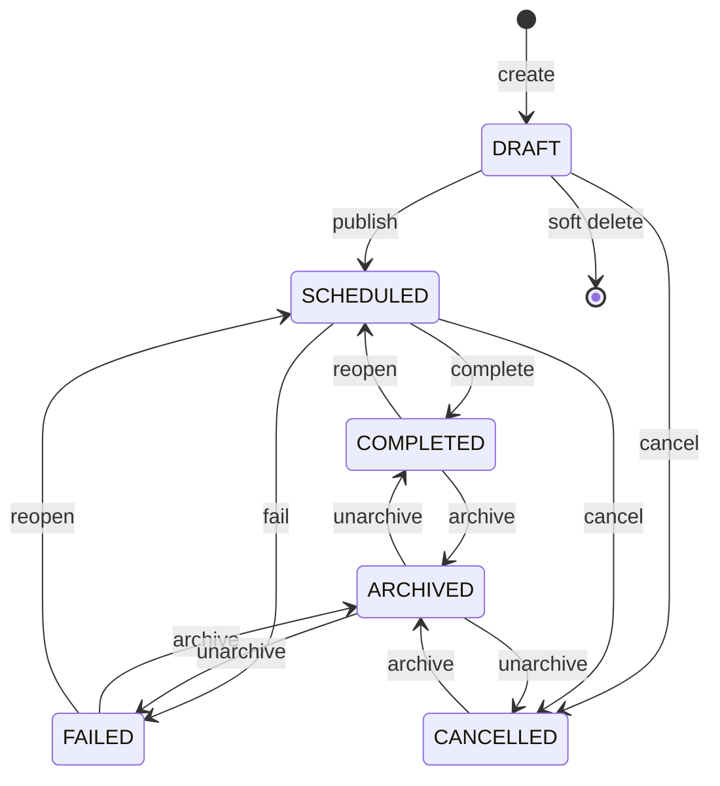

# Phase 15 — 02 — Requirements

Every rule is numbered and testable. `08-TESTS.md` references these IDs directly.

**Vocabulary reminder (non-negotiable):** every rule below states whether it concerns **persisted status** (`Mission.persistedStatus`, a DB column) or **display status** (output of `deriveMissionDisplayStatus()`). Conflating them was the costliest ambiguity of Phase 13 (ADR-029 §1).

---

## 1. Functional requirements

| ID | Requirement |
|---|---|
| **FR-01** | A user with `ADMIN` or `MISSION_PLANNER` can mark a `SCHEDULED` mission **completed**, supplying an actual arrival time. |
| **FR-02** | The same roles can mark a `SCHEDULED` mission **failed**, supplying a mandatory free-text reason and a classification. |
| **FR-03** | The same roles can **archive** a mission in any terminal persisted state (`COMPLETED`, `FAILED`, `CANCELLED`). |
| **FR-04** | The same roles can **unarchive** an `ARCHIVED` mission back to the terminal state it held before archiving. |
| **FR-05** | The same roles can **reopen** a `COMPLETED` or `FAILED` mission back to `SCHEDULED`, supplying a mandatory reason. |
| **FR-06** | Every transition writes an `AuditLog` entry and appears in the mission's history. |
| **FR-07** | Mission detail shows actual times alongside planned times, clearly labelled as distinct. |
| **FR-08** | Users can add timestamped, authored notes to a mission in any state; notes are soft-deletable by their author or an Admin. |
| **FR-09** | An Admin can manage `MissionType` reference data; a mission may optionally carry one. |
| **FR-10** | Every mutating mission operation requires the client's last-read `version`; a mismatch is rejected with a distinct error. |
| **FR-11** | New statuses appear consistently in mission list, mission detail, operational table, map detail panel, and dashboard. |
| **FR-12** | `STATUS_VIEWER` sees no lifecycle controls and is rejected server-side if it calls the endpoints. |

## 2. Lifecycle rules

### 2.1 Persisted state machine

### 2.2 Transition table (authoritative)

`04-ARCHITECTURE.md` requires this be encoded as **data**, not `if`-chains.

| # | Transition | From (persisted) | To | Required input | Guards |
|---|---|---|---|---|---|
| T1 | `publish` | `DRAFT` | `SCHEDULED` | — | existing Phase 7 rules (unchanged) |
| T2 | `cancel` | `DRAFT`, `SCHEDULED` | `CANCELLED` | `cancellationReason` | existing (unchanged) |
| T3 | `complete` | `SCHEDULED` | `COMPLETED` | `actualArrivalAt`, optional `actualDepartureAt` | LR-01 … LR-05 |
| T4 | `fail` | `SCHEDULED` | `FAILED` | `failedAt`, `failureReason`, `failureClassification` | LR-06 … LR-08 |
| T5 | `archive` | `COMPLETED`, `FAILED`, `CANCELLED` | `ARCHIVED` | — | LR-09 |
| T6 | `unarchive` | `ARCHIVED` | prior terminal state | — | LR-10 |
| T7 | `reopen` | `COMPLETED`, `FAILED` | `SCHEDULED` | `reopenReason` | LR-11 … LR-14 |
| T8 | `softDelete` | `DRAFT` | (deleted) | — | existing (unchanged) |

**Any (from, action) pair not in this table is invalid** and must be rejected with `MISSION_INVALID_TRANSITION` — never silently ignored.

### 2.3 Explicitly invalid transitions (must be tested)

| Attempt | Rejected because |
|---|---|
| `complete` a `DRAFT` | Unpublished missions have no operational reality. |
| `complete` an already-`COMPLETED` | Not idempotent by design — repeat submission must not silently overwrite an arrival time. |
| `fail` a `CANCELLED` | Cancellation is a decision, failure is an outcome; a cancelled mission never ran. |
| `reopen` a `CANCELLED` | Use `duplicate` (ADR-018's sanctioned path) — reopening would resurrect released shipments. |
| `reopen` an `ARCHIVED` | Must `unarchive` first — two-step by design, so archiving is a real barrier. |
| `archive` a `DRAFT` or `SCHEDULED` | Only finished work is archivable. |
| `publish` anything but `DRAFT` | Existing rule, unchanged. |
| Any transition on a soft-deleted mission | Deleted records are invisible to the service. |

### 2.4 Lifecycle rules (guards)

| ID | Rule |
|---|---|
| **LR-01** | `actualArrivalAt` must not be in the future relative to server time. |
| **LR-02** | `actualArrivalAt` must be **≥ `startAt`**. A mission cannot arrive before it was scheduled to depart. |
| **LR-03** | `actualArrivalAt` **may** be earlier or later than `estimatedArrivalAt` by any margin — earliness/lateness is data, not an error (A4). |
| **LR-04** | If `actualDepartureAt` is supplied it must be ≥ `startAt` and ≤ `actualArrivalAt`. |
| **LR-05** | On complete, every actively-assigned shipment becomes `DELIVERED` and `isActiveAssignment = false`. |
| **LR-06** | `failedAt` must not be in the future and must be ≥ `startAt`. |
| **LR-07** | `failureReason` is mandatory, trimmed, 3–500 chars. `failureClassification` must be a valid enum member. |
| **LR-08** | On fail, every actively-assigned shipment returns to `WAITING_FOR_DISPATCH` with `isActiveAssignment = false`, so it can be re-planned. |
| **LR-09** | Archiving records `archivedAt` and preserves the pre-archive terminal state so LR-10 can restore it. |
| **LR-10** | Unarchiving restores exactly the previous terminal state and clears `archivedAt`. |
| **LR-11** | `reopenReason` is mandatory, trimmed, 3–500 chars. |
| **LR-12** | Reopen clears the terminal facts it reverses (`actualArrivalAt`/`failedAt`/`failureReason`/`failureClassification`), increments `reopenCount`, sets `lastReopenedAt`. |
| **LR-13** | Reopen re-acquires the mission's shipments: each is re-assigned (`isActiveAssignment = true`) and set to `IN_TRANSIT`. **If any shipment is meanwhile actively assigned to another mission, reopen is rejected** with `SHIPMENT_ALREADY_ASSIGNED` (ADR-019's unique index enforces this). |
| **LR-14** | Reopen does **not** restore a deleted mission and does not bypass ADR-018 — a reopened mission is `SCHEDULED` and subject to the same edit lock as any other. |

### 2.5 Display-status precedence (the governing invariant)

`deriveMissionDisplayStatus(mission, viewTime)` evaluates **in this exact order**. The first match wins:

| Order | Condition (persisted) | Display status |
|---|---|---|
| 1 | `DRAFT` | `DRAFT` |
| 2 | `CANCELLED` | `CANCELLED` |
| 3 | `ARCHIVED` | `ARCHIVED` |
| 4 | **`COMPLETED`** | **`COMPLETED`** |
| 5 | **`FAILED`** | **`FAILED`** |
| 6 | `SCHEDULED` ∧ `viewTime < startAt` | `WAITING` |
| 7 | `SCHEDULED` ∧ `viewTime ≥ estimatedArrivalAt` | `ARRIVED` |
| 8 | otherwise | `IN_PROGRESS` |

Rows 4–5 are the **only** change. They are short-circuits placed exactly where `CANCELLED`/`ARCHIVED` already sit, which is what keeps map, table, timeline and dashboard consistent for free.

> **`ARRIVED` and `COMPLETED` are different facts.** `ARRIVED` = "the clock says it should be there." `COMPLETED` = "an operator confirmed it is." Never merge their labels or their counters.

### 2.6 Simulation freeze

| ID | Rule |
|---|---|
| **SF-01** | A `COMPLETED` mission is frozen at `actualArrivalAt` — the engine is not consulted for a later position. |
| **SF-02** | A `FAILED` mission is frozen at `failedAt`. |
| **SF-03** | These mirror the shipped `CANCELLED`/`cancelledAt` freeze exactly. No new position maths is introduced (S13). |

## 3. Validation rules

| ID | Rule | Error code |
|---|---|---|
| **V-01** | Every request body validated with Zod at the route boundary (`CLAUDE.md` §2). | `*_INVALID_INPUT` (422) |
| **V-02** | Timestamps are ISO-8601 with offset; converted at the boundary only (ADR-008). | `422` |
| **V-03** | `version` is a required non-negative integer on every mutating request. | `MISSION_VERSION_REQUIRED` (422) |
| **V-04** | Mission not found or soft-deleted. | `MISSION_NOT_FOUND` (404) |
| **V-05** | Transition not permitted from the current state. | `MISSION_INVALID_TRANSITION` (409) |
| **V-06** | Supplied `version` ≠ stored `version`. | `MISSION_VERSION_CONFLICT` (409) |
| **V-07** | Guard violation (LR-01…LR-14). | specific domain code (422) |
| **V-08** | Caller lacks the role. | `FORBIDDEN` (403) |
| **V-09** | `missionTypeId` must reference an existing, non-deleted, active `MissionType`. | `MISSION_TYPE_NOT_FOUND` (422) |
| **V-10** | Note body trimmed, 1–2000 chars. | `422` |

## 4. Concurrency rules

| ID | Rule |
|---|---|
| **CC-01** | `Mission.version` starts at 0 and increments by exactly 1 on every successful mutating operation. |
| **CC-02** | Every mutating operation performs a conditional update — `WHERE id = ? AND version = ?` — inside its transaction. Zero rows affected ⇒ `MISSION_VERSION_CONFLICT`. |
| **CC-03** | Read endpoints return the current `version`; clients echo it back. |
| **CC-04** | Notes are exempt (append-only, no lost-update risk) — CC-02 does not apply and the note does not bump `version`. |
| **CC-05** | ADR-019's pessimistic shipment lock stays exactly as is. The two mechanisms address different problems and coexist. |
| **CC-06** | A conflict must be surfaced as a recoverable UI state with a reload affordance — never a silent overwrite, never a raw 409. |

## 5. Transaction boundaries

| ID | Rule |
|---|---|
| **TX-01** | Each transition is a single `prisma.$transaction`: guard re-check → conditional mission update → shipment side-effects. |
| **TX-02** | The guard is re-evaluated **inside** the transaction against freshly-read state, never against data read before it. |
| **TX-03** | `logAudit` runs **after** the transaction commits, matching the shipped `cancelMission` pattern. A failed audit write must not roll back a committed business fact; it must be logged as an operational error. |
| **TX-04** | Shipment mutations that could race use the ADR-019 `FOR UPDATE` lock (relevant to LR-13's re-acquisition). |

## 6. Failure handling

| Scenario | Required behaviour |
|---|---|
| DB unavailable mid-transition | Transaction rolls back; mission unchanged; API returns 500 with a Persian message; UI offers retry. |
| Audit write fails after commit | Business fact stands; error logged; **never** presented as a failed transition. |
| Two operators complete the same mission simultaneously | Exactly one succeeds; the other receives `MISSION_VERSION_CONFLICT`. |
| Reopen races a competing assignment of the same shipment | ADR-019's unique index rejects it; surfaced as `SHIPMENT_ALREADY_ASSIGNED`. |
| Client sends a stale `version` after someone else archived the mission | `MISSION_VERSION_CONFLICT` — the transition guard is not even reached. |
| Malformed timestamp | 422 before any DB access. |

## 7. Performance requirements

| ID | Requirement |
|---|---|
| **P-01** | A single transition completes in < 300 ms server-side at current data volume (~1,000 missions). |
| **P-02** | No transition triggers an N+1 query; shipment side-effects use set-based `updateMany`. |
| **P-03** | `deriveMissionDisplayStatus` stays O(1) and allocation-free — it runs once per mission per scene build and once per mission per dashboard request. |
| **P-04** | New columns used in filters (`persistedStatus` already indexed; add indexes per `07-DATABASE.md`) must not force sequential scans. |
| **P-05** | The dashboard's mission query must not regress; it already reads a narrow `select` over all missions in range. |

## 8. Accessibility & RTL

| ID | Requirement |
|---|---|
| **AX-01** | Every lifecycle action is keyboard-reachable with a visible focus ring; dialogs close on `Escape`. |
| **AX-02** | Destructive/irreversible actions (fail, archive, reopen) require explicit confirmation naming the mission. |
| **AX-03** | Status is never conveyed by colour alone — icon plus Persian label (`UX_MAP_AND_DESIGN_SYSTEM.md` §4). |
| **AX-04** | Touch targets ≥ 44×44 CSS px. |
| **AX-05** | Layout uses logical properties; no hardcoded `left`/`right`. |
| **AX-06** | Numbers, codes and timestamps render LTR inside RTL text via `dir="ltr"`. |
| **AX-07** | Status changes announced via a bounded `aria-live` region. |

## 9. Offline behaviour

Per ADR-004 the product is offline **from the internet**, not from the LAN. There is no offline mutation queue and Phase 15 does not add one.

| ID | Requirement |
|---|---|
| **OF-01** | No transition depends on any external service, CDN, font or asset. |
| **OF-02** | If the internal API is unreachable, the UI shows a recoverable error with retry; it does not queue or fabricate a transition. |
| **OF-03** | Lifecycle actions remain fully functional with the internet disconnected and the LAN up. |

## 10. Edge cases

| # | Case | Required behaviour |
|---|---|---|
| E1 | `actualArrivalAt` exactly equals `startAt` | Accepted (zero-duration is legal, LR-02 uses ≥). |
| E2 | `actualArrivalAt` exactly equals `estimatedArrivalAt` | Accepted; "on time". |
| E3 | `actualArrivalAt` one second in the future | Rejected (LR-01) — clocks must not produce future facts. |
| E4 | Completing a mission whose display status is still `WAITING` | **Accepted.** An operator may confirm an early arrival before the planned departure has elapsed, provided LR-02 holds. |
| E5 | Mission with zero active shipments completed | Accepted; LR-05 is a no-op. |
| E6 | Reopen a mission reopened twice already | Accepted; `reopenCount` = 3. No cap in this phase. |
| E7 | Archive then unarchive then archive | Accepted; each writes audit. |
| E8 | Failing a mission whose ETA already passed (displayed `ARRIVED`) | **Accepted and important** — this is the exact case the phase exists for: the clock said arrived, reality says failed. Persisted `FAILED` wins (§2.5 row 5). |
| E9 | `missionTypeId` pointing at a soft-deleted type | Rejected (V-09). |
| E10 | Note added to an archived mission | Accepted — notes are always allowed (FR-08). |
| E11 | Two notes submitted simultaneously | Both persist; CC-04 exempts notes. |
| E12 | Timeline scrubbed to before a completed mission's `actualArrivalAt` | Display status is still `COMPLETED` — persisted state is not time-dependent. Documented explicitly so it is not mistaken for a bug. |
| E13 | Dashboard range excludes a completed mission's `startAt` | It is simply not counted, like any other range-filtered mission. Consistent with Phase 13. |
| E14 | Client omits `version` | 422 (V-03), not a silent success. |
