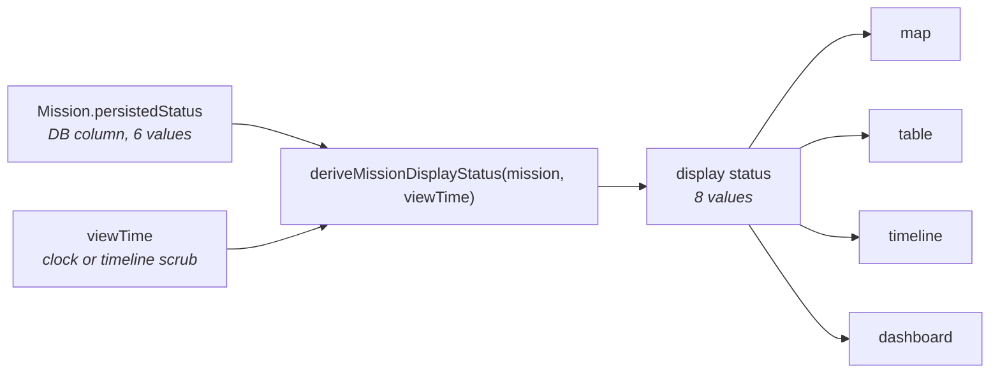
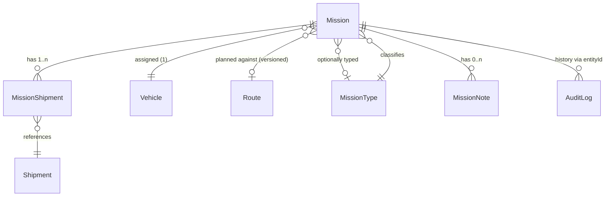

# Phase 15 — 03 — Domain Model

Ubiquitous language, entities, relationships, and invariants. Terms defined here are used verbatim in every later document and in code identifiers.

---

## 1. Naming hazards — read first

Three name collisions exist in this codebase. Getting them wrong produces subtly broken code that type-checks.

| Hazard | Distinction |
|---|---|
| **`Mission.version` vs `Mission.routeVersion`** | `version` (**new**) is an optimistic-concurrency token — an opaque integer that increments on every mutation and carries no business meaning. `routeVersion` (**existing**, ADR-007/ADR-020) snapshots *which version of the route* the mission was planned against. Unrelated. Never derive one from the other. |
| **"Assignment"** | *Vehicle assignment* = `Mission.vehicleId`, one per mission. *Shipment assignment* = `MissionShipment.isActiveAssignment`, many per mission, protected by ADR-019's partial unique index. Always qualify which. |
| **`ARRIVED` vs `COMPLETED`** | `ARRIVED` is **derived** — the clock passed the ETA. `COMPLETED` is **asserted** — a human confirmed it. A mission can be `ARRIVED` and then turn out `FAILED`. Never treat them as synonyms, never merge their labels. |

## 2. Entities

### 2.1 Mission (existing — extended)

The aggregate root. Phase 15 adds fields; it does not restructure the entity.

| Field | Status | Meaning |
|---|---|---|
| `id`, `code` | existing | Identity. `code` is `MS-` + 8 uppercase hex, unique, generated at creation. **Unchanged** — changing it would orphan every shipped mission. |
| `vehicleId` | existing | Vehicle assignment (one). |
| `originWarehouseId`, `originTitle`, `originLatitude/Longitude` | existing | Snapshotted origin (ADR-006). |
| `destinationOrganizationUnitId`, `destinationTitle`, `destinationLatitude/Longitude` | existing | Snapshotted destination. |
| `startAt` | existing | **Planned** departure. |
| `estimatedArrivalAt` | existing | **Planned/computed** arrival. |
| `speedSnapshotKmh`, `distanceMeters`, `estimatedDurationSeconds`, `routeId`, `routeVersion` | existing | Planning snapshot (ADR-006). |
| `persistedStatus` | existing, **extended** | See §3. |
| `cancelledAt`, `cancellationReason` | existing | Cancellation facts. |
| `notes` | existing | Legacy scalar. **Superseded by `MissionNote`** — see §2.5. |
| `publishedAt`, `duplicatedFromMissionId` | existing | Provenance. |
| **`actualDepartureAt`** | **new**, nullable | Observed departure. Optional. |
| **`actualArrivalAt`** | **new**, nullable | Observed arrival. Required to complete. |
| **`failedAt`** | **new**, nullable | When the failure occurred. Required to fail. |
| **`failureReason`** | **new**, nullable | Mandatory free text on failure. |
| **`failureClassification`** | **new**, nullable | Enum, §3.3. |
| **`archivedAt`** | **new**, nullable | When archived. |
| **`statusBeforeArchive`** | **new**, nullable | The terminal state to restore on unarchive (LR-09/LR-10). |
| **`reopenCount`** | **new**, default 0 | How many times reopened. |
| **`lastReopenedAt`** | **new**, nullable | Most recent reopen. |
| **`version`** | **new**, default 0 | Optimistic-concurrency token. |
| **`missionTypeId`** | **new**, nullable | Optional reference to `MissionType`. |

> **Planned vs actual is the central modelling idea of this phase.** Planned fields are frozen at publish (ADR-006) and are never overwritten by actuals. Actuals are additive observations. Any code that "corrects" `estimatedArrivalAt` from `actualArrivalAt` is wrong — it would destroy the ability to measure estimate accuracy.

### 2.2 MissionStatus — two vocabularies

Restated because it is the most-misused concept in the codebase.



The two sets are **not** the same size and **not** interchangeable:

| Persisted (6) | Display (8) |
|---|---|
| `DRAFT` | `DRAFT` |
| `SCHEDULED` | `WAITING` \| `IN_PROGRESS` \| `ARRIVED` *(derived from viewTime)* |
| `COMPLETED` **(new)** | `COMPLETED` **(new)** |
| `FAILED` **(new)** | `FAILED` **(new)** |
| `CANCELLED` | `CANCELLED` |
| `ARCHIVED` | `ARCHIVED` |

`SCHEDULED` is the only persisted value that fans out. Every other value maps 1:1 — which is precisely why persisted terminal states can short-circuit the clock.

### 2.3 MissionType (new — reference data)

Mirrors the shipped `VehicleType` / `CargoType` pattern exactly. Reference data, Admin-managed, never hardcoded in business logic (`CLAUDE.md` §5).

| Field | Notes |
|---|---|
| `id` | uuid |
| `code` | optional, unique |
| `name` | unique, required |
| `description` | optional |
| `isActive` | default true |
| `createdAt`, `updatedAt`, `deletedAt` | soft delete (ADR-015) |

A `MissionType` in use by any mission may not be hard-deleted — same rule the existing vehicle/cargo types follow.

### 2.4 MissionFailureClassification (new — enum)

A closed set, because it drives future analytics grouping. Free-text nuance goes in `failureReason`.

`VEHICLE_BREAKDOWN` · `ACCIDENT` · `CARGO_ISSUE` · `ROUTE_BLOCKED` · `WEATHER` · `DRIVER_UNAVAILABLE` · `OTHER`

`OTHER` requires `failureReason` to be genuinely descriptive — enforced only as a length rule (LR-07), not semantically.

### 2.5 MissionNote (new)

Replaces the scalar `Mission.notes` for anything conversational. The legacy field stays for backward compatibility and continues to hold the planner's original note; it is **not** migrated in this phase (see `07-DATABASE.md` §5).

| Field | Notes |
|---|---|
| `id` | uuid |
| `missionId` | FK, indexed |
| `body` | 1–2000 chars, trimmed |
| `createdById` | author |
| `createdAt` | ordering key |
| `deletedAt` | soft delete; author or Admin only |

Notes are **append-only** and exempt from optimistic concurrency (CC-04) — two people writing notes simultaneously is not a lost update.

### 2.6 MissionHistory / MissionAudit

**No new entity.** History is already served from `AuditLog` via `getMissionHistory()`. Phase 15 adds new `action` values to that stream:

`mission.completed` · `mission.failed` · `mission.archived` · `mission.unarchived` · `mission.reopened` · `mission.note.added` · `mission.note.deleted`

matching the shipped naming (`mission.cancelled`, `mission.published`, …). Each entry carries the actor, the entity id, and an `afterJson` snapshot — the shape `cancelMission` already establishes.

> **Design note.** A dedicated `MissionEvent` table was considered and deferred (ADR-P15-01). `AuditLog` already provides append-only, actor-attributed, queryable history. Introducing a parallel log now would fragment the audit trail and duplicate ADR-015. When multi-stop missions arrive, a `MissionStop` table — not an event log — is the right seam.

## 3. Value objects & enums

### 3.1 `MissionPersistedStatus` (extended)

```
DRAFT | SCHEDULED | COMPLETED (new) | FAILED (new) | CANCELLED | ARCHIVED
```

### 3.2 `MissionDisplayStatus` (extended)

```
DRAFT | WAITING | IN_PROGRESS | ARRIVED | COMPLETED (new) | FAILED (new) | CANCELLED | ARCHIVED
```

Persian labels (extend `src/lib/domain/mission-labels.ts`, the domain-layer map created in Phase 13):

| Value | Label | Tone |
|---|---|---|
| `DRAFT` | پیش‌نویس | info |
| `WAITING` | در انتظار حرکت | warning |
| `IN_PROGRESS` | در حال حرکت | primary |
| `ARRIVED` | رسیده (تخمینی) | success |
| `COMPLETED` | تکمیل‌شده | success |
| `FAILED` | ناموفق | danger |
| `CANCELLED` | لغوشده | danger |
| `ARCHIVED` | بایگانی‌شده | info |

> `ARRIVED`'s label gains the qualifier «(تخمینی)» so an operator can never confuse a clock-derived arrival with a confirmed one. This is a deliberate, user-visible change to shipped copy and must be called out in the phase summary.

### 3.3 Terminal-state predicate

```ts
/** وضعیت‌های پایانی ثبت‌شده — بر وضعیت ساعت‌محور اولویت دارند. */
const TERMINAL_PERSISTED: readonly MissionPersistedStatus[] =
  ["COMPLETED", "FAILED", "CANCELLED", "ARCHIVED"];

export function isTerminalPersistedStatus(s: MissionPersistedStatus): boolean {
  return TERMINAL_PERSISTED.includes(s);
}
```

## 4. Aggregates & relationships



**`Mission` is the aggregate root.** `MissionShipment` and `MissionNote` have no independent lifecycle. `Vehicle`, `Route`, `Shipment` and `MissionType` are separate aggregates referenced by id — Phase 15 never mutates a `Vehicle` or a `Route`, and mutates `Shipment.status` only as a declared side-effect of a mission transition (LR-05, LR-08, LR-13).

## 5. Invariants

Must hold at every transaction boundary. `08-TESTS.md` tests each.

| ID | Invariant |
|---|---|
| **I-01** | `persistedStatus` is always exactly one of the six enum values. |
| **I-02** | `COMPLETED` ⟹ `actualArrivalAt` is non-null. |
| **I-03** | `FAILED` ⟹ `failedAt`, `failureReason` and `failureClassification` are all non-null. |
| **I-04** | `CANCELLED` ⟹ `cancelledAt` and `cancellationReason` are non-null. *(existing)* |
| **I-05** | `ARCHIVED` ⟹ `archivedAt` and `statusBeforeArchive` are non-null, and `statusBeforeArchive` ∈ {`COMPLETED`,`FAILED`,`CANCELLED`}. |
| **I-06** | `actualArrivalAt` non-null ⟹ `actualArrivalAt ≥ startAt`. |
| **I-07** | `actualDepartureAt` non-null ⟹ `startAt ≤ actualDepartureAt ≤ actualArrivalAt`. |
| **I-08** | `version` is monotonically non-decreasing for a given mission id, forever. |
| **I-09** | A shipment is actively assigned to **at most one** mission at any instant (ADR-019, enforced by partial unique index). |
| **I-10** | Planned fields (`startAt`, `estimatedArrivalAt`, `speedSnapshotKmh`, `distanceMeters`, `routeVersion`) are **never** written by any Phase 15 transition. |
| **I-11** | `reopenCount ≥ 0`; `reopenCount > 0` ⟹ `lastReopenedAt` non-null. |
| **I-12** | A mission in a non-terminal persisted state (`DRAFT`, `SCHEDULED`) has `actualArrivalAt`, `failedAt`, `archivedAt` all null. Reopen must clear them (LR-12) or I-12 breaks. |
| **I-13** | `deriveMissionDisplayStatus` is pure and total — defined for every mission, never throws. |

## 6. Domain services (pure)

Live in `src/lib/domain/`, no DB, no React, fully unit-testable.

| Function | Responsibility |
|---|---|
| `deriveMissionDisplayStatus(mission, viewTime)` | **Existing, extended.** Sole arbiter of display status. |
| `isMissionOperationallyLocked(mission, now)` | **Existing, unchanged.** ADR-018 edit lock. |
| `isTerminalPersistedStatus(status)` | New. |
| `canTransition(from, action)` | New. Table lookup against §2.2 of `02-REQUIREMENTS.md`. |
| `assertTransitionAllowed(from, action)` | New. Throws `MISSION_INVALID_TRANSITION`. |
| `validateCompletionTimes(mission, input)` | New. LR-01…LR-04. |
| `validateFailureInput(mission, input)` | New. LR-06…LR-07. |
| `nextVersion(current)` | New. Trivial, but named so the increment rule lives in one place. |

## 7. MissionContext / MissionWorkflow

The brief names these; they map onto existing structures rather than new ones:

- **MissionContext** — the actor + mission + `viewTime` triple a transition is evaluated against. Modelled as the existing `ActorContext` plus the mission entity; **no new type is introduced**, because inventing a context object that merely wraps two existing values adds indirection without invariants.
- **MissionWorkflow** — the transition table (§2.2) plus its guards. Encoded as data in `mission-lifecycle.ts`, not as a class hierarchy. This is what makes the approval-workflow extension (§3 of `01-SCOPE.md`) a table entry rather than a refactor.
