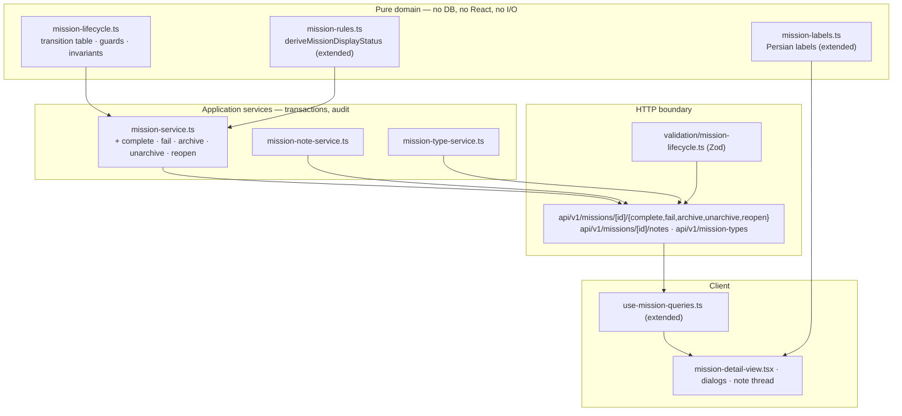
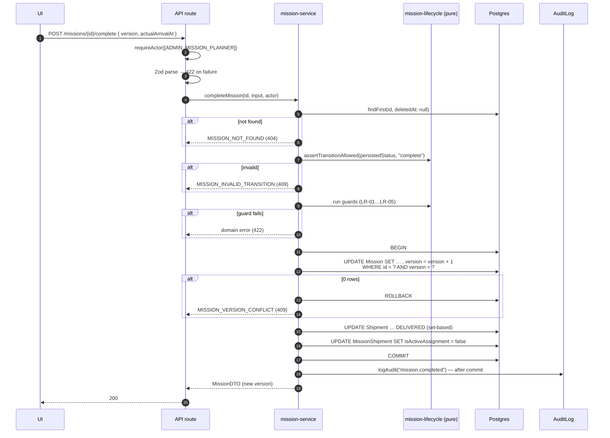
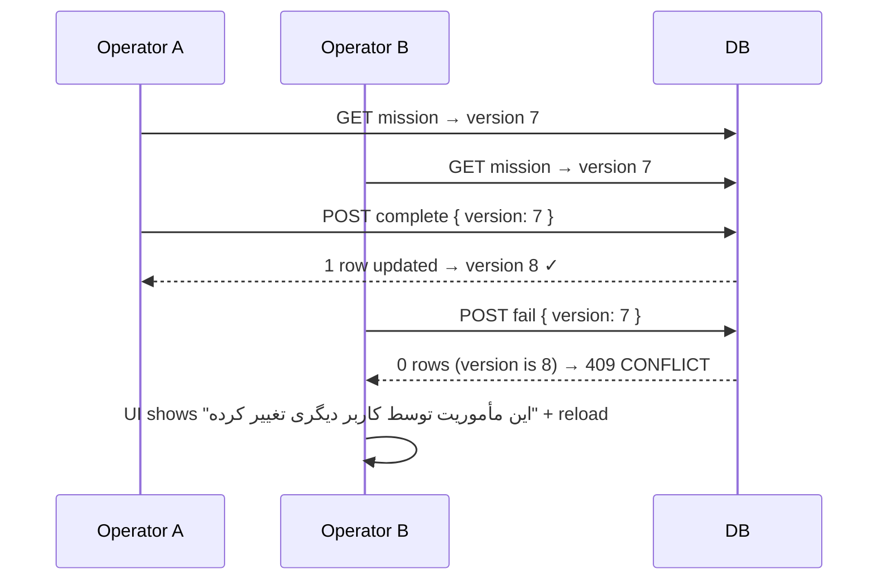

# Phase 15 — 04 — Architecture

How the module is structured, why, and where it may be extended. Every architectural decision here is final and recorded in `ADR.md`; the implementation engineer makes none.

---

## 1. Layering



**Dependency rule (enforced, not aspirational):** arrows point one way only. L1 imports nothing from L2–L4. L2 imports L1 and Prisma. L3 imports L2. L4 imports L3's DTO types and L1's *pure* helpers only.

> **Layer-crossing hazard learned in Phase 13:** `src/features/**` may import from `src/lib/domain/**`, but a server service must **never** import from `src/features/**`. Doing so drags UI types — and transitively the Prisma client — into the wrong bundle. Phase 13 hit exactly this: importing `roles.ts` into a `"use client"` component pulled `node:module` into the browser bundle, which type-checked cleanly and then failed the Turbopack build. **`tsc` will not catch this class of error; only `npm run build` will.**

## 2. Workflow engine

### 2.1 The transition table is data

```ts
export type MissionAction =
  | "publish" | "cancel" | "complete" | "fail"
  | "archive" | "unarchive" | "reopen" | "softDelete";

export interface TransitionSpec {
  readonly action: MissionAction;
  readonly from: readonly MissionPersistedStatus[];
  /** null ⇒ target is computed (unarchive restores statusBeforeArchive). */
  readonly to: MissionPersistedStatus | null;
}

export const MISSION_TRANSITIONS: readonly TransitionSpec[] = [
  { action: "publish",    from: ["DRAFT"],                              to: "SCHEDULED" },
  { action: "cancel",     from: ["DRAFT", "SCHEDULED"],                 to: "CANCELLED" },
  { action: "complete",   from: ["SCHEDULED"],                          to: "COMPLETED" },
  { action: "fail",       from: ["SCHEDULED"],                          to: "FAILED" },
  { action: "archive",    from: ["COMPLETED", "FAILED", "CANCELLED"],   to: "ARCHIVED" },
  { action: "unarchive",  from: ["ARCHIVED"],                           to: null },
  { action: "reopen",     from: ["COMPLETED", "FAILED"],                to: "SCHEDULED" },
  { action: "softDelete", from: ["DRAFT"],                              to: null },
];
```

Encoding transitions as data rather than `if`/`switch` chains is what makes the approval-workflow extension a **one-row change**: insert `PENDING_APPROVAL`, add two rows, add one guard. No service restructuring, no new abstraction.

### 2.2 Guard composition

Each action has zero or more pure guards. Guards are ordinary functions returning `void` or throwing `DomainError` — deliberately **not** a rules-engine abstraction, which would be over-engineering for eight transitions.

```ts
type Guard = (mission: MissionSnapshot, input: unknown, now: Date) => void;

const GUARDS: Record<MissionAction, readonly Guard[]> = {
  complete: [guardActualArrivalNotFuture, guardArrivalAfterStart, guardDepartureWindow],
  fail:     [guardFailedAtNotFuture, guardFailedAtAfterStart, guardFailureReason],
  reopen:   [guardReopenReason],
  archive: [], unarchive: [], publish: [], cancel: [], softDelete: [],
};
```

## 3. Transition sequence — the canonical shape

Every new transition follows exactly this shape, which generalises the shipped `cancelMission`:



**Three details that are load-bearing:**

1. The version check lives in the `WHERE` clause of the update, not in a prior `SELECT`. A read-then-check would reintroduce the race it exists to prevent.
2. Guards run **before** the transaction on the freshly-read snapshot, and the conditional update makes the whole thing safe: if anything changed in between, the version no longer matches and the transaction aborts.
3. `logAudit` runs **after commit** (TX-03), matching `cancelMission`. A failed audit write must never roll back a committed business fact.

## 4. Concurrency

### 4.1 Chosen: optimistic, on the mission row



**Why optimistic, not pessimistic:** mission editing is user-paced and can span a multi-step wizard. Holding a row lock across that would be pathological — one abandoned browser tab would block a mission indefinitely. Optimistic control costs one integer column and one `WHERE` clause and fails safely.

**Why the shipment lock stays pessimistic:** ADR-019's `SELECT … FOR UPDATE` protects a *cross-aggregate* invariant (a shipment may be actively assigned to at most one mission) evaluated inside a short server-side transaction with no human in the loop. That is exactly where pessimistic locking is correct. The two mechanisms solve different problems and coexist without interaction.

### 4.2 Version scope

| Operation | Requires `version` | Bumps `version` |
|---|---|---|
| `update`, `cancel`, `complete`, `fail`, `archive`, `unarchive`, `reopen`, `publish` | yes | yes |
| add/delete note | no (CC-04) | no |
| read operations | n/a | no |

## 5. Extension points

Each is a named seam, verified by the structure above:

| Extension | Seam | Cost |
|---|---|---|
| Approval workflow | `MISSION_TRANSITIONS` rows + one guard | ~10 lines |
| Multi-stop | `MissionStop` table; mission-level actuals become the last stop's | new table, no state-machine change |
| Convoy | `convoyId` grouping; transitions compose per-mission | no state-machine change |
| Recurring | generator emitting `DRAFT` missions | upstream of the lifecycle entirely |
| Templates | stored `MissionCreateInput`; `duplicateMission` proves the shape | no lifecycle change |
| E-signature | attestation attached to the per-transition audit row | audit payload only |
| External integration | outbox consumer over `AuditLog` | zero transition changes |
| Attachments | reuses Phase 14's `IconAsset` upload + SVG sanitisation pipeline | deferred to avoid building a second pipeline |

## 6. Error taxonomy

| Code | HTTP | Meaning |
|---|---|---|
| `MISSION_NOT_FOUND` | 404 | Absent or soft-deleted. |
| `MISSION_INVALID_TRANSITION` | 409 | Action not permitted from current persisted state. |
| `MISSION_VERSION_CONFLICT` | 409 | Concurrent modification. |
| `MISSION_VERSION_REQUIRED` | 422 | `version` missing from a mutating request. |
| `MISSION_ARRIVAL_IN_FUTURE` | 422 | LR-01. |
| `MISSION_ARRIVAL_BEFORE_START` | 422 | LR-02. |
| `MISSION_DEPARTURE_WINDOW_INVALID` | 422 | LR-04. |
| `MISSION_FAILURE_REASON_REQUIRED` | 422 | LR-07. |
| `MISSION_REOPEN_REASON_REQUIRED` | 422 | LR-11. |
| `SHIPMENT_ALREADY_ASSIGNED` | 409 | LR-13 / ADR-019. **Existing code, reused.** |
| `MISSION_TYPE_NOT_FOUND` | 422 | V-09. |
| `FORBIDDEN` | 403 | Role gate. |
| `UNAUTHENTICATED` | 401 | No session. |

All carry a Persian `message`; field-level problems also populate `fieldErrors`, matching the shipped `DomainError` contract.

## 7. What is deliberately *not* built

| Rejected design | Why |
|---|---|
| A `MissionEvent` event-sourcing log | `AuditLog` already provides append-only, actor-attributed history (ADR-015). A parallel log would fragment the trail. |
| A workflow/rules-engine library | Eight transitions and nine guards. A library would add a dependency and an abstraction layer for negative benefit, and violates the no-unnecessary-dependency principle that has held since Phase 0. |
| A `REOPENED` persisted state | Doubles the state space for every downstream consumer to express something audit already records. See ADR-P15-02. |
| Pessimistic locking on missions | §4.1. |
| Overwriting `estimatedArrivalAt` with the actual | Destroys estimate-accuracy measurement and violates ADR-006 and I-10. |
| A separate "mission workflow" microservice | ADR-002 — modular monolith. |
